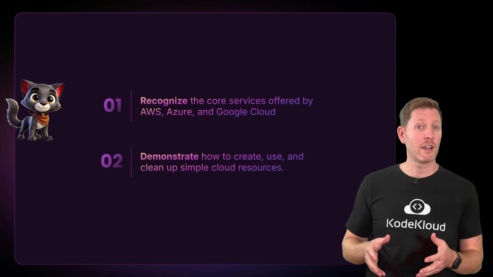
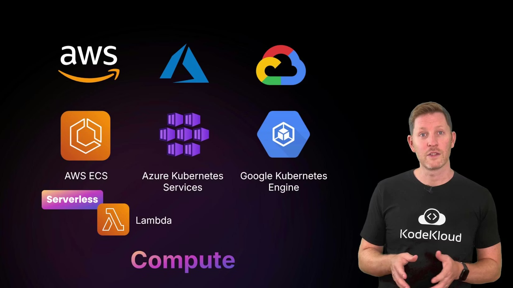
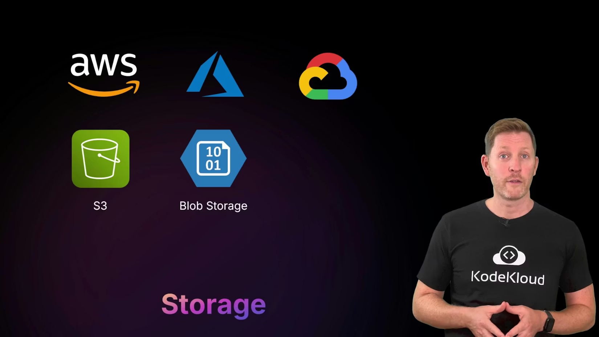
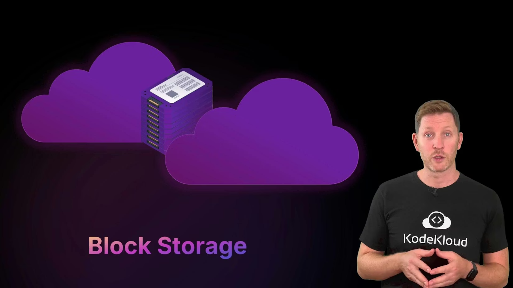
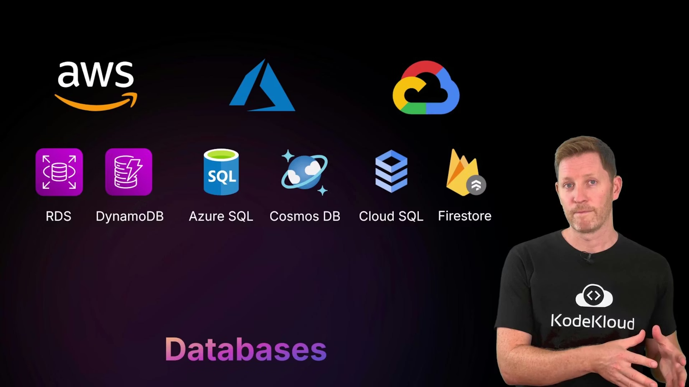
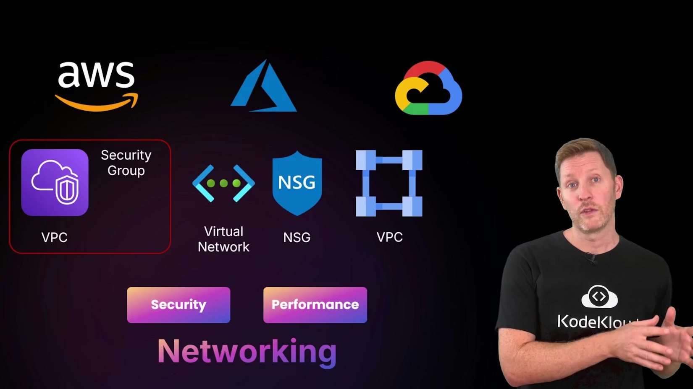

# Core Cloud Services

> Overview of core cloud building blocks—compute, storage, databases, and networking—and how AWS, Azure, and Google Cloud map and operate them with basic hands-on setup and cleanup guidance.

Before we dive into specific cloud platforms, it helps to step back and see the bigger picture: what building blocks do cloud providers offer, and how do you map their names and features across AWS, Azure, and Google Cloud?

In this lesson we organize cloud services into four core domains—compute, storage, databases, and networking—and show how those categories align across the three major providers. By the end you'll be able to identify core services in AWS, Azure, and GCP, and know the basics of creating, using, and cleaning up simple resources.

<Frame>
    
</Frame>

Overview and market context

Three cloud providers dominate the global market: Amazon Web Services (AWS), Microsoft Azure, and Google Cloud Platform (GCP). They power consumer and enterprise workloads—from streaming services to scientific computing—by offering the same core building blocks (compute, storage, databases, and networking) under different service names and packaging.

A brief timeline:

* AWS launched in 2006, when Amazon began offering its internal infrastructure as a service.
* Azure launched in 2010, extending Microsoft's enterprise reach into the cloud.
* Google Cloud launched in 2011, building on Google’s strengths in search, data, and machine learning.

Market position and strategy:

* AWS leads in market share and breadth of services.
* Azure is strong in enterprise integration and Microsoft ecosystems.
* GCP focuses on data, analytics, and machine learning capabilities.

Many organizations use multiple clouds depending on cost, features, or team expertise. For learning, start with whichever provider you can access—core concepts transfer between platforms.

<Callout icon="lightbulb" color="#1CB2FE">
  Start with the cloud platform you can access. Compute, storage, database, and networking concepts carry across providers—even if the service names differ.
</Callout>

Core service domains (at a glance)

| Domain     | AWS (example services)                               | Azure (example services)                                         | Google Cloud (example services)                                   |
| ---------- | ---------------------------------------------------- | ---------------------------------------------------------------- | ----------------------------------------------------------------- |
| Compute    | EC2 (VMs), ECS/EKS (containers), Lambda (serverless) | Virtual Machines, AKS (Kubernetes), Azure Functions              | Compute Engine (VMs), GKE (Kubernetes), Cloud Functions           |
| Storage    | S3 (object), EBS (block), EFS (file)                 | Blob Storage (object), Managed Disks (block), Azure Files (file) | Cloud Storage (object), Persistent Disk (block), Filestore (file) |
| Databases  | RDS (managed SQL), DynamoDB (NoSQL)                  | Azure SQL, Cosmos DB (NoSQL)                                     | Cloud SQL (managed SQL), Firestore (NoSQL)                        |
| Networking | VPC, Security Groups, NACLs                          | Virtual Network, Network Security Groups                         | VPC, Firewall Rules, IAM networking controls                      |

Compute — where your code runs

Compute services run your workloads: virtual machines, containers, or serverless functions.

* Virtual machines (VMs): Pick OS, CPU, memory, and storage; you pay while the machine runs.
* Container services (ECS/EKS, AKS, GKE): Manage containers at scale, orchestrate deployments, and integrate with CI/CD.
* Serverless (Lambda, Azure Functions, Cloud Functions): Run code without provisioning servers; billing often based on requests and consumed resources rather than uptime.

Key decisions: required OS, scaling needs, and management overhead. Container orchestration is preferred for complex microservices; serverless is ideal for event-driven short-running tasks.

<Frame>
    
</Frame>

Storage — object, block, and file

Storage services cover three common patterns:

* Object storage (S3, Blob Storage, Cloud Storage): Best for files, backups, logs, and media. Often supports multiple storage classes (hot, cold, archival) to balance cost and access speed.
* Block storage (EBS, Managed Disks, Persistent Disk): Virtual disks attached to VMs for OS and application data.
* File storage (EFS, Azure Files, Filestore): Managed network filesystems for shared access across instances.

This lesson includes a hands-on demonstration of object storage (S3) to show how storage classes and lifecycle policies affect cost and performance.

<Frame>
    
</Frame>

<Frame>
    
</Frame>

Practical storage CLI examples (quickstart)

* Create an S3 bucket (AWS CLI): `aws s3 mb s3://my-bucket --region us-east-1`
* Remove an S3 bucket and its contents: `aws s3 rb s3://my-bucket --force`
* Create a Cloud Storage bucket (gcloud): `gsutil mb gs://my-bucket`
* Remove a Cloud Storage bucket and contents: `gsutil rm -r gs://my-bucket`
* Create a Blob container (Azure CLI): `az storage container create --name mycontainer --account-name mystorageaccount`
* Delete a Blob container (Azure CLI): `az storage container delete --name mycontainer --account-name mystorageaccount`

Databases — managed relational and NoSQL

Cloud providers offer managed database services so you can focus on data and queries instead of administration:

* Relational (managed SQL): RDS (AWS), Azure SQL, Cloud SQL (GCP).
* NoSQL / multi-model: DynamoDB (AWS), Cosmos DB (Azure), Firestore (GCP).

Managed databases handle backups, patching, scaling, and high availability. Choose based on data model, latency requirements, and transactional guarantees.

<Frame>
    
</Frame>

Networking — connectivity, isolation, and security

Networking connects and secures components. Each provider offers virtual networks, subnetting, routing, and firewall controls to isolate workloads and control traffic:

* AWS: VPC (Virtual Private Cloud), security groups, network ACLs.
* Azure: Virtual Network, Network Security Groups (NSGs).
* GCP: VPC with firewall rules and IAM networking controls.

You use these tools to segment applications, control traffic between tiers, and expose only required endpoints. Cloud networking still relies on familiar fundamentals—IP addressing, routing, and segmentation—but applied at scale.

<Frame>
    
</Frame>

Best practices and next steps

* Learn by doing: create a VM, a storage bucket, a managed database instance, and a simple VPC/subnet to see how pieces connect.
* Track costs: resources incur charges while provisioned—always clean up demo resources.
* Use provider documentation for service-specific limits and features.

Summary

Although service names differ, the four core domains—compute, storage, databases, and networking—are common to all providers. Master these building blocks, and you'll be able to navigate any cloud platform more quickly. Try creating, using, and cleaning up simple resources to see these concepts in action.

<Callout icon="lightbulb" color="#1CB2FE">
  Remember: names vary but core concepts are consistent. Focus first on compute, storage, databases, and networking—provider-specific details come next.
</Callout>

Links and references

* [AWS Documentation](https://docs.aws.amazon.com/)
* [Microsoft Azure Documentation](https://docs.microsoft.com/azure)
* [Google Cloud Documentation](https://cloud.google.com/docs)
* [Kubernetes Basics](https://kubernetes.io/docs/concepts/overview/what-is-kubernetes/)

<CardGroup>
  <Card title="Watch Video" icon="video" cta="Learn more" href="https://learn.kodekloud.com/user/courses/cloud-computing-fundamentals/module/db2b85ff-442f-481d-a308-21c5eb63344b/lesson/879180b2-6575-4504-ae81-3286840dd9c4" />
</CardGroup>
