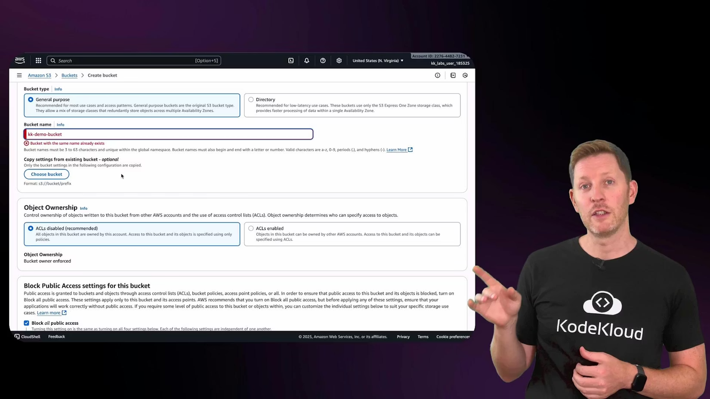
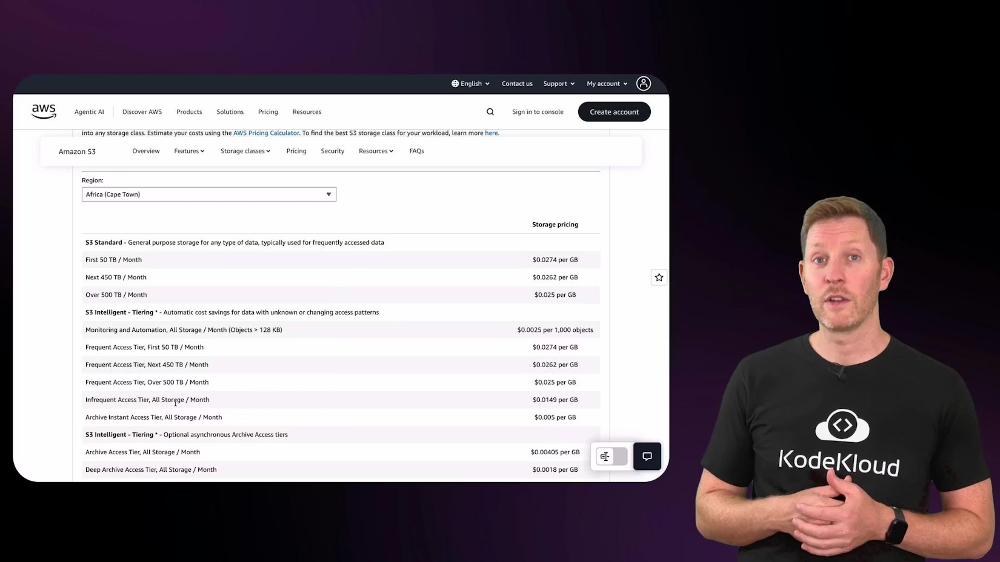
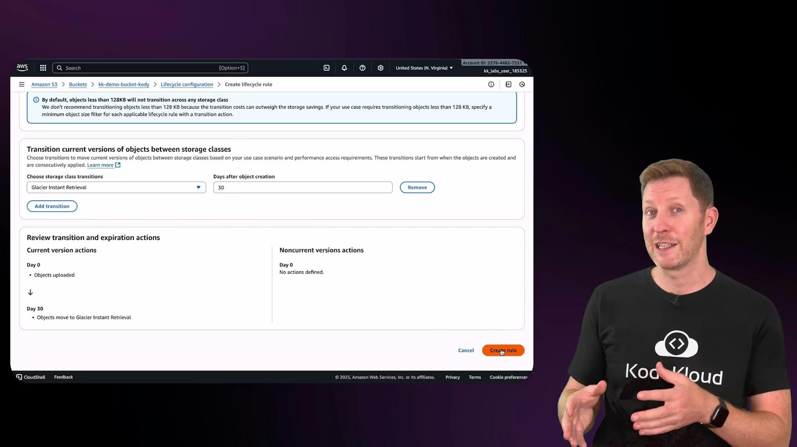
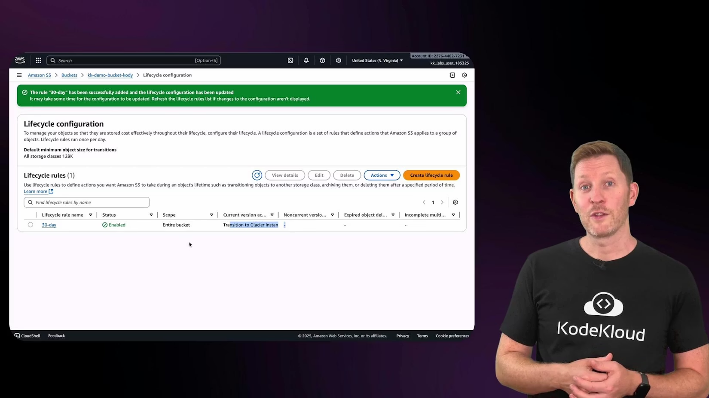
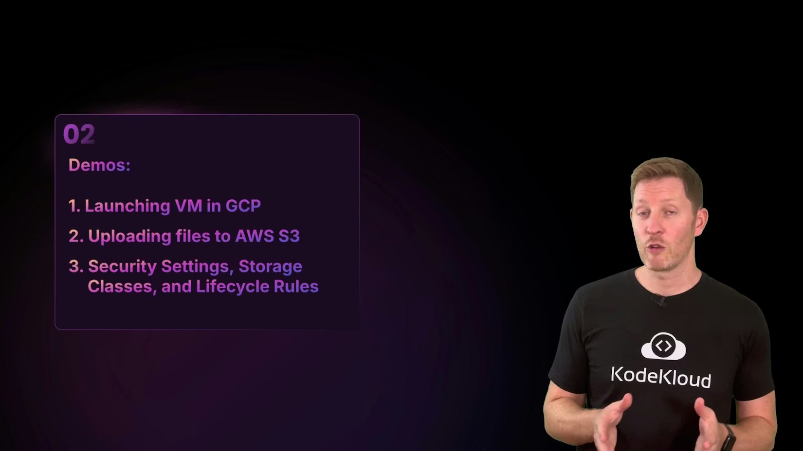

# Demo Creating S3 Bucket on AWS

> AWS S3 实操增强笔记：从创建 Bucket 到安全配置、存储类别、生命周期规则与资源清理，按中英逐段对照展开，并补充课堂外的治理实践。
>
> Enhanced AWS S3 hands-on note: from bucket creation to security settings, storage classes, lifecycle policies, and cleanup, presented in paragraph-by-paragraph bilingual format with practical governance extensions.

## 1. 本节目标 / Lesson Goal

本节的真实目标不是“会上传文件”，而是理解对象存储如何在安全、成本、可维护性之间做平衡。

The real goal is not just uploading files, but understanding how object storage balances security, cost, and maintainability.

S3 是 AWS 的核心对象存储服务，适用于备份、日志、媒体文件、静态资源等多种场景。

S3 is AWS's core object storage service and is used for backups, logs, media, static assets, and many other scenarios.

## 2. 创建 Bucket 前需要知道什么 / What to Know Before Creating a Bucket

Bucket 名称必须全局唯一，这是课堂演示中最先出现的实际限制。命名建议采用“组织-环境-业务-随机后缀”模式，减少冲突。

Bucket names must be globally unique, a practical constraint shown early in the demo. A naming pattern like org-env-workload-randomSuffix reduces collisions.

Bucket 不是普通文件夹，它附带访问控制、生命周期、版本管理、加密与审计能力。

A bucket is not just a folder; it includes access control, lifecycle policy, versioning, encryption, and audit behavior.

## 3. 创建阶段的关键配置 / Key Settings During Creation

Object Ownership 建议保持 Bucket owner enforced，这样你可以统一通过 IAM 与 Bucket Policy 管理权限，避免 ACL 带来的复杂度。

Keep Object Ownership as Bucket owner enforced so permissions remain centralized through IAM and bucket policy, avoiding ACL complexity.

Block Public Access 建议默认开启，除非你有明确、经过评审的公开访问需求。

Keep Block Public Access enabled by default unless you have a clear, reviewed requirement for public exposure.

Versioning 可提升可恢复性，但会增加存储成本；Tag 用于成本归集、自动化运维与资源检索，应在创建阶段就规划。

Versioning improves recoverability but increases storage cost; tags support cost allocation, automation, and discoverability, and should be planned at creation time.

## 4. 上传对象与权限验证 / Upload Objects and Validate Access

上传对象后要检查元数据，包括大小、内容类型、时间戳、存储类别与加密状态。

After upload, inspect metadata such as size, content type, timestamps, storage class, and encryption state.

如果公共访问被阻止，匿名访问对象 URL 出现 AccessDenied 是预期结果，说明默认安全策略生效。

If public access is blocked, AccessDenied for anonymous object URL access is expected and indicates secure defaults are working.

## 5. 存储类别选择逻辑 / Storage Class Decision Logic

存储类别不是“越便宜越好”，而是要与访问频率、恢复时间目标、保留周期配套。

Storage class is not about choosing the cheapest tier; it must align with access frequency, recovery-time expectations, and retention duration.

Standard 适合高频访问；Intelligent-Tiering 适合访问模式不确定；Glacier 系列适合归档与长期保存。

Standard fits frequent access; Intelligent-Tiering fits uncertain access patterns; Glacier classes fit archival and long retention.

课堂里展示了定价页面，核心价值是让你意识到成本模型是“存储+请求+检索+时长约束”的组合。

The pricing page in class highlighted that cost is a combination of storage, request, retrieval, and duration constraints.

## 6. 生命周期规则 / Lifecycle Rules

生命周期规则是对象存储降本最关键的自动化能力。你可以按对象年龄、前缀、标签等条件自动转层或过期删除。

Lifecycle rules are the most important automation mechanism for object-storage cost control. You can transition or expire data by object age, prefix, tags, and other filters.

课堂演示了 30 天后转入 Glacier Instant Retrieval 的规则，这体现了“先用高性能层，后转低成本层”的经典策略。

The class demonstrated a 30-day transition to Glacier Instant Retrieval, representing a classic pattern: start in higher-performance storage, then transition to cheaper archival tiers.

### 6.1 生命周期补充注意点 / Extra Lifecycle Considerations

对象转层可能产生转换费用；某些低频层存在最短存储时长限制，提前删除会产生额外费用。

Transitions may incur transition charges; some archive tiers enforce minimum storage duration, and early deletion may trigger extra cost.

启用版本控制后，生命周期策略需要区分 current 与 noncurrent 版本，否则会出现“当前对象被管理了、历史版本堆积未清理”的情况。

With versioning enabled, lifecycle rules must cover both current and noncurrent versions; otherwise old versions accumulate silently.

## 7. 删除对象与删除 Bucket / Delete Objects and Delete Bucket

删除 Bucket 前必须先删除对象；启用了版本控制时，还要删除历史版本与 delete markers。

You must empty objects before deleting a bucket; with versioning, historical versions and delete markers must also be removed.

课堂强调了“资源不会自动清理”，这是云成本治理的基础认知。

The lesson stressed that resources are not auto-cleaned, which is foundational for cloud cost governance.

## 8. 课堂外安全实践补充 / Extra Security Practices

建议默认启用加密（SSE-S3 或 SSE-KMS），对敏感数据使用 KMS 并结合最小权限 IAM 策略。

Enable encryption by default (SSE-S3 or SSE-KMS), and use KMS plus least-privilege IAM for sensitive data.

尽量避免直接开放 Bucket 公网读取；如需分发静态内容，优先通过 CloudFront 做受控分发。

Avoid direct public bucket exposure where possible; if public distribution is needed, prefer controlled delivery through CloudFront.

建议开启 CloudTrail 数据事件或相关审计日志，建立对象访问可追踪性。

Enable CloudTrail data events or equivalent audit logging for object-level access traceability.

## 9. 课堂回顾 / Lesson Recap

本节你应当掌握三件事：

You should leave this lesson with three core abilities:

1. 能正确创建并配置 S3 Bucket 的安全基线。
2. 能根据访问模式选择存储类别。
3. 能用生命周期规则实现自动化成本管理与清理策略。

1. Create S3 buckets with a secure baseline configuration.
2. Select storage classes based on access behavior.
3. Use lifecycle rules for automated cost and retention governance.

如果你把“命名、权限、生命周期、清理”四件事做成固定模板，S3 运维质量会显著提升。

If you standardize naming, access, lifecycle, and cleanup as a repeatable template, S3 operational quality improves dramatically.
