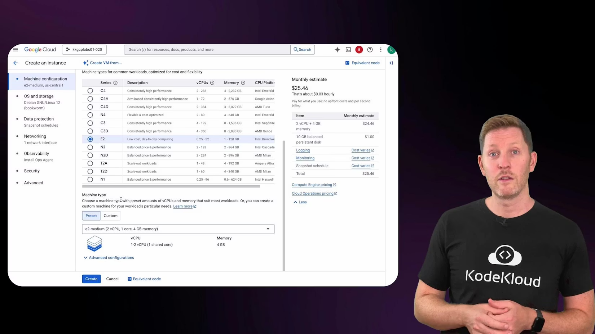
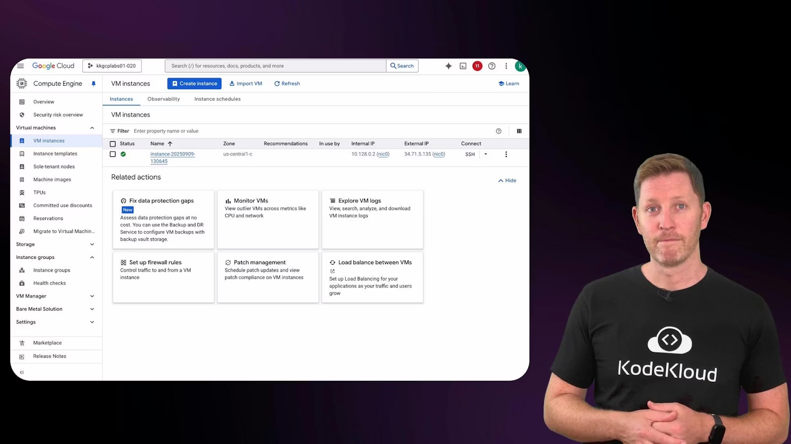
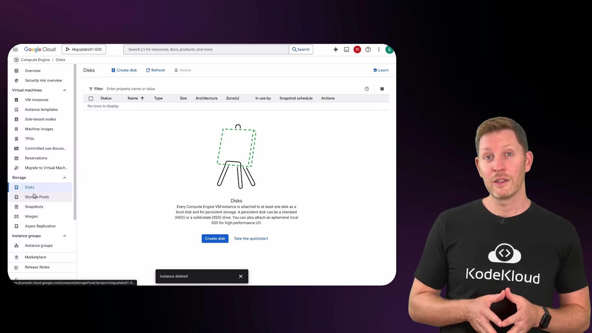

# Demo Creating VM on Google Cloud

> A step-by-step demo showing how to create, configure, SSH into, verify, and manage a Google Cloud Compute Engine virtual machine, including disk and lifecycle operations.

In this lesson we create a virtual machine on Google Cloud Platform (a Compute Engine instance). This walkthrough shows how to provision a VM from the Cloud Console, verify its resources, connect over SSH, and manage its lifecycle (stop/delete). The steps mirror what you might do on local virtualization (choose CPU, memory, disk, and OS), except the VM runs in Google's data centers and Google manages the physical hardware.

If you followed the Virtualization and Containers course, you'll recognize the workflow. Imagine you need a clean Linux machine for development, testing, or hosting a small service without touching local hardware — Compute Engine provides that on demand.

From the GCP Console you can manage all cloud resources — VMs, storage, networking, APIs, billing, and monitoring. To create a VM, open the left-hand menu and choose Compute Engine → VM instances, then click Create Instance.

## Choose machine configuration

When creating an instance you select a region/zone, machine type, boot disk (OS and disk size), networking, and optional items like GPUs or additional disks. Google groups machine types by use case (general purpose, memory-optimized, compute-optimized, GPU-enabled). You can also fine-tune CPU and memory with custom machine types.

For this demo we choose a general-purpose machine type, e2-medium (2 vCPUs, 4 GB RAM). The console shows an estimated monthly cost (roughly \$25/month for e2-medium in many regions), and lets you pick boot disk size and OS.



<Frame>
    
</Frame>

Quick reference: common machine-type choices

| Use case          | Example machine types            | Typical purpose                   |
| ----------------- | -------------------------------- | --------------------------------- |
| General purpose   | `e2-medium`, `n1-standard-1` | Web servers, small dev/test VMs   |
| Memory-optimized  | `m1-megamem`, `m2-ultramem`  | Large databases, in-memory caches |
| Compute-optimized | `c2-highcpu`                   | CPU-bound workloads               |
| GPU-enabled       | `a2`, `n1-standard` + GPU    | ML training, accelerated graphics |

For this demo we selected:

* Machine type: `e2-medium` (2 vCPU, 4 GB RAM)
* Boot disk: 10 GB (default persistent boot disk)
* OS: Debian/Ubuntu (select via the boot disk chooser)

After creation, the instance appears in the VM instances list with its name, region/zone, internal and external IP addresses, and a green status indicator when running. The Overview tab also shows the attached boot disk: every instance has at least one persistent boot disk.



<Frame>
    
</Frame>

## Connect to the VM using SSH

To connect, select the SSH menu for the instance and choose "Open in browser window." The Cloud Console creates a secure SSH session to the VM using the instance's external IP and an ephemeral key pair (or your configured OS Login credentials).

<Callout icon="lightbulb" color="#1CB2FE">
  Opening SSH in the browser uses ephemeral SSH keys (or OS Login, if enabled) and avoids manual key management for ad-hoc access. For automated or production access, consider using OS Login, IAM roles, or managed SSH keys.
</Callout>

Once connected, verify the VM matches the requested resources. Use `df -h` to confirm disk size and `free -m` to confirm memory. The example session below shows these checks, installing a small terminal game (`ninvaders`) with `sudo`, running it briefly, then exiting the SSH session.

```bash
Linux instance-20250909-130645 6.1.0-37-cloud-amd64 #1 SMP PREEMPT_DYNAMIC Debian 6.1.140-1 (2025-05-22) x86_64

The programs included with the Debian GNU/Linux system are free software;
the exact distribution terms for each program are described in the
individual files in /usr/share/doc/*/copyright.

Debian GNU/Linux comes with ABSOLUTELY NO WARRANTY, to the extent
permitted by applicable law.
kk_lab_user_723568@instance-20250909-130645:~$ df -h
Filesystem      Size  Used Avail Use% Mounted on
udev            2.0G     0  2.0G   0% /dev
tmpfs           393M  520K  392M   1% /run
/dev/sda1       9.7G  2.7G  6.6G  29% /
tmpfs           2.0G     0  2.0G   0% /dev/shm
tmpfs           5.0M     0  5.0M   0% /run/lock
/dev/sda15      124M   12M  113M  10% /boot/efi
tmpfs           393M     0  393M   0% /run/user/1000

kk_lab_user_723568@instance-20250909-130645:~$ free -m
             total        used        free      shared  buff/cache   available
Mem:          3924         526        2601           0        1017        3397
Swap:            0           0           0

kk_lab_user_723568@instance-20250909-130645:~$ sudo apt update && sudo apt install ninvaders -y
Reading package lists... Done
Building dependency tree... Done
Reading state information... Done
The following additional packages will be installed:
  libncurses6
The following NEW packages will be installed:
  libncurses6 ninvaders
0 upgraded, 2 newly installed, 0 to remove and 60 not upgraded.
Need to get 122 kB of archives.
After this operation, 400 kB of additional disk space will be used.
Get:1 https://deb.debian.org/debian bookworm/main amd64 libncurses6 amd64 6.4-4 [103 kB]
Get:2 https://deb.debian.org/debian bookworm/main amd64 ninvaders amd64 0.1.1-4.1 [19.0 kB]
Fetched 122 kB in 0s (889 kB/s)
Selecting previously unselected package libncurses6:amd64.
(Reading database ... 72285 files and directories currently installed.)
Preparing to unpack .../libncurses6_6.4-4_amd64.deb ...
Unpacking libncurses6:amd64 (6.4-4) ...
Selecting previously unselected package ninvaders.
Preparing to unpack .../ninvaders_0.1.1-4.1_amd64.deb ...
Unpacking ninvaders (0.1.1-4.1) ...
Setting up libncurses6:amd64 (6.4-4) ...
Setting up ninvaders (0.1.1-4.1) ...
Processing triggers for man-db (2.11.2-2) ...
Processing triggers for libc-bin (2.36-9+deb12u10) ...

kk_lab_user_723568@instance-20250909-130645:~$ ninvaders
...
Final score: 0001600, Final level: 01
Final rating... Quitter

*** nInvaders 0.1.1
*** (c)opyright 2k2 by Dettus
*** dettus@matrixx-bielefeld.de
Additional code by Mike Saarna,
Sebastian Gutsfeld -> segoh@gmx.net,
Alexander Hollinger -> alexander.hollinger@gmx.net and
Matthias Tharr -> hiasat2@compuserve.de
kk_lab_user_723568@instance-20250909-130645:~$ exit
```

The `df -h` and `free -m` outputs confirm the boot disk and memory match the instance configuration. This quick verification is a good habit: cloud resources map back to physical infrastructure managed by the provider.

When you finish an interactive session, type `exit` to close the SSH session. Closing the terminal does not stop the VM; it keeps running (and incurring compute charges) until you stop or delete it.

<Callout icon="warning" color="#FF6B6B">
  Stopping an instance halts compute (vCPU) and runtime charges, but persistent disks and reserved (static) external IP addresses may continue to incur storage or reservation costs. Deleting an instance will typically remove the VM; check the instance's disk deletion policy to confirm whether its boot disk is retained or deleted.
</Callout>

## Stop, delete, or retain disks

Back in the GCP Console you can stop the instance from the instance's three-dot menu. The status will change from Running to Stopped and the green indicator disappears. Visit Compute Engine → Disks to see boot disks: a stopped instance's boot disk remains allocated (and billable) until you delete it.

If you delete the instance, the instance entry is removed from the VM instances list. If the boot disk was configured to delete with the instance it will be removed; otherwise the disk remains in the Disks list and continues to incur storage charges until you delete it.



<Frame>
    
</Frame>

## Summary

In minutes you can go from an empty GCP project to a running VM with root access and persistent storage. Compute Engine enables rapid provisioning, on-demand scaling, and flexible machine types — without purchasing or maintaining physical hardware.

Links and references

* Compute Engine documentation: [https://cloud.google.com/compute/docs](https://cloud.google.com/compute/docs)
* Creating instances: [https://cloud.google.com/compute/docs/instances/create-start-instance](https://cloud.google.com/compute/docs/instances/create-start-instance)
* SSH to VMs: [https://cloud.google.com/compute/docs/instances/connecting-to-instance](https://cloud.google.com/compute/docs/instances/connecting-to-instance)
* Pricing overview: [https://cloud.google.com/pricing](https://cloud.google.com/pricing)

<CardGroup>
  <Card title="Watch Video" icon="video" cta="Learn more" href="https://learn.kodekloud.com/user/courses/cloud-computing-fundamentals/module/db2b85ff-442f-481d-a308-21c5eb63344b/lesson/97283e51-1761-4a88-9c41-fc5e7073d0ac" />
</CardGroup>

Built with [Mintlify](https://mintlify.com).
