# Cloud Security and Costs Part 1

> Overview of cloud security fundamentals, shared responsibility, IAM, network controls, CIA triad and mitigations, plus mindset for cloud cost management.

Now let’s cover two things people often forget until it’s too late: security and cost. You’ve already seen how cloud services are structured and where responsibility splits between you and the provider. Security and cost are cross-cutting concerns — they run through everything you build in the cloud. One misplaced permission, one misconfigured storage bucket, or one oversized database can turn a small issue into a production incident or a large monthly bill.

In this lesson we’ll zoom in on cloud security fundamentals you must get right (shared responsibility, network controls, IAM, and the CIA triad) and set up the right mindset before switching to cost-management techniques.

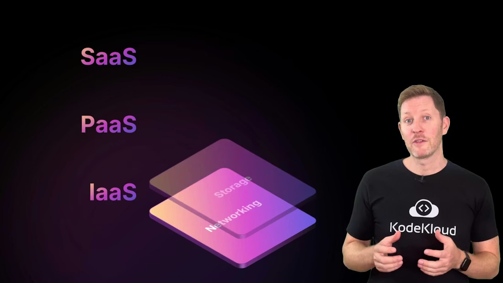

<Frame>
    
</Frame>

<Callout icon="lightbulb" color="#1CB2FE">
  Cloud providers (AWS, Azure, GCP) secure the infrastructure — the physical data centers, hypervisors, and managed platform services. You are responsible for securing your workloads, data, and access policies running on top of that infrastructure. This is the shared responsibility model. For reference, see [AWS Shared Responsibility](https://aws.amazon.com/compliance/shared-responsibility-model/), [Azure shared responsibility](https://learn.microsoft.com/azure/security/fundamentals/shared-responsibility) and [GCP shared responsibility](https://cloud.google.com/security/shared-responsibility).
</Callout>

When you run services in the cloud, the provider secures the platform while you secure your applications and data. Providers give foundational networking primitives such as virtual private clouds (VPCs), which are private, isolated networks where your cloud resources live. These building blocks are managed by the provider and are isolated from other customers.

Once your workload and data run on top of that foundation, you must decide who can log in, who can access which resources, and what actions each identity can perform. Two primary controls help you enforce that:

* Security groups (network controls): Virtual firewalls that let you define which ports and IP ranges or services can connect to a given resource.
* IAM (identity and access management): Policies and roles that define who can read, write, create, or delete cloud resources.

  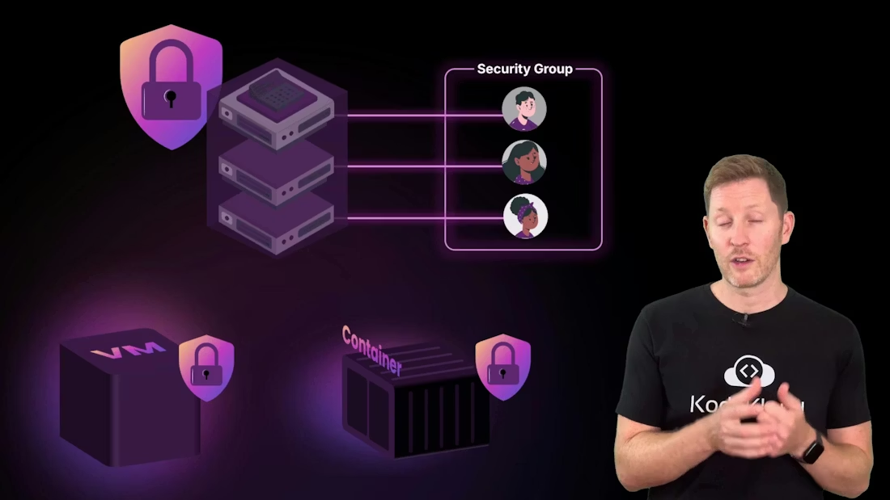

<Frame>
    
</Frame>

Think of it like an office building: security groups are the reception desk deciding who gets through which entrance; IAM controls what people can do once inside — which doors they can open, which files they can read, and which systems they can modify.

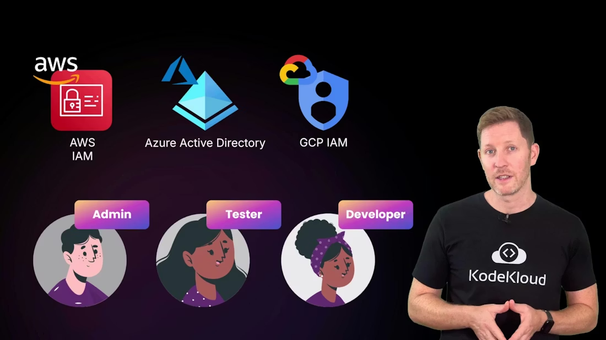

<Frame>
    
</Frame>

Neither security groups nor IAM are pre-configured to your use case — the provider supplies the tools, you create the rules. Leaving security groups wide open or granting everyone administrative rights is a common misstep; the provider will not reconfigure those settings for you.

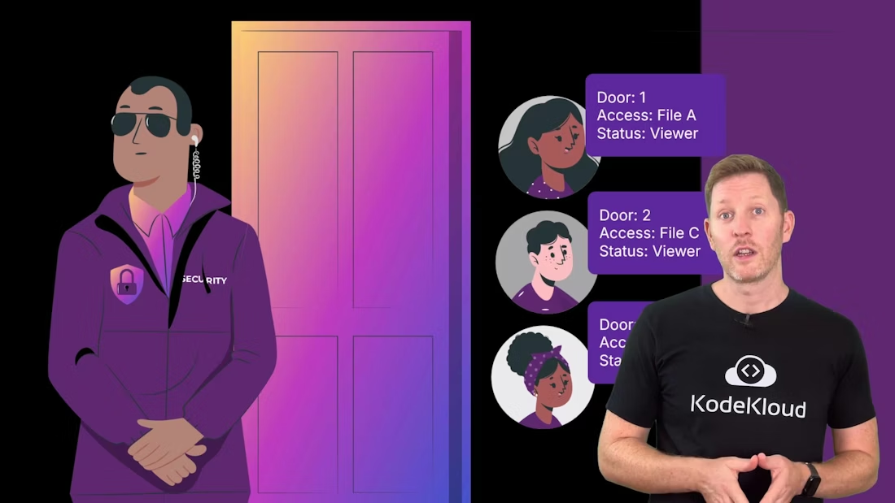

<Frame>
    
</Frame>

Industry security thinking is often summarized by the CIA triad: Confidentiality, Integrity, Availability. Use this framework to classify threats and plan mitigations.

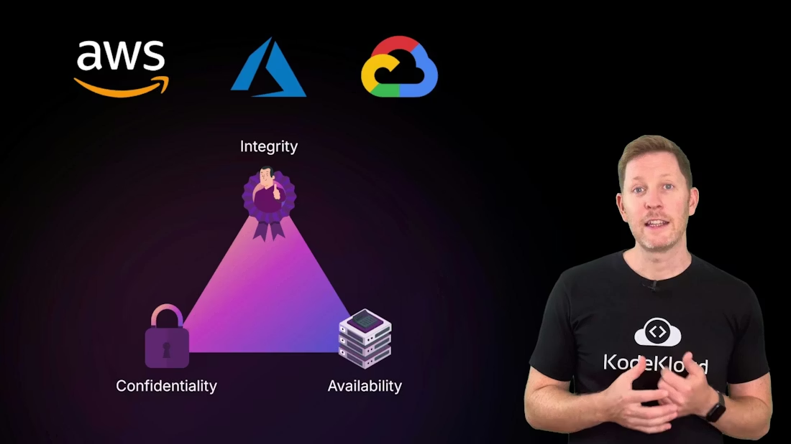

<Frame>
    
</Frame>

Below is a concise mapping of common risks to practical mitigations — useful as a checklist when designing secure cloud systems.

| CIA Pillar      | Typical Risks                                           | Practical Mitigations                                                                                                                                                                                      |
| --------------- | ------------------------------------------------------- | ---------------------------------------------------------------------------------------------------------------------------------------------------------------------------------------------------------- |
| Confidentiality | Misconfigured storage, secrets leaked in code, phishing | Default storage to private, apply least privilege with IAM, enable automated scans/audit logs, use a secrets manager, enforce MFA, run phishing awareness training.                                        |
| Integrity       | Unauthorized edits, accidental deletes, rogue scripts   | Separate read/write roles, enable detailed audit logging, use versioning/immutable backups, restrict admin actions with just-in-time or approval workflows.                                                |
| Availability    | Single-server failure, AZ/region outage, traffic spikes | Architect across availability zones/regions, use load balancers, configure auto scaling with clear thresholds (e.g., scale if CPU > 70% for N minutes), run health checks, and automate instance recovery. |

Confidentiality risks explained

* Misconfigured storage: Example — a team uploads customer invoices to a cloud folder but leaves sharing public. Mitigation: default to private, restrict access with IAM, and enable automated public-exposure scanners and audit logs.
* Secrets in code: Example — an API key committed to a public repo. Mitigation: never store credentials in code; use a secrets manager (inject secrets at runtime or via secure CI/CD).
* Phishing: Example — stolen credentials via a fake login. Mitigation: user training and phishing-resistant authentication like multi-factor authentication (MFA).

  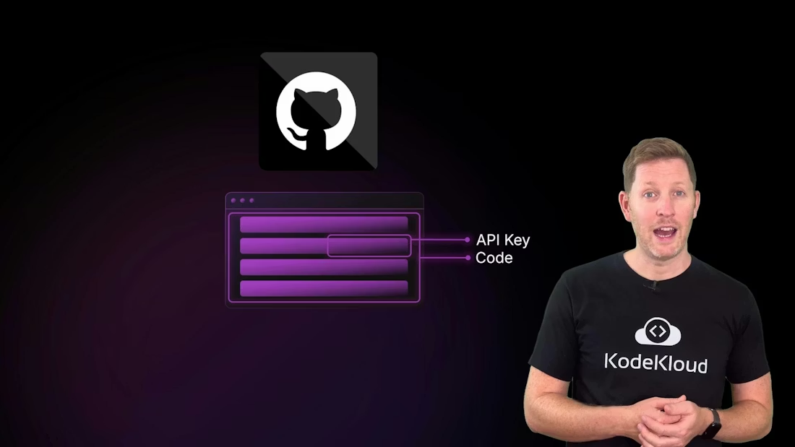

  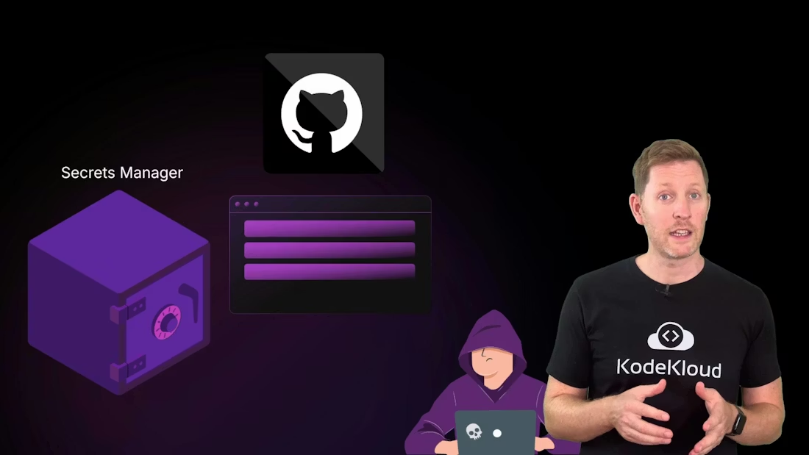

<Frame>
    
</Frame>

<Frame>
    
</Frame>

<Callout icon="warning" color="#FF6B6B">
  Never commit secrets (API keys, credentials) to source control. Use a managed secrets store and integrate secrets into CI/CD pipelines securely. If a secret is exposed, rotate it immediately and audit any usage.
</Callout>

<Frame>
    
</Frame>

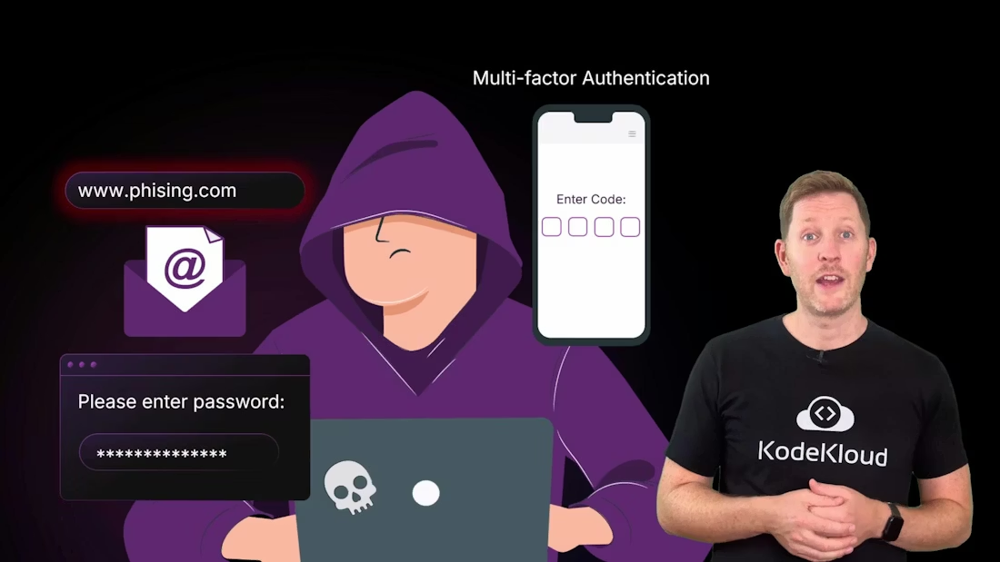

Integrity risks

* Tampering or accidental edits: A rogue script or an unauthorized user could modify or delete records, making data inaccurate. Mitigations: least-privilege IAM roles (separate read-only from write/admin), detailed audit logging, and versioning or immutable backups so you can trace and roll back changes.

  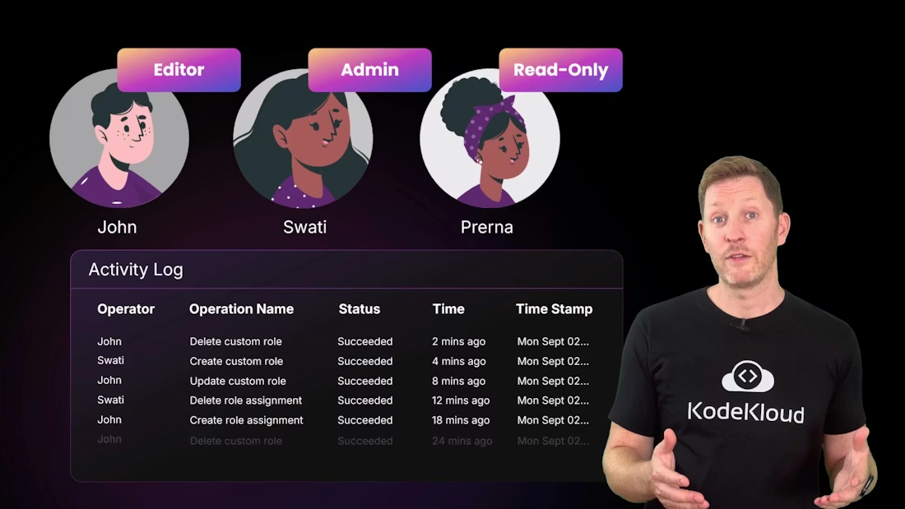

<Frame>
    
</Frame>

Availability risks

* Downtime and capacity issues: Even if data is confidential and intact, users still need the service to be available. Outages can result from a single-server failure, an availability zone or regional outage, or sudden traffic spikes. Cloud providers design infrastructure across regions and availability zones, but you must architect your applications to leverage that redundancy.

  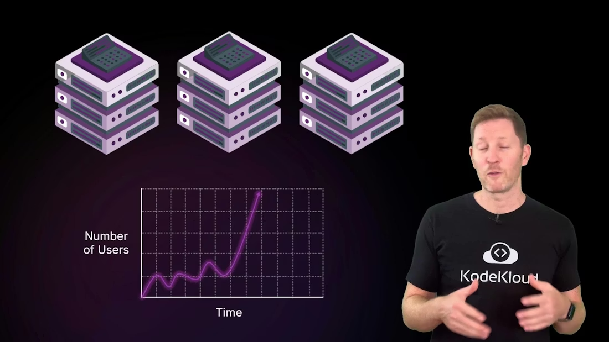

<Frame>
    
</Frame>

Design for failure (best practices)

* Spread resources across multiple availability zones and, when appropriate, across regions.
* Use load balancers to distribute traffic to healthy instances.
* Configure auto scaling with clear rules (for example, scale out when average CPU > 70% for N minutes).
* Implement health checks and automated recovery policies so unhealthy instances are replaced without manual intervention.

  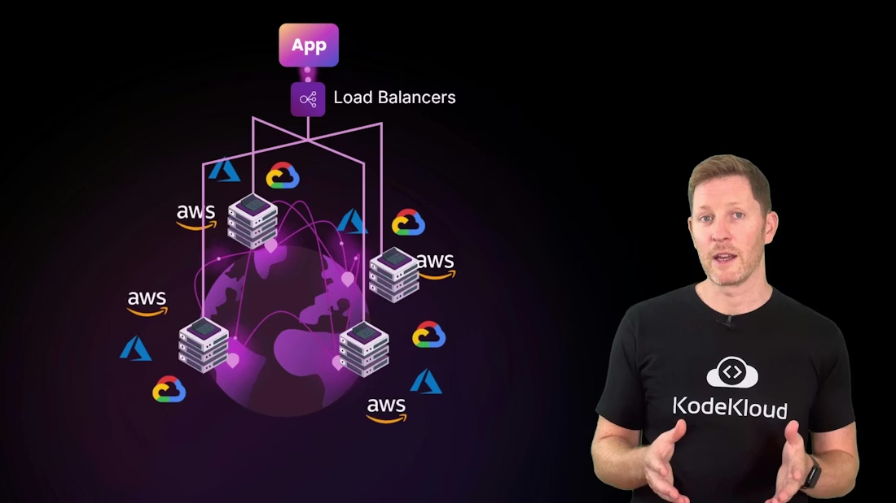

<Frame>
    
</Frame>

Cloud providers supply tools like load balancers, auto scaling, and multi-zone deployments — but they must be configured to match your availability goals and failure modes.

Quick check (pop quiz)
Which of the following statements is true?

A. Cloud providers always handle access permissions.
B. Integrity means only authorized users can access data.
C. Users are responsible for securing their own data and code.
D. CDNs are the best fix for confidentiality issues.

Pause to think, then continue. The correct answer is C.

* Why: A is false — providers provide the tools, but you configure access.
* Why: B is false — integrity is about preventing unauthorized modification (accuracy), while confidentiality is about preventing unauthorized reading.
* Why: D is false — CDNs help performance and availability (and can provide DDoS protection), but they’re not the primary solution for confidentiality.

  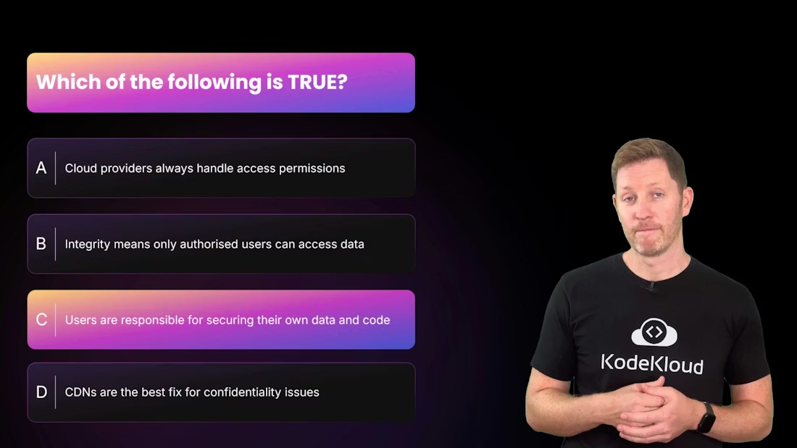

<Frame>
    
</Frame>

Recap — key takeaways

* Shared responsibility model: cloud providers secure the platform; you secure workloads, data, and access policies.
* Map threats to the CIA triad: Confidentiality (data leaks), Integrity (tampering or accidental edits), Availability (outages and capacity failures).
* Mitigate threats with correct configuration (security groups, IAM), cloud-native features (secrets managers, logging, versioning, multi-zone architectures), and operational practices (least privilege, MFA, training, automation).

  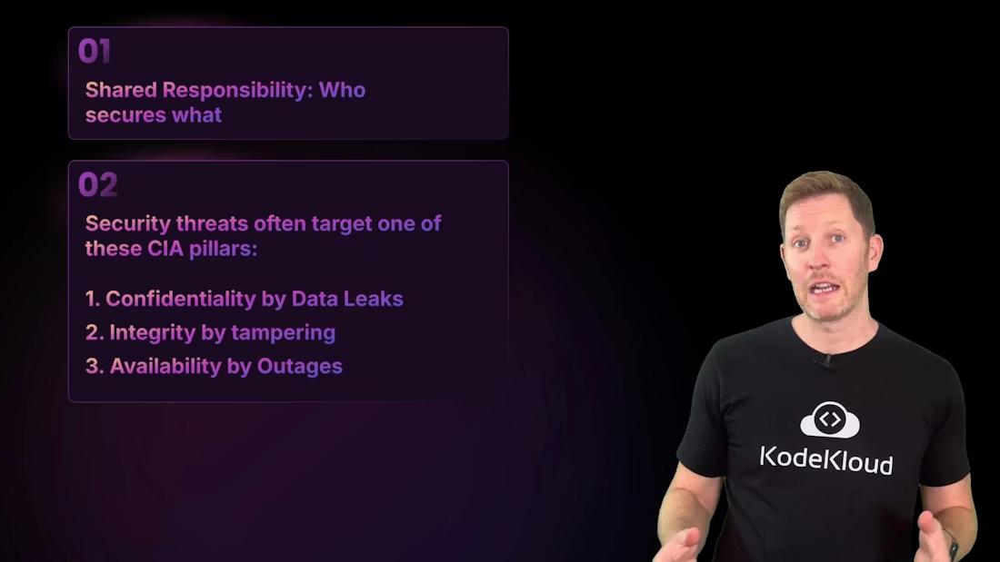

<Frame>
    
</Frame>

What’s next
In the next section we’ll shift focus to cost management: how cloud economics differ from on-prem, rightsizing and automated shutdowns to reduce waste, and how commitment plans or reserved capacity can lower bills when used effectively. We’ll cover practical steps to monitor, analyze, and optimize cloud spend.

<CardGroup>
  <Card title="Watch Video" icon="video" cta="Learn more" href="https://learn.kodekloud.com/user/courses/cloud-computing-fundamentals/module/7725d0b0-e43d-41c5-978e-66f36b65cba7/lesson/2bf77c47-f5c7-4a6b-a83b-f94bb705c372" />
</CardGroup>
