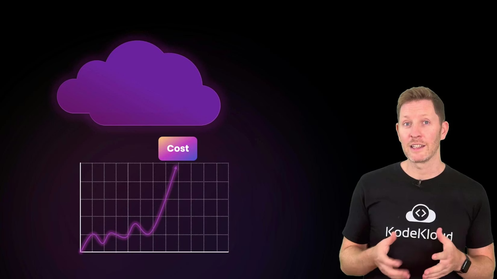
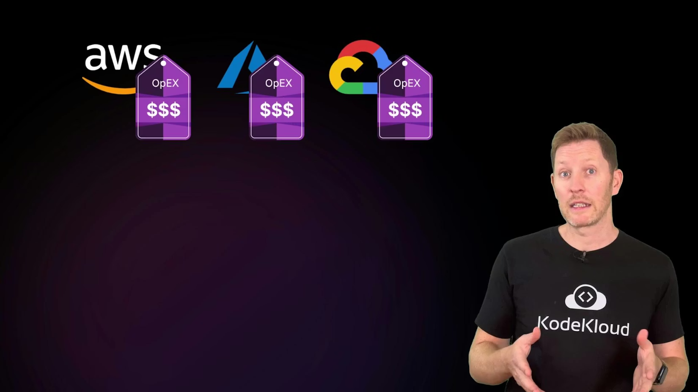
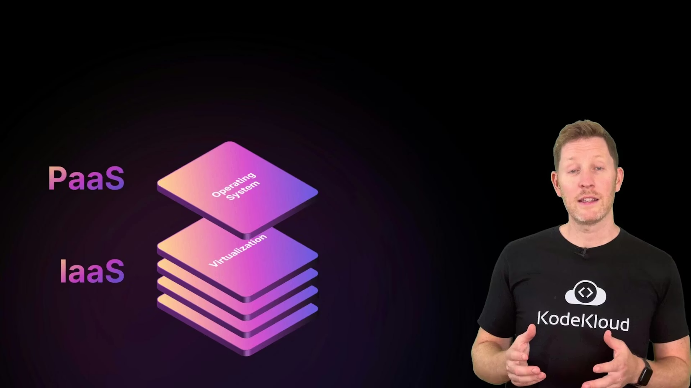
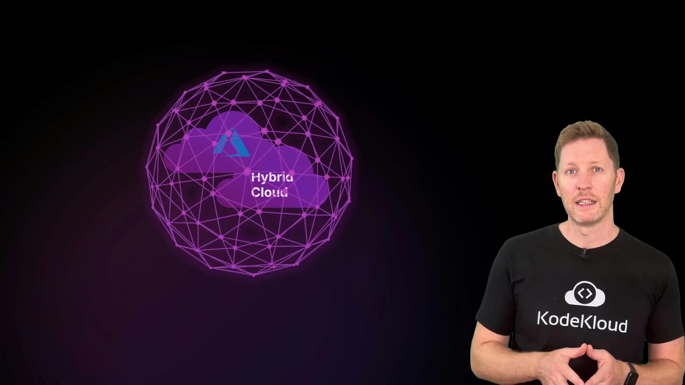
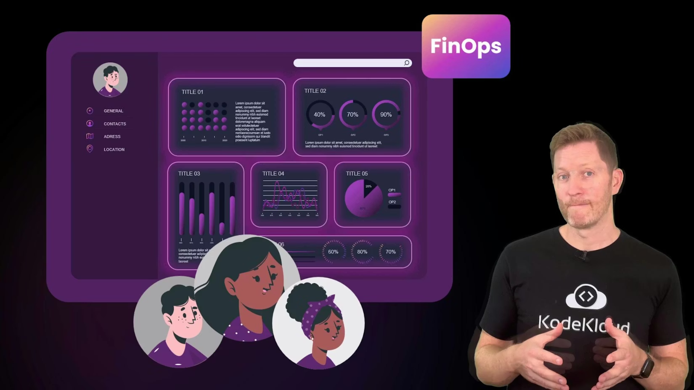
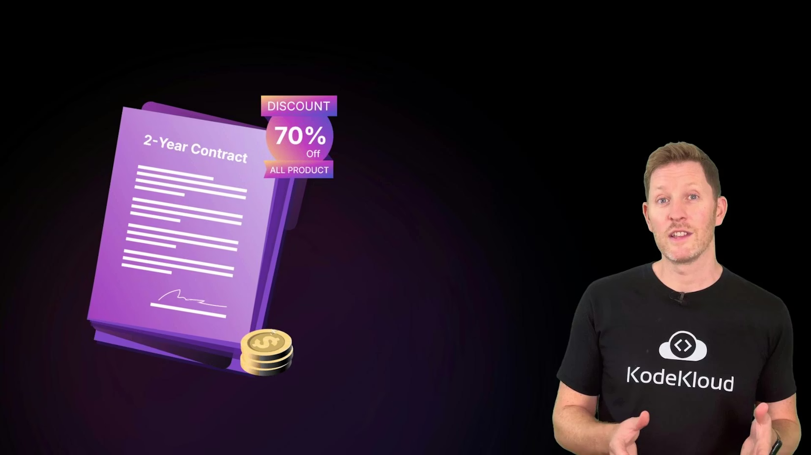
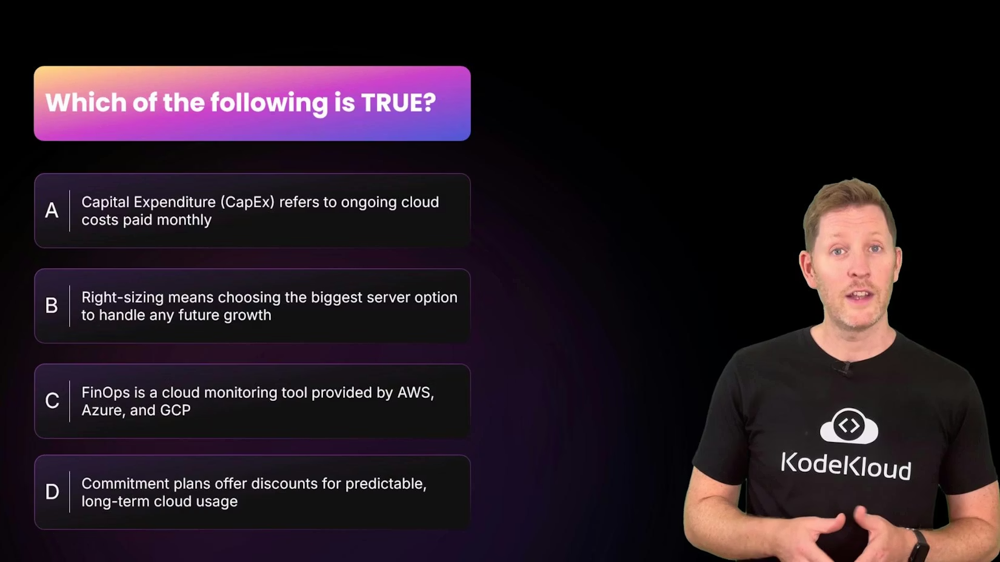

# Cloud Security and Costs Part 2

> Practical techniques and FinOps practices to control cloud spending—rightsizing, tagging, automated shutdowns, and commitment discounts to keep costs predictable while preserving agility

Cloud makes it easy to launch and scale, but without guardrails costs can spiral quickly. This article shows practical, repeatable techniques to keep cloud spend predictable while preserving agility.

<Frame>
    
</Frame>

## From CapEx to OpEx: how cloud changes spending

Before cloud, most IT spending was CapEx (capital expenditure): large up‑front investments in servers, networking, and datacenter space intended to be used for years. Cloud shifts that model toward OpEx (operational expenditure): you rent compute, storage, and other services on demand and pay based on usage (billing granularity varies by provider and service).

<Frame>
    
</Frame>

That on‑demand flexibility is powerful, but it can also make unexpected cost spikes possible. Two axes determine your control and cost profile: the service model and the deployment model.

## Service models: who manages what and where costs appear

| Service Model                                | Who manages most of the stack               | Cost trade-offs                                                                                                 |
| -------------------------------------------- | ------------------------------------------- | --------------------------------------------------------------------------------------------------------------- |
| IaaS (Infrastructure as a Service)           | You manage VMs, networking, storage, and OS | More control and optimization opportunities — but also more ways to overspend if resources are overprovisioned |
| PaaS / SaaS (Platform/Software as a Service) | Provider manages more layers                | Less operational burden; convenient but often higher per-unit cost for managed convenience                      |

## Deployment models: cost implications

| Deployment Model | Typical cost profile                                                | Best for                                      |
| ---------------- | ------------------------------------------------------------------- | --------------------------------------------- |
| Public cloud     | Pay-for-what-you-use; good for bursty/unpredictable workloads       | Variable workloads, rapid scaling             |
| Private cloud    | Higher upfront or ongoing costs for owned infrastructure            | Regulatory or performance-sensitive workloads |
| Hybrid cloud     | Mix of both — can increase operational complexity and hidden costs | Gradual migration, special-case workloads     |

## FinOps: governance for cloud costs

FinOps brings financial accountability into engineering teams by combining people, processes, and tooling. Its goal is predictable spend through visibility, ownership, and incentives that encourage cost-conscious decisions without slowing delivery.

<Frame>
    
</Frame>

<Callout icon="lightbulb" color="#1CB2FE">
  FinOps is a cross-functional practice — not a single vendor product. Key activities include tagging, budgeting, cost allocation, and rightsizing so teams make predictable, accountable choices about cloud spend.
</Callout>

Next, practical fixes for the most common cost traps.

## Common cost traps and practical fixes

|                                       Cost Trap | Quick fix                            | Example action                                                                                                            |
| ----------------------------------------------: | ------------------------------------ | ------------------------------------------------------------------------------------------------------------------------- |
|                              Over‑provisioning | Rightsize resources based on metrics | Start small, monitor CPU/memory/disk/network, migrate to a cheaper instance family if utilization is low                  |
|                     Idle non‑prod environments | Schedule automated shutdowns         | Use provider scheduler, cron jobs, or CI triggers to stop VMs outside business hours and start on demand                  |
|                             Untracked resources | Tagging and ownership rules          | Enforce tags like `team`, `environment`, `project`, `cost-center`, `owner` and block untagged resource creation |
| Long-term predictable capacity billed on-demand | Use commitment discounts             | Reserve capacity with Savings Plans, Reserved Instances, or Committed Use Discounts for 1–3 year terms                   |
|                              Lack of visibility | FinOps dashboards and alerts         | Configure budgets, alerts, and cost allocation reports to detect anomalies early                                          |

Right-sizing

* Don’t pick top-end instances “just in case.” Rightsizing is matching resources to actual demand. Use cloud provider recommendations and rightsizing tools to identify cheaper instance types with comparable performance.

Automate shutdowns

* Non‑production environments often run 24/7. Schedule automated shutdowns outside business hours and provide automated startup scripts or CI jobs for on‑demand access — high ROI with low disruption.

Commitment discounts

* For steady, long-running workloads use reserved instances, savings plans, or committed-use discounts to reduce costs (savings can range widely by provider and commitment type).

<Frame>
    
</Frame>

<Callout icon="warning" color="#FF6B6B">
  Commitment discounts save money but add financial risk if usage drops. Evaluate historical utilization, consider partial coverage, and use convertible/ flexible plans where available.
</Callout>

Tag everything

* Large environments become hard to track. Tagging (or labeling) resources with metadata such as `team`, `environment` (`dev`/`staging`/`prod`), `project`, `cost-center`, and `owner` enables accurate cost allocation and cleanup. Enforce tag policies and use them in billing reports.

## Quick assessment — pop quiz

Pop quiz — which statement is true?

A. Capital expenditure, or CapEx, refers to ongoing cloud costs paid monthly.
B. Rightsizing means choosing the biggest server option to handle any future growth.
C. FinOps is a cloud monitoring tool provided by AWS, Azure, and GCP.
D. Commitment plans offer discounts for predictable long-term cloud usage.

<Frame>
    
</Frame>

Answer: D is correct.

* A is backwards: CapEx is upfront spending (on‑prem hardware); cloud typically uses OpEx (pay‑as‑you‑go).
* B is incorrect: Rightsizing is about matching resources to actual needs, not overprovisioning.
* C is incorrect: FinOps is a cross‑team practice and cultural approach, not a single monitoring product.

## Recap — practical checklist

* Understand CapEx vs OpEx: cloud converts many capital purchases into usage‑based operational spend.
* Apply the basics: rightsizing, automating non‑prod shutdowns, using commitment discounts for steady workloads, and enforcing tagging for visibility.
* Use FinOps principles to ensure teams have ownership, visibility, and incentives to control costs while moving quickly.

You’ve now seen core techniques to manage cloud costs without sacrificing agility. Next, study provider-specific cost controls and security options to apply these practices in your environment.

## Links and references

* [FinOps Foundation](https://www.finops.org/) — practices and community resources
* [Kubernetes cost optimization basics](https://kubernetes.io) — general guidance on resource requests/limits and cluster sizing
* AWS Cost Management docs: [https://aws.amazon.com/aws-cost-management/](https://aws.amazon.com/aws-cost-management/)
* Azure Cost Management: [https://learn.microsoft.com/azure/cost-management-billing/](https://learn.microsoft.com/azure/cost-management-billing/)
* Google Cloud Billing: [https://cloud.google.com/billing](https://cloud.google.com/billing)

<CardGroup>
  <Card title="Watch Video" icon="video" cta="Learn more" href="https://learn.kodekloud.com/user/courses/cloud-computing-fundamentals/module/7725d0b0-e43d-41c5-978e-66f36b65cba7/lesson/1152b6c4-8e5e-4739-af00-34084e98e39a" />
</CardGroup>

Built with [Mintlify](https://mintlify.com).
