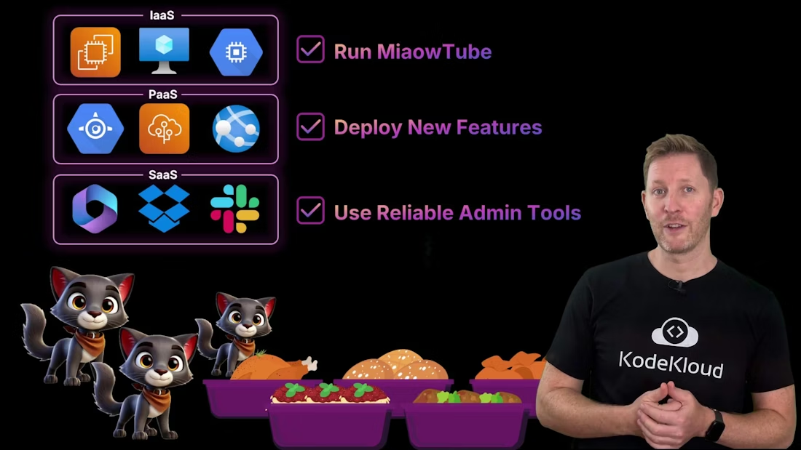
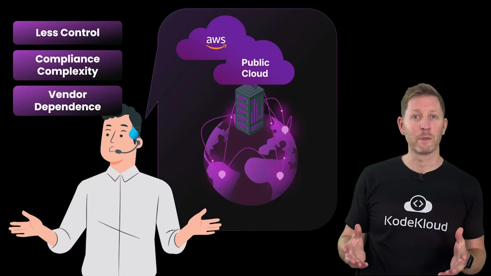
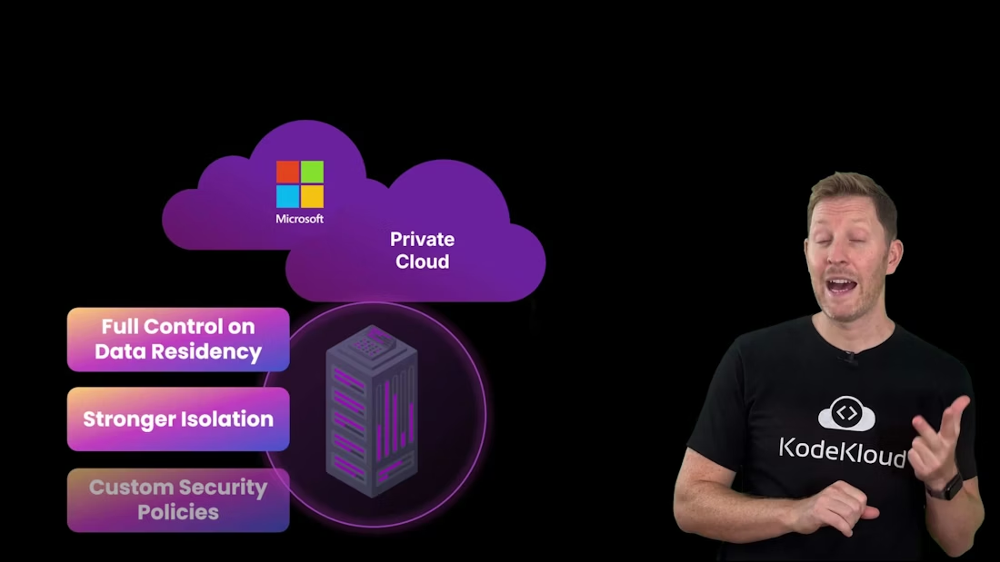
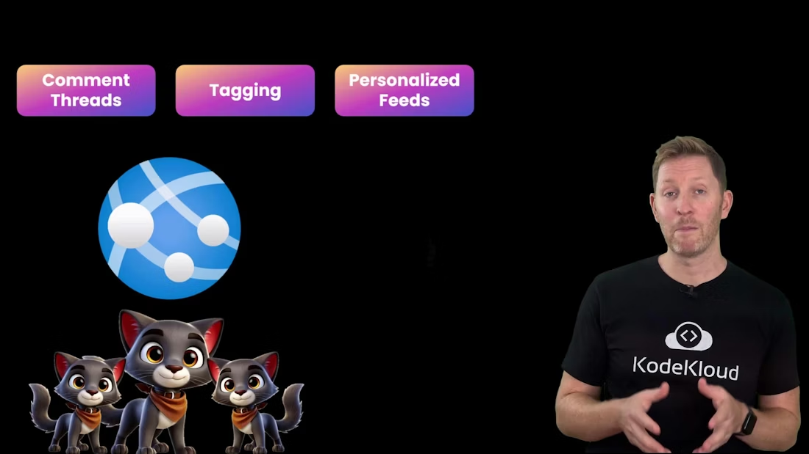
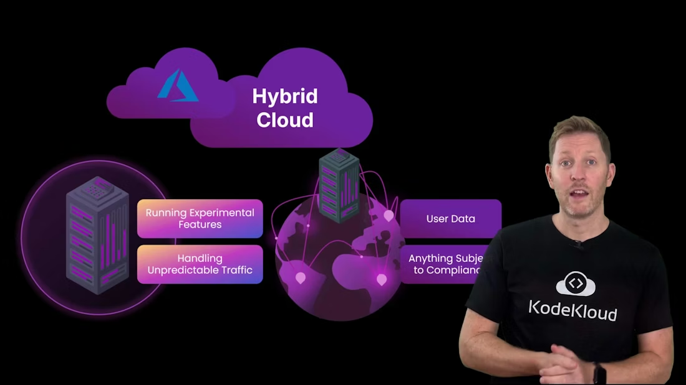
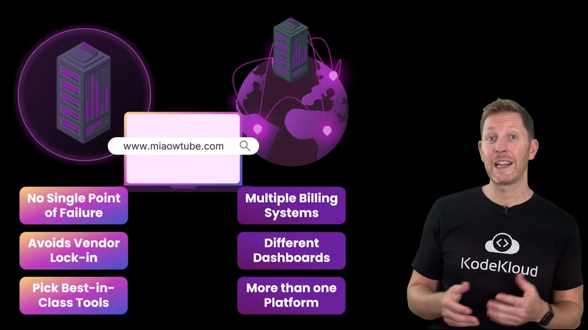
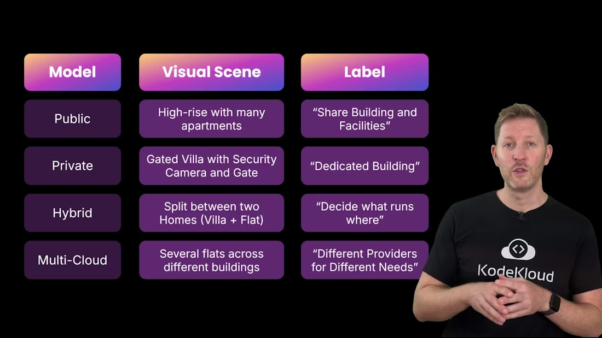
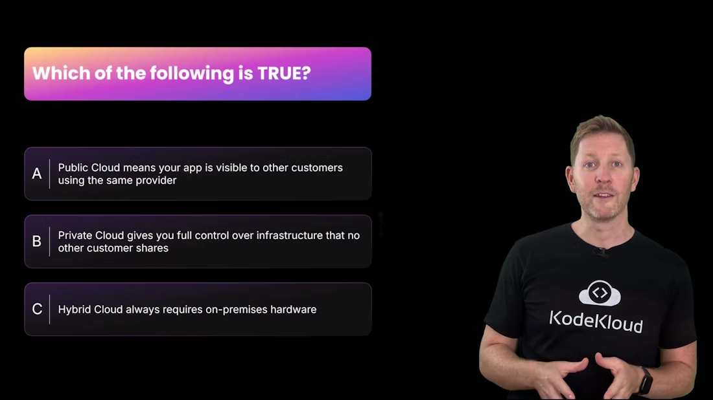
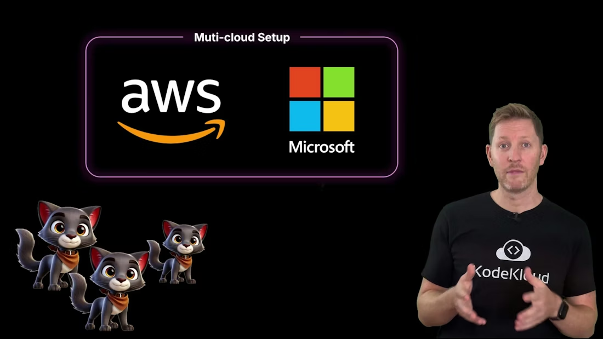
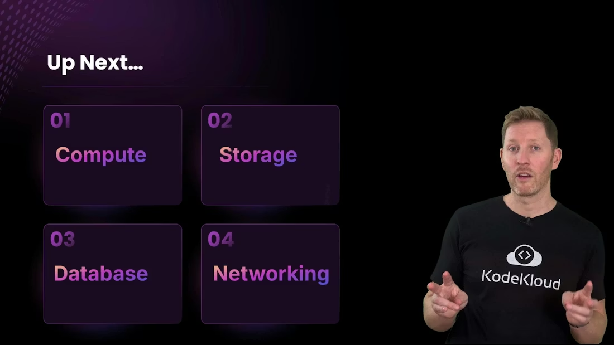

> ## Documentation Index
>
> Fetch the complete documentation index at: https://notes.kodekloud.com/llms.txt
> Use this file to discover all available pages before exploring further.

# Cloud Deployment Models

> Explains public, private, hybrid, and multi cloud deployment models, benefits, trade offs, and guidance for selecting appropriate models using MiaoTube examples

Back at the Cloud Solutions Expo buffet, Cody has mapped the services needed to meet MiaoTube’s three core requirements:

* Run the platform on an IaaS provider for core infrastructure.
* Ship features quickly using PaaS.
* Use SaaS for day-to-day collaboration and admin.

  

<Frame>
    
</Frame>

But Cody still needs to answer an essential question: where will these services actually run — on shared hardware, dedicated machines, or a mix? That decision is defined by cloud deployment models. In this lesson you’ll learn the differences between public, private, hybrid, and multi-cloud deployments, and when to use each.

## Public cloud — speed and scale for global workloads

Cody and the team visit the AWS booth to plan hosting the core MiaoTube platform (video uploads, processing, streaming). The rep recommends a public cloud for high-traffic workloads.

Key benefits of public cloud:

* Infrastructure is owned and managed by the provider and shared across customers — no need to buy or provision physical servers.
* Resources (VMs, containers, managed services) can be launched in minutes, enabling rapid scaling for traffic spikes.
* The provider handles physical hardware, power, cooling, and networking, reducing operational overhead.
* Global presence: run services from data centers around the world to reduce latency.

Trade-offs to consider:

* Less direct control over the underlying hardware; correct configuration is required to ensure tenant isolation.
* Responsibility for compliance and data residency remains with you — choose regions and configure policies accordingly.
* Using proprietary managed services increases the risk of vendor lock-in and makes migration harder later.

For MiaoTube’s unpredictable, global streaming workload, AWS public cloud delivers the elasticity and speed they need.

<Frame>
    
</Frame>

<Callout icon="warning" color="#FF6B6B">
  Public cloud gives fast access to resources, but beware of vendor lock-in and ensure your compliance requirements (data residency, encryption, audit) are enforced through architecture and configuration.
</Callout>

## Private cloud — control and isolation for sensitive workloads

Next, the team visits the Microsoft booth. For collaboration tools (email, document editing, video calls) handling sensitive internal data, Cody considers private cloud options like Microsoft 365 paired with private hosting or managed private cloud.

Private cloud characteristics:

* Dedicated hardware and isolated environments, hosted on-premises or by a trusted provider.
* Clear control over data residency and where information physically resides.
* Stronger isolation — no other tenants share your infrastructure.
* Customizable security policies, monitoring, and compliance controls.

Trade-offs:

* Higher cost because infrastructure isn’t shared.
* More operational responsibility for patching, integration, monitoring (unless you use a managed private offering).
* Generally slower to provision and scale than public cloud.

Private cloud is a good fit for internal systems where confidentiality, compliance, and auditability are top priorities.

<Frame>
    
</Frame>

## Hybrid cloud — combine scale and control

Because MiaoTube already runs services in both public and private environments, they’re effectively hybrid. For the second requirement (fast feature delivery), they choose Azure App Service for the front-end features (comments, tagging, feeds) while keeping sensitive account data in a private environment.

Hybrid cloud blends public and private resources and connects them via networking, identity, and integration tooling:

* Use public cloud for scalable, cost-effective services and experiments.
* Keep regulated or sensitive workloads in private cloud or on-premises systems.
* Use centralized tooling to operate both environments with a unified view.

Hybrid trade-offs:

* Added operational complexity — you manage two infrastructures.
* Secure data flow between environments and address compliance boundaries.
* Avoid duplication and keep an eye on cross-environment costs.

Hybrid is ideal when you need both fast delivery and strong control.

<Frame>
    
</Frame>

<Frame>
    
</Frame>

<Callout icon="lightbulb" color="#1CB2FE">
  Hybrid cloud gives you flexibility: run public services for scale and place sensitive data on private infrastructure. Use network encryption, consistent IAM, and monitoring to reduce integration risks.
</Callout>

## Multi-cloud — resilience and best-of-breed services

MiaoTube uses both AWS and Microsoft, which makes them a multi-cloud organization — a common outcome as teams pick the best service for each workload.

Advantages of multi-cloud:

* Resilience — architected correctly, no single provider outage takes everything down.
* Flexibility — pick best-in-class services from multiple vendors, reducing single-vendor dependency.

Challenges:

* More complex billing and operational dashboards.
* Teams must be trained to operate multiple platforms and tools.

Larger organizations often accept this complexity for redundancy and strategic flexibility.

<Frame>
    
</Frame>

## Deployment model quick comparison

| Model         |                                                         When to use | Pros                                                  | Cons                                                              |
| ------------- | ------------------------------------------------------------------: | ----------------------------------------------------- | ----------------------------------------------------------------- |
| Public cloud  |         Global, unpredictable workloads (web scale apps, streaming) | Fast provisioning, elasticity, global footprint       | Less control, compliance responsibility, potential vendor lock-in |
| Private cloud | Sensitive or regulated workloads (internal systems, financial data) | Strong isolation, control over residency and policies | Higher cost, more ops responsibility, slower to scale             |
| Hybrid cloud  |                Mix of public experiments and private sensitive data | Best of both worlds: scale + control                  | Integration complexity, secure data movement required             |
| Multi-cloud   |                           Need resilience or best-of-breed services | Reduced single-provider risk, service flexibility     | Operational/billing complexity, cross-training required           |

## Analogy: deployment models as housing types

Think of service models like different rental types:

* Public cloud — an apartment in a busy block: quick and affordable, limited customization.
* Private cloud — a private villa: full control and privacy, higher cost and maintenance.
* Hybrid cloud — renting both a villa and a city flat: run sensitive work privately, everyday workloads in the flat.
* Multi-cloud — properties across town from different landlords: spreads risk, increases management overhead.

It’s not about choosing a single model for everything — choose the right model for each part of your stack.

<Frame>
    
</Frame>

## Quick quiz

Which statement is true?

A. Public cloud means your app is visible to other customers using the same provider.
B. A private cloud gives you full control over infrastructure that no other customer shares.
C. Hybrid cloud always requires on-premises hardware.

<Frame>
    
</Frame>

Answer: B is correct.

* A is false — public cloud shares physical infrastructure, but proper isolation prevents your app or data from being exposed to other customers.
* B is true — private cloud uses dedicated infrastructure for a single organization, enabling greater control and isolation.
* C is misleading — hybrid cloud can include on-premises hardware, but it does not always require it. Hybrid refers to integration between private and public environments, which can both be hosted by providers.

## Recap — choose the right model for each workload

* Public cloud: fast, scalable, cost-effective; less control.
* Private cloud: dedicated, isolated, auditable; higher cost and ops overhead.
* Hybrid cloud: combine scale and control; requires integration and secure data flow.
* Multi-cloud: resilience and flexibility; manage increased operational complexity.

MiaoTube’s use of AWS and Microsoft demonstrates a practical multi-cloud outcome: teams select services that best match each workload.

<Frame>
    
</Frame>

Regardless of which deployment model you pick, the same core services power applications: compute, storage, database, and networking — integrated to deliver seamless cloud experiences.

<Frame>
    
</Frame>

These are the topics we'll cover next.

## Links and references

* AWS: [https://aws.amazon.com/](https://aws.amazon.com/)
* Microsoft Azure: [https://azure.microsoft.com/](https://azure.microsoft.com/)
* Microsoft 365: [https://www.microsoft.com/microsoft-365](https://www.microsoft.com/microsoft-365)
* Cloud computing overview (Wikipedia): [https://en.wikipedia.org/wiki/Cloud\_computing](https://en.wikipedia.org/wiki/Cloud_computing)

<CardGroup>
  <Card title="Watch Video" icon="video" cta="Learn more" href="https://learn.kodekloud.com/user/courses/cloud-computing-fundamentals/module/e16354f3-264c-4514-bd13-a1d03d4b9dd5/lesson/8c2a2fd1-1db0-4164-adbd-7f276f59db39" />
</CardGroup>

Built with [Mintlify](https://mintlify.com).
