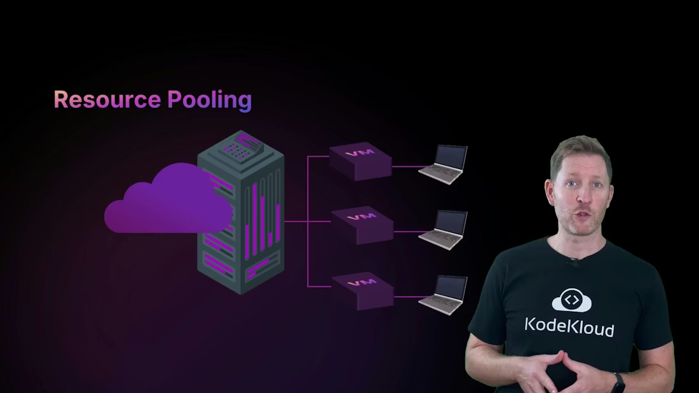
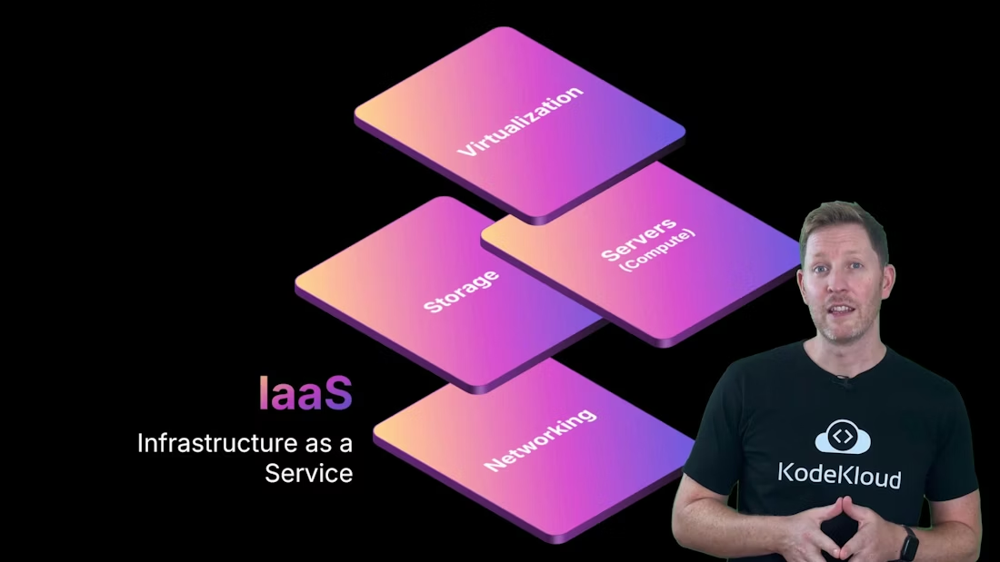
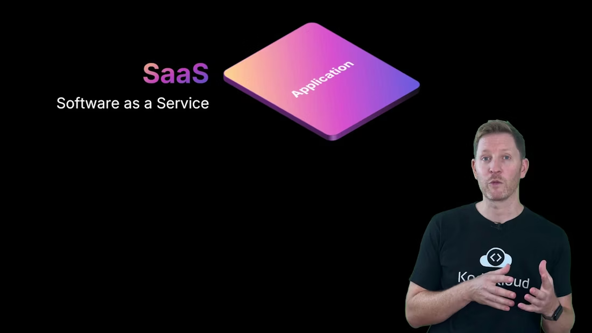
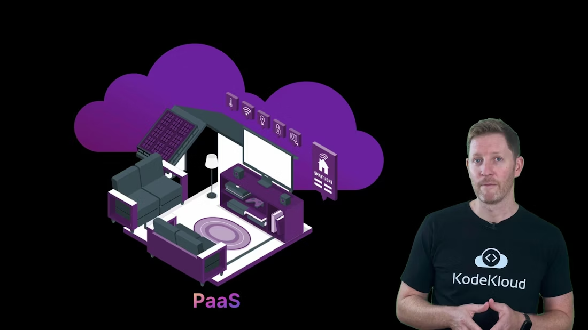
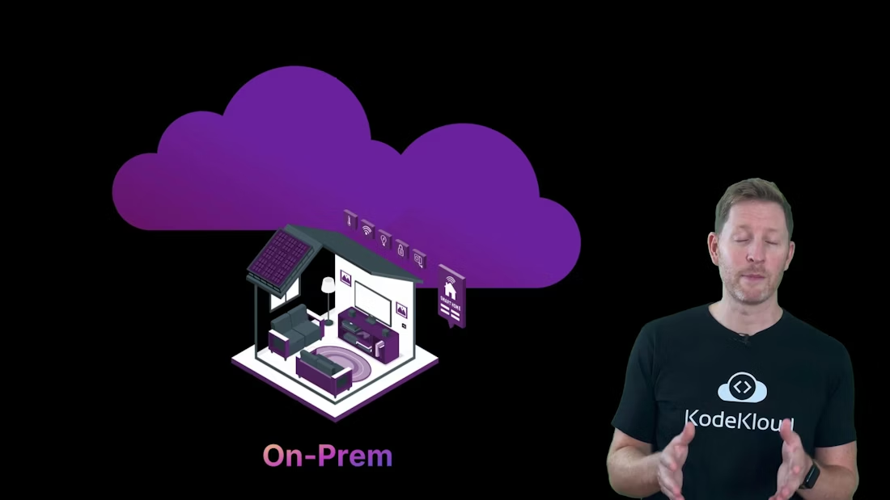
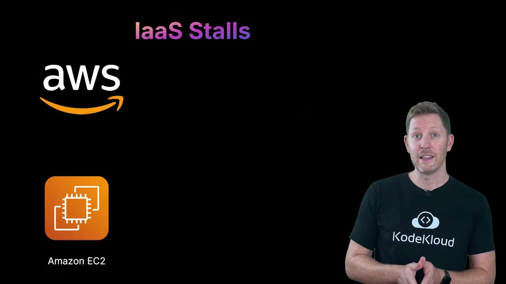
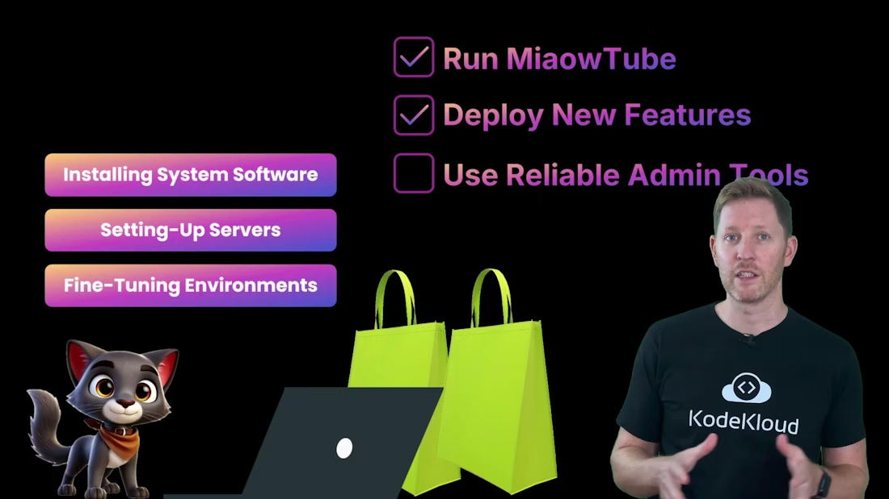
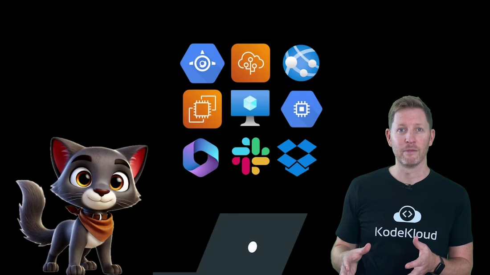
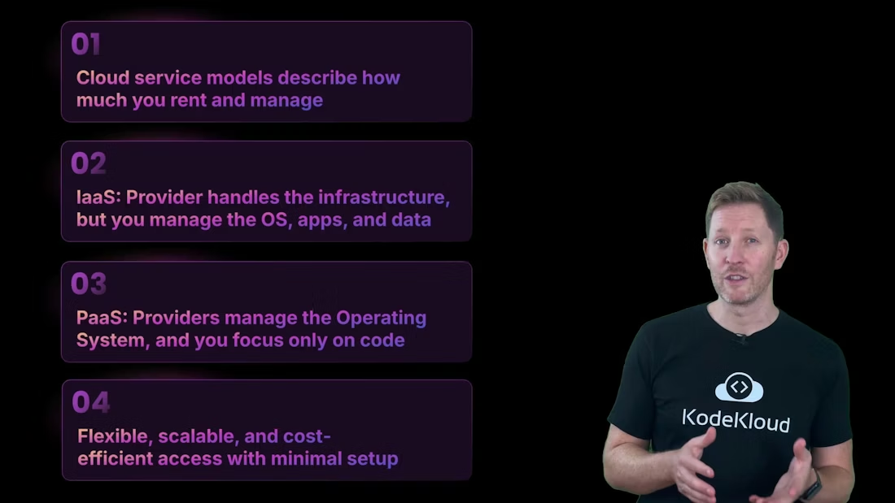

> ## Documentation Index
>
> Fetch the complete documentation index at: https://notes.kodekloud.com/llms.txt
> Use this file to discover all available pages before exploring further.

# Cloud Service Models

> Explains IaaS PaaS and SaaS, comparing responsibility splits, examples, use cases, and guidance for choosing appropriate cloud or on premises models

This lesson builds on the NIST definition of cloud computing: on-demand network access to pooled resources, rapid elasticity, and measurable usage. We’ll use a layered view of responsibility — from physical hardware up to the application — to compare how much the customer manages versus the cloud provider.

<Frame>
    
</Frame>

<Callout icon="lightbulb" color="#1CB2FE">
  By the end of this lesson you will be able to:

* Compare cloud service models (IaaS, PaaS, SaaS) by responsibility split between customer and provider.
* Identify real-world examples for each model.
* Recommend which model best fits a given business need.
  `</Callout>`

We’ll simplify the stack into three core layers:

* Physical infrastructure (data center, servers, networking, storage)
* Platform (operating system, runtime, middleware)
* Application (your code, data, user-facing services)

Each cloud model shifts responsibility for these layers between you and the provider.

IaaS — Infrastructure as a Service

* The provider supplies the foundational infrastructure: servers, storage, networking, and virtualization.
* You (the customer) install and manage the operating system, application runtimes, applications, and data.
* This gives flexibility and control over architecture and configuration, but you remain responsible for OS patching, security configuration, and application lifecycle.

  

<Frame>
    
</Frame>

PaaS — Platform as a Service

* The provider manages the infrastructure and the underlying platform (OS, runtime, middleware).
* You focus on deploying and managing your application code and data.
* PaaS reduces operational overhead and accelerates development and deployment cycles by handling provisioning, OS maintenance, and scaling.

SaaS — Software as a Service

* The provider manages infrastructure, platform, and the application itself.
* You simply use the software (via browser or API) and handle only configuration and user-level administration.
* This model maximizes convenience and minimizes operations work for end-users.

  

<Frame>
    
</Frame>

Analogy: Renting homes

* Infrastructure = building shell (walls, wiring, plumbing, power)
* Platform = fixtures and fittings (kitchen, appliances, heating)
* Software = how you use the space (cooking, relaxing, hosting guests)
* IaaS is like an unfurnished apartment — landlord maintains building systems, you furnish and maintain the interior.
* PaaS is like a furnished apartment with working appliances — you bring personal items and start using it.
* SaaS is like a hotel room — everything is managed; you check in and use the service.

  

<Frame>
    
</Frame>

On-premises vs Cloud

* On-premises: the organization owns and operates every layer — hardware, OS, platform, and application.
* Cloud: responsibility is shared and depends on the chosen service model.

  

<Frame>
    
</Frame>

Concrete example — MiaoTube maps needs to models
MiaoTube’s DIY servers are slowing feature delivery because the team spends too much time on patching, upgrades, and firefighting. At the Cloud Solutions Expo they match three priorities to cloud models:

1. Run the video pipeline (uploads, processing, streaming) without managing physical servers.
2. Deploy new features quickly (comments, tagging, search) with minimal system setup.
3. Use reliable admin tools (email, docs, team calls) without building backend services.

IaaS options such as [Amazon EC2](https://aws.amazon.com/ec2/), [Azure Virtual Machines](https://azure.microsoft.com/services/virtual-machines/), and [Google Compute Engine](https://cloud.google.com/compute) let MiaoTube run their video pipeline on VMs: the cloud provider handles hardware, while MiaoTube controls OS and application configuration. This satisfies requirement 1.

<Frame>
    
</Frame>

Managed PaaS offerings — for example [Google App Engine](https://cloud.google.com/appengine), [AWS Elastic Beanstalk](https://aws.amazon.com/elasticbeanstalk/), and [Azure App Service](https://azure.microsoft.com/services/app-service/) — let developers push code while the platform takes care of runtime provisioning, scaling, and OS maintenance. These satisfy requirement 2 by enabling faster feature rollout.

<Frame>
    
</Frame>

SaaS tools like [Google Workspace](https://workspace.google.com/), [Microsoft 365](https://www.microsoft.com/microsoft-365), [Dropbox](https://www.dropbox.com/), and [Slack](https://slack.com/) cover requirement 3 — ready-to-use admin and collaboration services with no backend to build or maintain.

By the end of the expo MiaoTube chooses a hybrid approach:

* IaaS for custom, resource-intensive components.
* PaaS to accelerate application development and deployment.
* SaaS for productivity and admin tools.

  

<Frame>
    
</Frame>

Responsibility summary table

| Layer / Model                                 | On-Prem         | IaaS                           | PaaS                                                   | SaaS                                            |
| --------------------------------------------- | --------------- | ------------------------------ | ------------------------------------------------------ | ----------------------------------------------- |
| Physical infra (servers, networking, storage) | You             | Provider                       | Provider                                               | Provider                                        |
| Virtualization / hypervisor                   | You             | Provider                       | Provider                                               | Provider                                        |
| Operating system & runtime                    | You             | You                            | Provider                                               | Provider                                        |
| Application & data                            | You             | You                            | You                                                    | Provider (managed app)                          |
| Typical examples                              | `Self-hosted` | `EC2`, `Azure VM`, `GCE` | `App Engine`, `Elastic Beanstalk`, `App Service` | `Google Workspace`, `Salesforce`, `Slack` |
| Use-case                                      | Maximum control | Flexible VM-based apps         | Fast dev and deploy                                    | End-user applications                           |

Quick check
Which statement is true?
A. IaaS gives you ready-made apps like email and spreadsheets.
B. PaaS requires you to manage the operating system yourself.
C. SaaS handles all the backend, so you can just log in and use it.

Answer: C. SaaS products are fully managed by the provider — you use the app without handling setup, patching, or maintenance. Statement A is false (ready-made apps are SaaS). Statement B is false (with PaaS the provider manages the OS and runtime).

Recap

* Cloud service models define how much of the IT stack you rent versus manage.

  * IaaS: provider handles infrastructure; you manage OS, apps, and data.
  * PaaS: provider also manages OS and platform; you focus on code and data.
  * SaaS: provider manages everything; you use the software.
* The trade-off: more provider responsibility reduces operational complexity but also reduces direct control.
* Most organizations use a mix of models to balance control, speed, and cost.

  

<Frame>
    
</Frame>

Next up: deployment models — how cloud infrastructure is hosted and shared (public, private, hybrid, and community clouds). See the following resources for further reading and real-world service documentation.

Links and references

* [Amazon EC2 (IaaS)](https://aws.amazon.com/ec2/)
* [Google Compute Engine (IaaS)](https://cloud.google.com/compute)
* [Azure Virtual Machines (IaaS)](https://azure.microsoft.com/services/virtual-machines/)
* [Google App Engine (PaaS)](https://cloud.google.com/appengine)
* [AWS Elastic Beanstalk (PaaS)](https://aws.amazon.com/elasticbeanstalk/)
* [Azure App Service (PaaS)](https://azure.microsoft.com/services/app-service/)
* [Google Workspace (SaaS)](https://workspace.google.com/)
* [Microsoft 365 (SaaS)](https://www.microsoft.com/microsoft-365)

<CardGroup>
  <Card title="Watch Video" icon="video" cta="Learn more" href="https://learn.kodekloud.com/user/courses/cloud-computing-fundamentals/module/e16354f3-264c-4514-bd13-a1d03d4b9dd5/lesson/41ef75e1-360a-445d-88c8-1f7fd7f40c48" />
</CardGroup>

Built with [Mintlify](https://mintlify.com).
