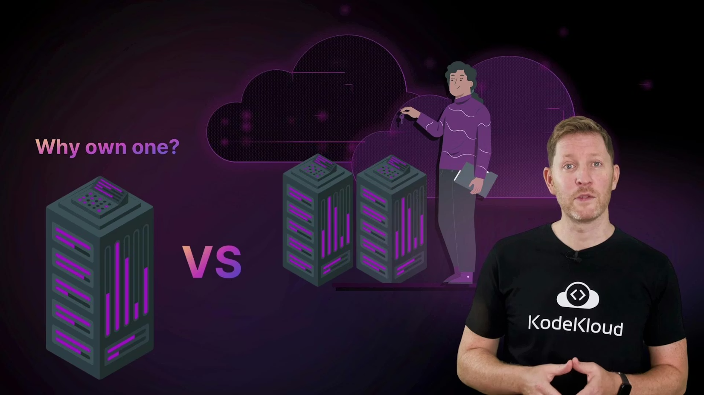
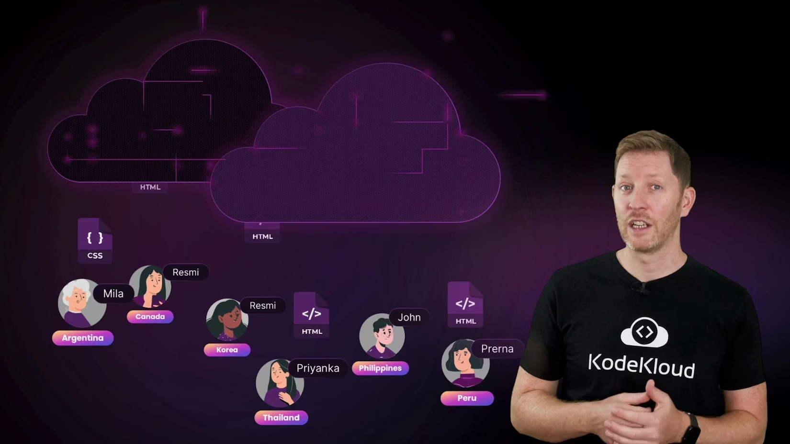
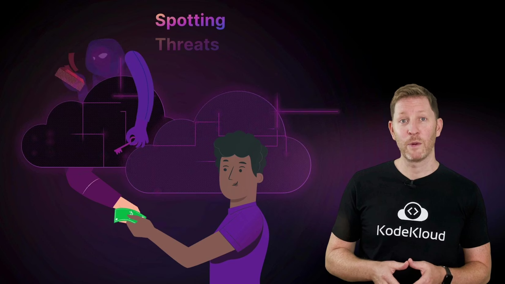
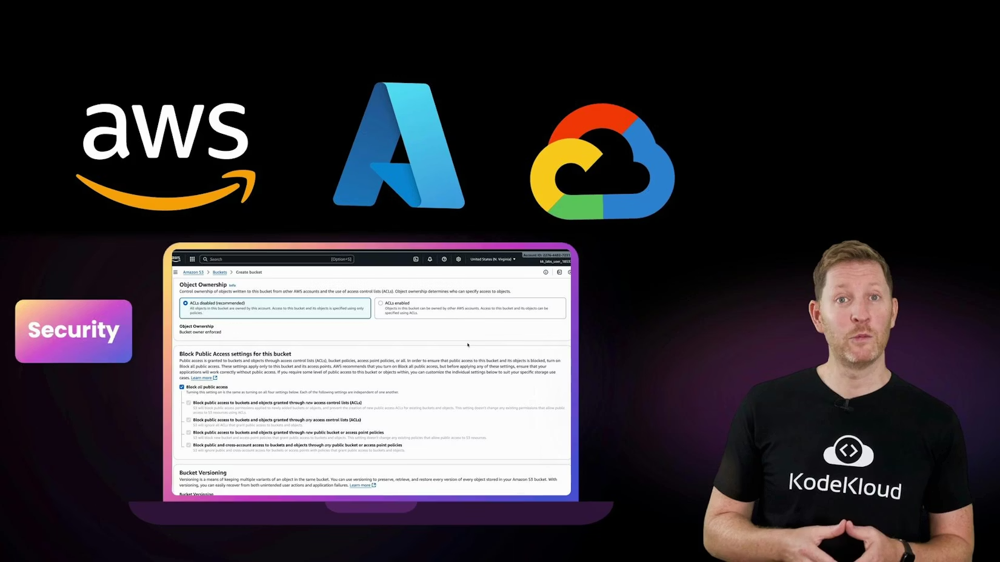

> ## Documentation Index
>
> Fetch the complete documentation index at: https://notes.kodekloud.com/llms.txt
> Use this file to discover all available pages before exploring further.

# Course Introduction

> Overview of cloud computing fundamentals covering service models, deployment options, scalability, storage, security, cost management, and hands-on labs with major providers.

Picture this: you snap a photo on your phone and it’s instantly backed up and accessible anywhere in the world. Or a business launches a website that serves millions of users overnight without buying a single new server. How is this possible? Cloud computing — the technology powering much of our connected world.

Hi, I’m Alan. In this lesson we’ll unpack the core ideas behind the cloud, explore how it’s changing IT, and show you how to make the most of its flexibility and power. Below is a quick overview of what you’ll learn and why it matters.

What you’ll learn

* Core differences between cloud and traditional IT: renting compute and storage vs. owning hardware.
* Cloud service models (IaaS, PaaS, SaaS) and how each shifts control and responsibility.
* Deployment approaches (public, private, hybrid, multi-cloud) and real-world use cases.
* How cloud providers run code at scale, store and distribute data globally, and support different database types.
* Security responsibilities, common threats, and practical cost-management techniques.
* Hands-on experience creating, monitoring, and cleaning up cloud resources on major providers.

  

<Frame>
    
</Frame>

Why cloud is different (quick summary)

* Rent vs own: Cloud lets you pay for capacity when you need it rather than buying and maintaining physical servers.
* Elasticity: Scale up or down quickly to match demand.
* Operational trade-offs: You trade some direct control for faster provisioning, managed services, and operational simplicity.
* Business impact: Faster iteration, reduced time-to-market, and often better cost-efficiency when workloads are variable.

Cloud service models at a glance

| Service Model                      | What you manage            | What the provider manages           | Typical use case                                |
| ---------------------------------- | -------------------------- | ----------------------------------- | ----------------------------------------------- |
| IaaS (Infrastructure as a Service) | OS, runtimes, applications | Servers, virtualization, networking | Lift-and-shift VMs, custom platforms            |
| PaaS (Platform as a Service)       | Applications, data         | OS, runtimes, middleware, scaling   | Web apps, microservices, developer productivity |
| SaaS (Software as a Service)       | User data, configuration   | Entire stack and app                | Email, CRM, collaboration tools                 |

Deployment approaches and when to choose them

| Deployment Model | When to use it                                          | Example                              |
| ---------------- | ------------------------------------------------------- | ------------------------------------ |
| Public cloud     | Rapid scaling, pay-as-you-go, no datacenter management  | Startups, bursty workloads           |
| Private cloud    | Strict compliance, full control                         | Regulated industries                 |
| Hybrid cloud     | Mix of on-prem and cloud for flexibility                | Gradual cloud migration              |
| Multi-cloud      | Avoid vendor lock-in or leverage best-of-breed services | Large enterprises with diverse needs |

Next, we’ll break down the main cloud service models and show how each shifts the balance between user control and provider convenience, with practical examples.

You’ll also learn the key approaches to deploying cloud environments and how each fits different needs, with quick examples of where and why organizations choose them.

Then we’ll peek behind the scenes. You’ll see how the cloud runs code at scale, stores massive amounts of data, distributes it globally with low latency, and supports a range of database types.

<Frame>
    
</Frame>

How cloud services operate at scale (high level)

* Compute: Auto-scaling groups, serverless functions, and container orchestration run ephemeral workloads and long-lived services.
* Storage: Object storage for large, durable files; block storage for VM disks; file systems for shared access.
* Networking & delivery: CDNs and global load balancers minimize latency for distributed users.
* Data & databases: Relational databases, NoSQL stores, data warehouses, and analytics pipelines support different workloads and SLAs.

Security and cost control matter

* Shared responsibility: Cloud providers secure the infrastructure; customers secure their data, identities, and configurations.
* Common threats: Misconfigured storage, exposed credentials, insecure network rules.
* Cost techniques: Right-sizing, reserved instances or savings plans, scheduling non-production shutdowns, and monitoring spend with alerts and budgets.

  

<Frame>
    
</Frame>

<Callout icon="warning" color="#FF6B6B">
  Cloud resources can incur real costs if left running. Always practice creating and cleaning up resources during labs, and use provider cost controls (budgets, alerts, shutdown schedules) to avoid surprises.
</Callout>

Major cloud providers and hands-on practice
You’ll meet the major cloud providers — [AWS](https://learn.kodekloud.com/user/courses/aws-for-beginners-with-hands-on-labs), [Azure](https://learn.kodekloud.com/user/courses/az900-microsoft-azure-fundamentals), and [Google Cloud](https://learn.kodekloud.com/user/courses/gcp-cloud-digital-leader-certification). This course includes guided labs where you’ll create, inspect, and clean up cloud resources while learning to use provider dashboards for monitoring security posture and costs.

<Frame>
    
</Frame>

<Callout icon="lightbulb" color="#1CB2FE">
  To get the most from the labs: create a free-tier account (if available), follow the cleanup instructions after each lab, and ask questions in the KodeKloud community — hands-on practice is the fastest path to confidence.
</Callout>

Who this lesson is for
Whether you’re aiming to break into tech, modernize an existing business, or satisfy your curiosity, this lesson delivers the foundational knowledge and practical skills to start working with cloud technology confidently. Bring your questions, try the labs, and join the global learning community at KodeKloud.

<CardGroup>
  <Card title="Watch Video" icon="video" cta="Learn more" href="https://learn.kodekloud.com/user/courses/cloud-computing-fundamentals/module/011c3039-0ef4-42f9-8ac1-0633bb3bf667/lesson/32a30d02-13db-4f86-ba8d-6142328a3a1a" />
</CardGroup>

Built with [Mintlify](https://mintlify.com).
