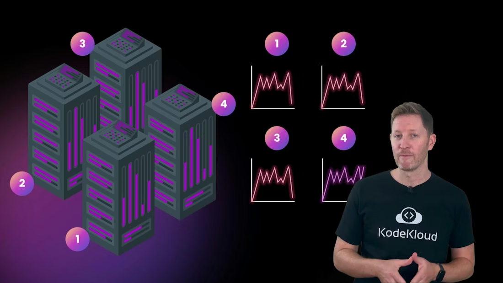
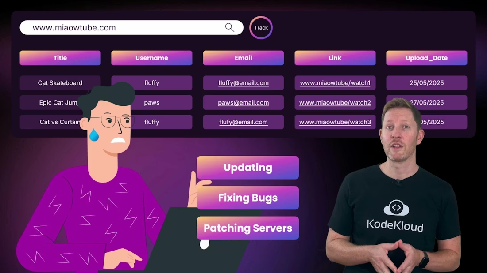
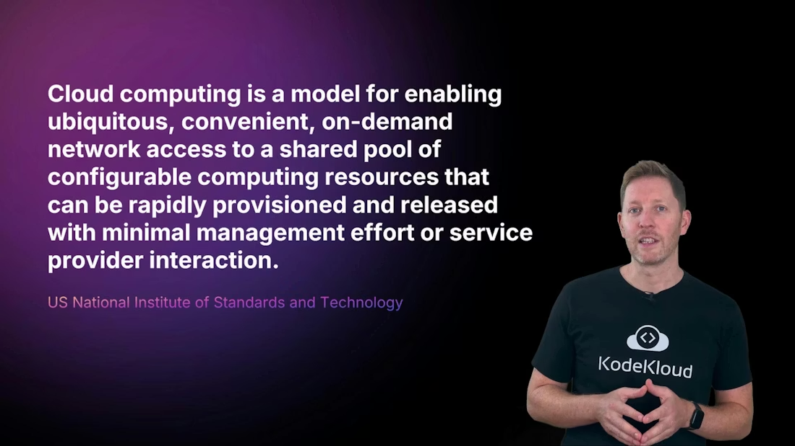
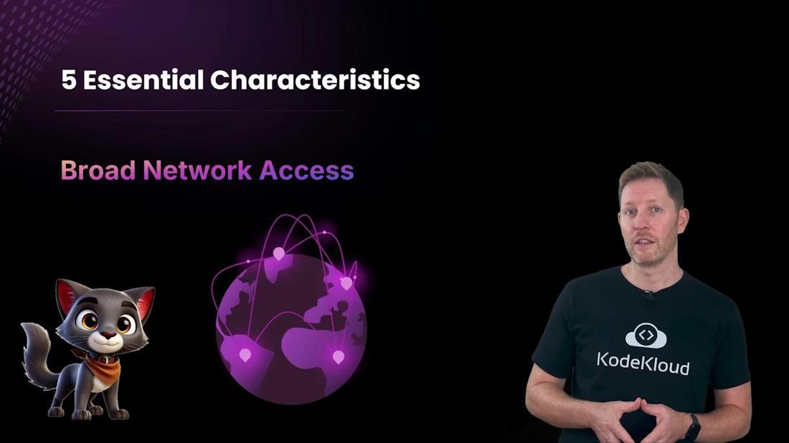
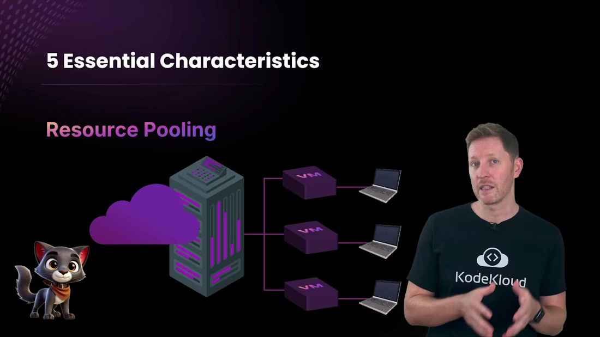
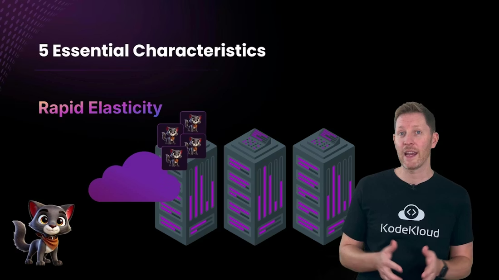
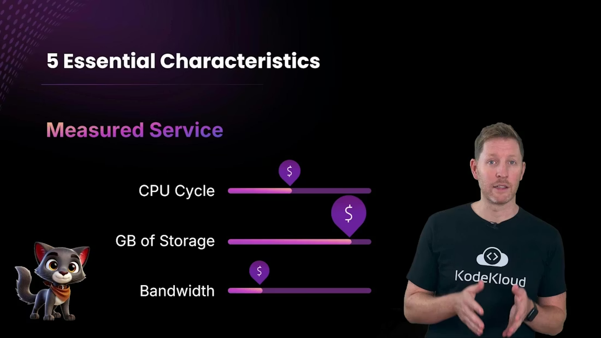
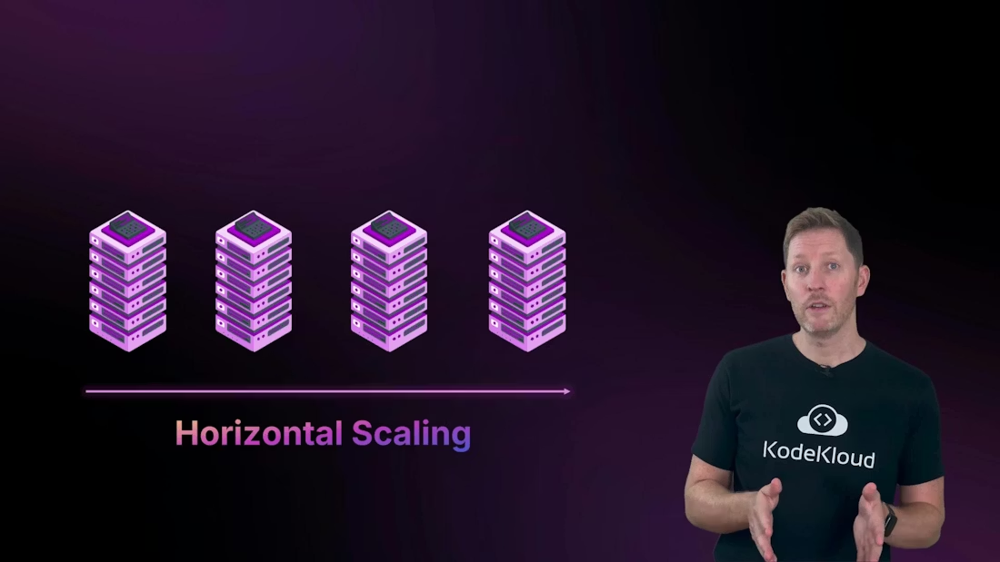
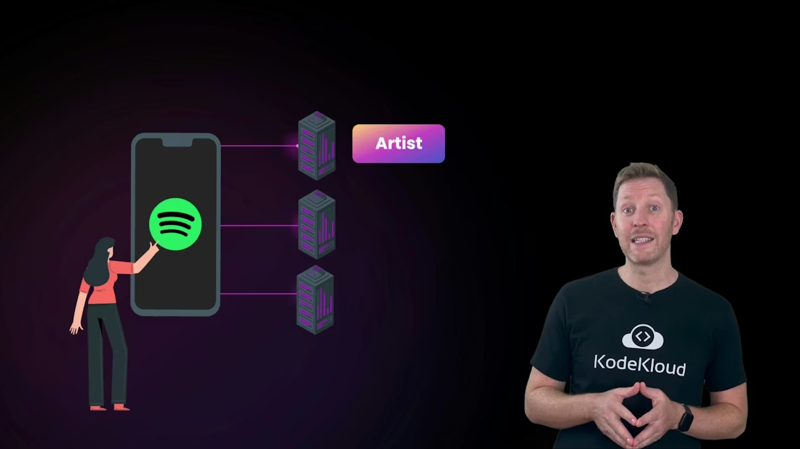

# Why Cloud / 为什么要上云

> Overview of cloud computing fundamentals, NIST definition, five essential characteristics, service and deployment models, and benefits and trade-offs illustrated with a viral app scaling example.
>
> 本章用一个应用爆红后的扩容故事引出云计算基础、NIST 定义、五个基本特性、服务与部署模型，以及云计算的收益和代价。

If you took the [Database Fundamentals](https://learn.kodekloud.com/user/courses/database-fundamentals) course, you’ll remember MeowTube — Kody’s homegrown video site for cats.

如果你学过 [Database Fundamentals](https://learn.kodekloud.com/user/courses/database-fundamentals) 课程，应该还记得 MeowTube——Kody 自己搭建的猫咪视频网站。

Back then, MeowTube ran on a single server in a spare room. When it went viral, the team scrambled to scale: buying and wiring extra servers just to keep up with demand. Scaling back after the spike wasn’t worth the hassle, so the extra machines sat idle, wasting space and money. Working away from the office was a headache.

那时候，MeowTube 只运行在杂物间里的一台服务器上。等它突然爆红后，团队只能手忙脚乱地扩容：赶紧买服务器、接线、上架，只为了跟上不断上涨的访问量。等流量回落之后，再把机器缩回去又太麻烦，于是这些多出来的设备就一直闲着，白白占地方也白白花钱。更麻烦的是，离开办公室后远程维护也很痛苦。

<Frame>
    
</Frame>

Every maintenance task — updating MeowTube’s website, fixing backend bugs, or patching servers — depended on clunky VPNs and slow remote access.

每一次维护任务——更新 MeowTube 网站、修复后端 bug、给服务器打补丁——都得依赖笨重的 VPN 和缓慢的远程访问。

<Frame>
    
</Frame>

Sometimes the systems wouldn’t respond at all. Then they found the cloud.

有时候，这些系统甚至根本不响应。后来，他们找到了云。

## Learning goals / 学习目标

By the end of this lesson you’ll be able to:

学完这一课后，你将能够：

* Explain how cloud computing differs from traditional on-premises infrastructure. / 解释云计算与传统本地基础设施的区别。
* Evaluate the core benefits and trade-offs of cloud computing. / 分析云计算的核心收益与权衡。
* Identify everyday examples of cloud computing in consumer and business contexts. / 识别云计算在日常消费场景和商业场景中的常见例子。

<Callout icon="lightbulb" color="#1CB2FE">
  This lesson covers cloud fundamentals: what cloud computing is, its essential characteristics, the basic service and deployment models, and common real-world examples.
   
  本课覆盖云计算基础：什么是云计算、它的基本特性、基础服务与部署模型，以及常见的真实应用场景。
</Callout>

## What is cloud computing? / 什么是云计算？

At a basic level, instead of buying and managing your own computers, you rent computing resources from a provider. A formal definition from NIST, the US National Institute of Standards and Technology, explains the model more precisely.

从最基础的层面看，云计算就是：你不再自己购买和管理电脑，而是向云厂商租用计算资源。美国国家标准与技术研究院（NIST）的正式定义会把这个模型讲得更精确。

<Frame>
    
</Frame>

NIST defines cloud computing as a model for enabling ubiquitous, convenient, on-demand network access to a shared pool of configurable computing resources — for example, networks, servers, storage, applications, and services — that can be rapidly provisioned and released with minimal management effort or service provider interaction.

NIST 将云计算定义为一种模型：它能让用户通过网络以无处不在、方便、按需的方式访问一个共享的、可配置的计算资源池——比如网络、服务器、存储、应用和服务——并且这些资源可以被快速开通和释放，而只需要极少的管理工作或与服务商的交互。

That definition is compact but important: cloud computing combines several essential characteristics that change how teams build and operate systems. NIST groups these into five essential characteristics, three service models, and four deployment models. Below we focus on the five essential characteristics and their practical impact for Kody and her team.

这一定义虽然简短，但非常重要：云计算把若干关键特性结合在一起，改变了团队构建和运营系统的方式。NIST 将它们分成五个基本特性、三种服务模型和四种部署模型。下面我们先聚焦这五个基本特性，以及它们对 Kody 和她的团队意味着什么。

## 5 essential characteristics / 五个基本特性

### 1. On-demand self-service / 按需自助服务

Kody can provision MeowTube’s resources — a server, a database, or a container — instantly without human intervention from the provider. Provisioning is fast and self-directed.

Kody 可以立刻为 MeowTube 申请资源，比如服务器、数据库或容器，而且不需要云厂商人工介入。整个开通过程又快又是自助式的。

### 2. Broad network access / 广泛的网络访问

Cloud services are available over the internet, not just across internal networks, so Kody and her team can access resources from anywhere and on many device types.

云服务通过互联网提供访问，而不只是局限在内部网络里，所以 Kody 和她的团队可以在任何地方、通过多种设备访问资源。

<Frame>
    
</Frame>

### 3. Resource pooling / 资源池化

Cloud providers pool hardware across many customers. Virtualization and isolation mechanisms ensure each customer’s compute and storage remain logically separated while benefiting from shared, enterprise-grade infrastructure.

云厂商会把硬件资源池化，供很多客户共同使用。虚拟化和隔离机制会确保每个客户的计算和存储在逻辑上彼此分离，同时又能享受到共享的企业级基础设施。

<Frame>
    
</Frame>

This lets teams use powerful infrastructure without capital investment or maintenance overhead.

这让团队可以使用强大的基础设施，而不用先投入大量资本，也不用承担维护负担。

### 4. Rapid elasticity / 快速弹性

Cloud platforms support quick horizontal scaling — adding more machines to share load — and fast vertical scaling when needed. When a kitten video goes viral, additional servers can spin up in seconds and be torn down when traffic drops.

云平台支持快速的横向扩展——通过增加更多机器来分担负载——也支持需要时的快速纵向扩展。当一段小猫视频突然爆红时，更多服务器可以在几秒钟内启动；当流量下降后，它们又可以迅速下线。

<Frame>
    
</Frame>

### 5. Measured service / 可计量服务

Cloud usage is metered: CPU cycles, storage GBs, and network bandwidth are tracked and billed. Usage reports, metrics, and logs make consumption visible and actionable.

云资源是可计量的：CPU 周期、存储容量和网络带宽都会被跟踪并计费。使用报告、指标和日志能让消耗变得可见，也更容易被管理和优化。

<Frame>
    
</Frame>

## Service models and deployment models — quick preview / 服务模型与部署模型速览

Service models describe what you rent, and deployment models describe where it runs. The table below summarizes the core options.

服务模型描述的是“你租什么”，部署模型描述的是“它运行在哪里”。下表总结了最核心的选项。

| Category / 类别             | Common models / 常见模型                            | What it means / 含义                                                                                                             |
| --------------------------- | --------------------------------------------------- | -------------------------------------------------------------------------------------------------------------------------------- |
| Service model / 服务模型    | IaaS (Infrastructure as a Service) / 基础设施即服务 | Raw compute, storage, and networking you configure and manage. / 你自己配置和管理原始计算、存储和网络资源。                      |
| Service model / 服务模型    | PaaS (Platform as a Service) / 平台即服务           | Managed runtime and services for building and running applications. / 提供托管运行环境和服务来构建、运行应用，基础设施负担更少。 |
| Service model / 服务模型    | SaaS (Software as a Service) / 软件即服务           | Fully managed applications delivered over the internet. / 通过互联网交付的完全托管应用。                                         |
| Deployment model / 部署模型 | Public cloud / 公有云                               | Shared infrastructure managed by a provider. / 由云厂商管理的共享基础设施。                                                      |
| Deployment model / 部署模型 | Private cloud / 私有云                              | Dedicated infrastructure for a single organization. / 为单一组织专用的基础设施。                                                 |
| Deployment model / 部署模型 | Hybrid cloud / 混合云                               | A mix of public and private environments for flexibility and compliance. / 公有云与私有环境混合，以兼顾灵活性和合规性。          |
| Deployment model / 部署模型 | Community cloud / 社区云                            | Shared infrastructure for organizations with common needs. / 为有共同需求的组织共享的基础设施。                                  |

As you move from IaaS → PaaS → SaaS, the provider assumes more responsibility for maintenance and operations.

随着你从 IaaS 走向 PaaS，再走向 SaaS，云厂商承担的维护和运维责任会越来越多。

## Pros and cons of the five characteristics / 五个特性的优缺点

### On-demand self-service / 按需自助服务

* Pros: Rapid provisioning speeds development, testing, and recovery. No long hardware procurement cycles. / 优点：快速开通能加速开发、测试和恢复，而且不再受漫长的硬件采购周期限制。
* Cons: Without governance, it’s easy to lose track of resources and incur unexpected costs. / 缺点：如果没有治理，资源很容易失控，也更容易出现意外费用。

### Broad network access / 广泛的网络访问

* Pros: Enables remote work, multi-device access, and distributed teams. / 优点：支持远程办公、多设备访问和分布式团队协作。
* Cons: Reliance on network connectivity means outages or poor links affect access. / 缺点：高度依赖网络连接，网络中断或链路质量差都会影响访问。

### Resource pooling / 资源池化

* Pros: Access to enterprise-grade hardware and managed services without capital expense. / 优点：无需资本开支就能使用企业级硬件和托管服务。
* Cons: Shared infrastructure introduces multi-tenant risk; misconfigurations can create exposure. / 缺点：共享基础设施会带来多租户风险，配置错误也可能造成暴露。

### Rapid elasticity / 快速弹性

* Pros: Automatically match capacity to demand; horizontal scaling increases fault tolerance. / 优点：容量可以自动匹配需求，横向扩展还能提升容错能力。
* Cons: Applications not designed for scaling can be costly to autoscale or may fail to scale properly. / 缺点：如果应用本身不适合扩展，自动扩缩容会很贵，甚至无法正常扩展。

  

<Frame>
    
</Frame>

### Measured service / 可计量服务

* Pros: Detailed metrics and billing help optimize costs and improve security and operations. / 优点：详细指标和计费信息有助于优化成本，并改进安全与运维。
* Cons: You must actively monitor usage and configure alerts or cost controls to avoid surprises. / 缺点：你必须主动监控使用情况，并配置告警和成本控制，否则很容易出现意外。

<Callout icon="warning" color="#FF6B6B">
  Cloud is powerful, but poor governance or architecture can lead to cost overruns, security gaps, or availability issues. Plan resource lifecycle and monitoring from day one.
   
  云计算很强大，但如果治理或架构做得不好，就可能出现成本超支、安全漏洞或可用性问题。从第一天开始就要规划资源生命周期和监控。
</Callout>

## Everyday examples of cloud computing / 云计算的日常例子

Cloud services power many apps you use every day.

云服务支撑着许多你每天都会用到的应用。

* Travel booking sites (for example, Booking.com) fetch reservations from cloud backends rather than local device storage. / 旅行预订网站（例如 Booking.com）会从云端后端获取预订信息，而不是从本地设备存储读取。
* Music streaming (for example, Spotify) streams tracks and metadata from cloud servers on demand rather than storing everything locally. / 音乐流媒体（例如 Spotify）会按需从云服务器流式传输歌曲和元数据，而不是把所有内容都保存在本地。

  

<Frame>
    
</Frame>

* Food delivery apps coordinate menus, payments, and courier locations in real time through cloud systems. / 外卖应用通过云系统实时协调菜单、支付和骑手位置。
* Collaboration tools, such as Google Docs, enable simultaneous editing because the document state lives in the cloud. / 协作工具，例如 Google Docs，可以支持多人同时编辑，因为文档状态保存在云端。
* Many business databases and managed services now run in the cloud. See the [Database Fundamentals](https://learn.kodekloud.com/user/courses/database-fundamentals) course for examples. / 许多企业数据库和托管服务如今也运行在云中。你可以参考 [Database Fundamentals](https://learn.kodekloud.com/user/courses/database-fundamentals) 课程了解更多例子。

## Quick quiz / 小测验

Which of the following statements is true?

以下哪一项说法是正确的？

A. Cloud computing lets you rent IT resources from providers instead of buying servers. / 云计算让你可以向云厂商租用 IT 资源，而不是自己买服务器。
B. The biggest benefit of cloud is that it’s always cheaper than on-premises. / 云计算最大的好处就是一定比本地部署更便宜。
C. Everyday apps like Spotify and Booking.com mostly run on your phone, not in the cloud. / Spotify 和 Booking.com 这类日常应用主要都运行在你的手机上，而不是云端。

Pause now. Welcome back.

先暂停一下，准备好后再往下看。

Correct answer: A. Cloud resources are delivered from providers’ data centers, so you don’t own the hardware.

正确答案：A。云资源来自云厂商的数据中心，所以你并不拥有这些硬件。

B is a myth — total cost depends on design, usage patterns, and management. C is misleading — user devices provide the interface, but heavy compute and storage are typically in the cloud.

B 是一种误解，因为总成本取决于设计、使用模式和管理方式。C 也容易误导，因为用户设备只是提供界面，而大量计算和存储通常都在云端完成。

## Recap / 回顾

Before cloud adoption, organizations depended on slow, expensive on-premises infrastructure. NIST’s definition and the five essential characteristics capture why cloud changed the game:

在上云之前，组织通常依赖缓慢且昂贵的本地基础设施。NIST 的定义和五个基本特性很好地解释了为什么云计算改变了游戏规则：

* On-demand self-service / 按需自助服务
* Broad network access / 广泛的网络访问
* Resource pooling / 资源池化
* Rapid elasticity / 快速弹性
* Measured service / 可计量服务

Cloud computing offers flexible, scalable, and potentially cost-effective access to IT resources with reduced setup and maintenance. To realize those benefits, teams need strong architecture, governance, and monitoring to control costs and maintain security and availability.

云计算提供了灵活、可扩展、并且在合适情况下具有成本优势的 IT 资源访问方式，同时减少了搭建和维护工作。要真正获得这些收益，团队需要良好的架构、治理和监控，才能控制成本并维持安全性与可用性。

## Next steps / 下一步

We’ll dive next into the three service models — IaaS, PaaS, and SaaS — to clarify responsibilities and trade-offs so you can choose the right model for MeowTube or your own projects.

下一步，我们会进入三种服务模型——IaaS、PaaS 和 SaaS——来讲清楚责任划分和权衡关系，这样你就能为 MeowTube 或自己的项目选择合适的模型。

## Links and references / 链接与参考

* NIST Cloud Definition: [https://nvlpubs.nist.gov/nistpubs/Legacy/SP/nistspecialpublication800-145.pdf](https://nvlpubs.nist.gov/nistpubs/Legacy/SP/nistspecialpublication800-145.pdf)
* [Database Fundamentals — KodeKloud course](https://learn.kodekloud.com/user/courses/database-fundamentals)

<CardGroup>
  <Card title="Watch Video" icon="video" cta="Learn more" href="https://learn.kodekloud.com/user/courses/cloud-computing-fundamentals/module/011c3039-0ef4-42f9-8ac1-0633bb3bf667/lesson/0c524470-858d-484d-9248-60dc2e27b789" />
</CardGroup>

Built with [Mintlify](https://mintlify.com).
