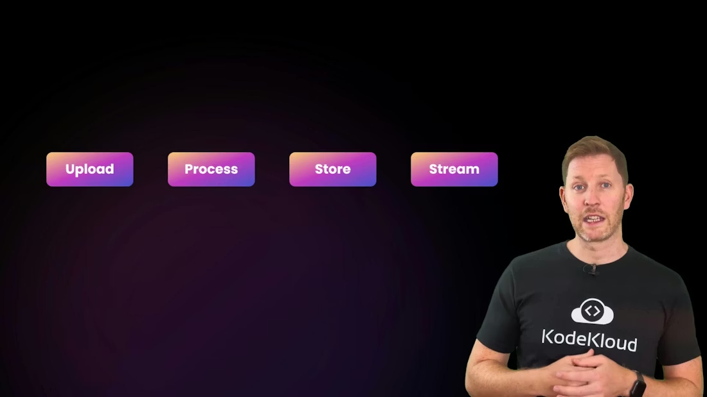
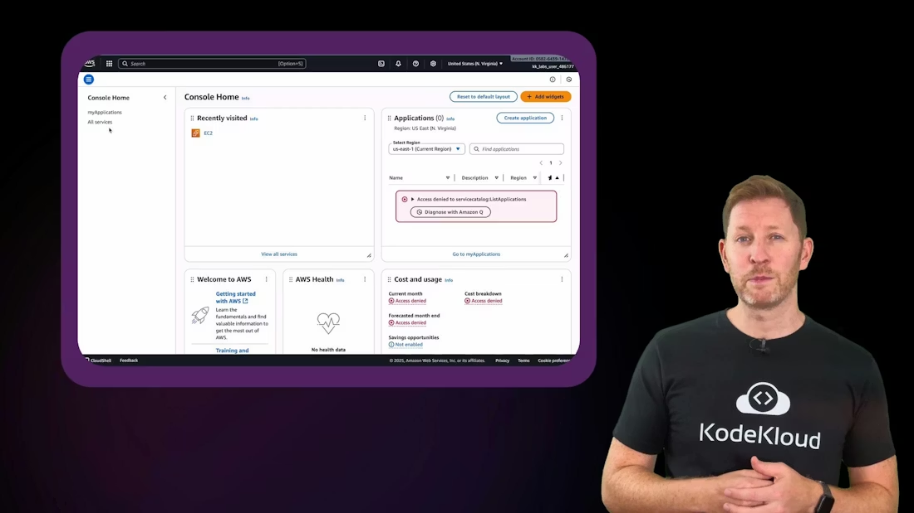
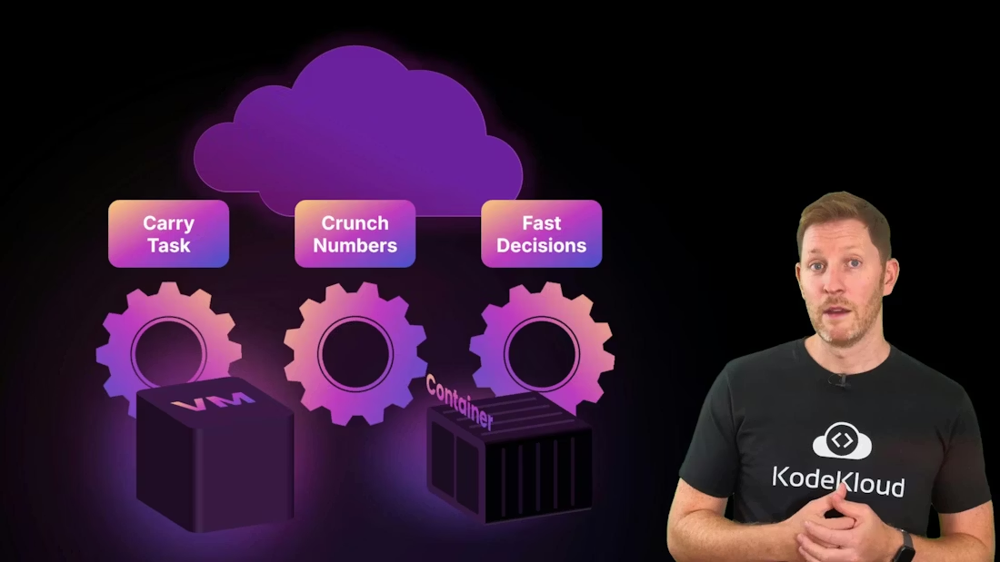
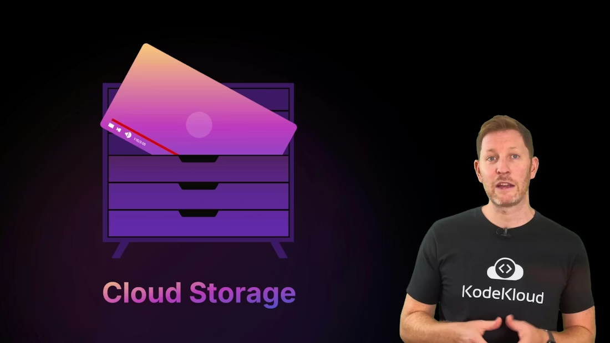
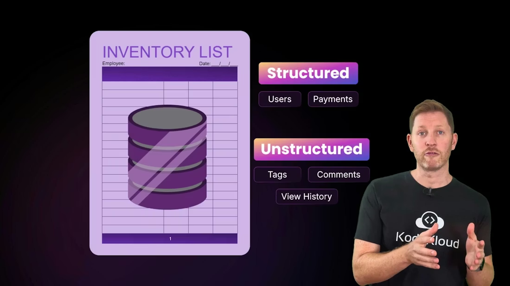
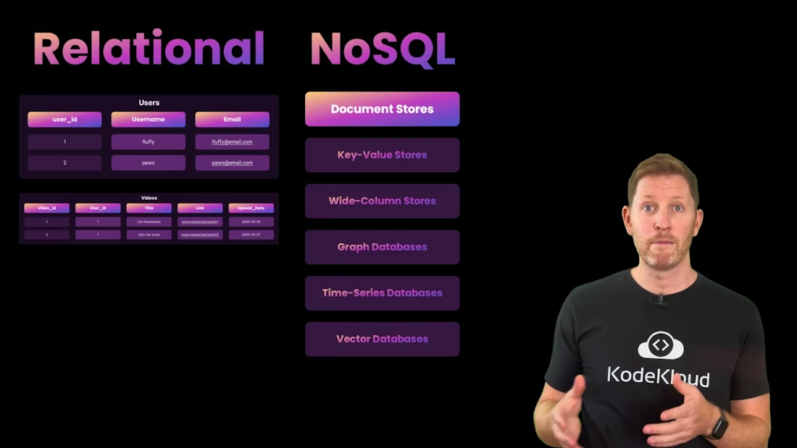
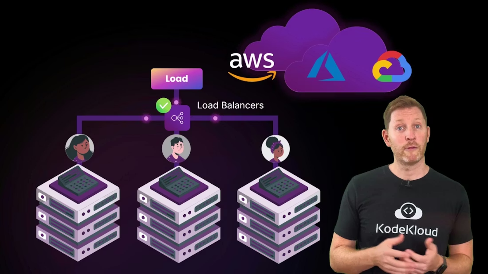
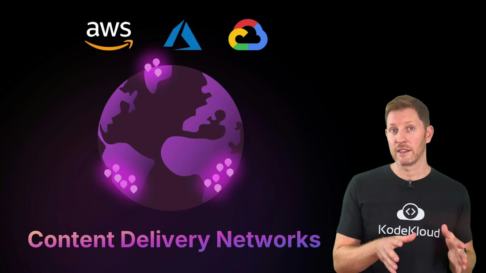
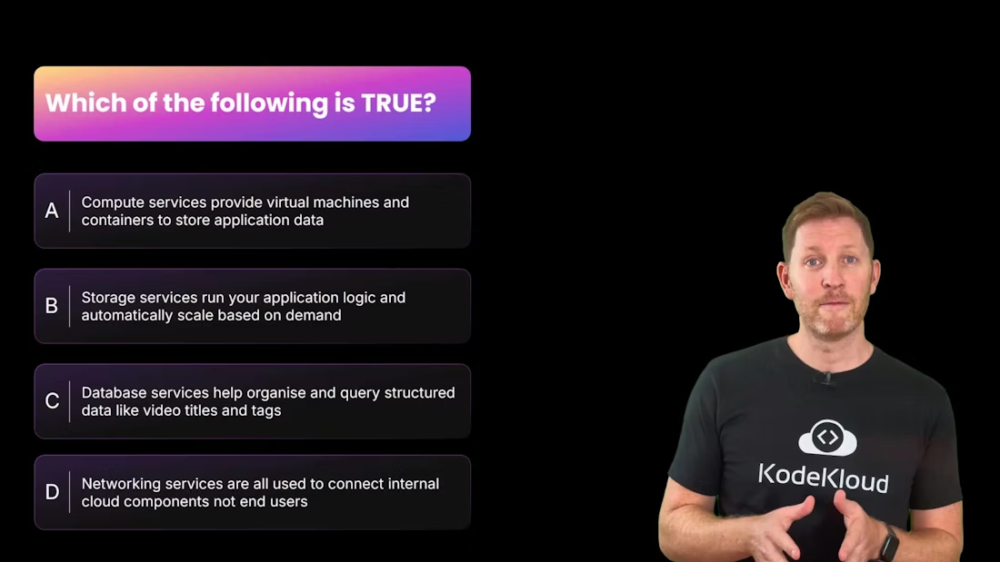
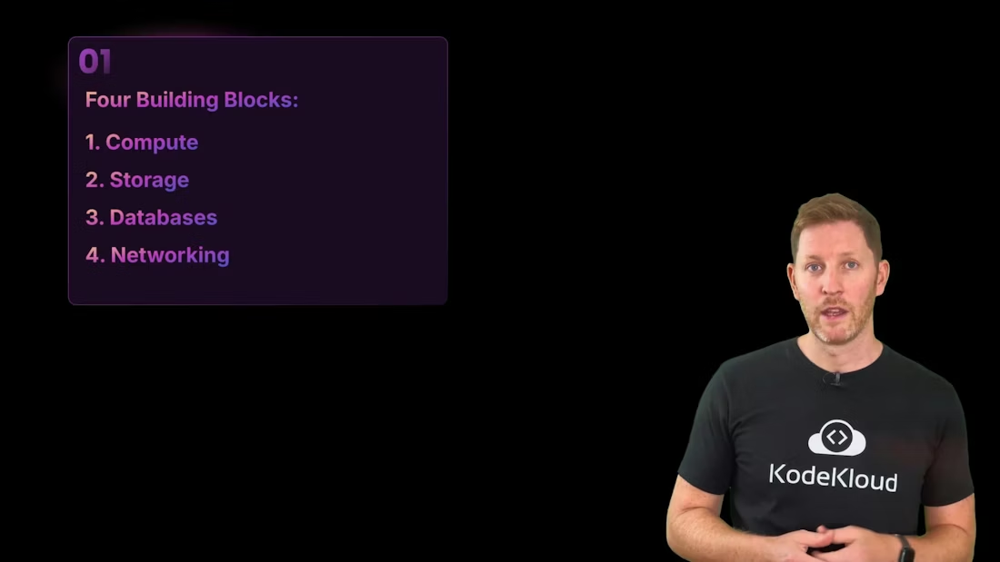

# What Happens in the Cloud / 云里到底发生了什么

> 中文：这一章用一个视频平台的典型流程来解释云计算的内部工作方式：上传、处理、存储、索引、分发。你会看到计算、存储、数据库和网络是如何像一条生产线那样协作的。
>
> English: This chapter uses a typical video platform flow to explain how cloud computing works internally: upload, process, store, index, and deliver. You will see how compute, storage, databases, and networking cooperate like a production line.

Yahoo’s new Remix feature just went viral. Millions of users upload clips, edit videos in the browser, and watch content around the world simultaneously, with no buffering and no late-night calls to IT. How does that scale?

秘密不是某一台超级服务器，而是一整套云服务工厂在协同工作：计算负责扩容和处理，存储负责保存耐久媒体，数据库负责整理元数据，网络负责把内容送到最接近用户的地方。

English: The secret is not a single super-server. It is a whole factory of cloud services working together: scaling compute, storing durable media, organizing metadata in databases, and delivering content over optimized networks. This article follows the typical steps a Remix video takes, from upload to global playback, and explains the core cloud building blocks that make it possible.



<Frame>
    
</Frame>

## 1. The big picture / 总览

Cloud dashboards can look like a jungle of services,

云控制台看起来常常像一片服务丛林，



<Frame>
    
</Frame>

but most systems are built from four repeatable building blocks: Compute, Storage, Databases, and Networking.

但大多数系统其实都可以拆成四个可重复的基础模块：计算、存储、数据库和网络。

These foundations power modern platforms and keep front-end experiences smooth and responsive.

它们一起支撑现代平台，让前端体验保持流畅、稳定且可扩展。

After reading this article, you’ll be able to describe how compute, storage, databases, and networking work together to run, store, manage, and deliver applications at scale.

读完这一章后，你将能够描述计算、存储、数据库和网络如何协作，在大规模环境下运行、保存、管理和分发应用。

---

## 2. Compute / 计算

### Compute — the brain that runs the work / 计算：执行工作的“大脑”

When Remix launched, millions began editing, cropping, and rendering videos in the browser. That processing doesn’t all run on each user’s device — cloud compute services perform the heavy lifting.

中文：当 Remix 上线后，数百万用户开始在浏览器里编辑、裁剪和渲染视频。这些处理并不会全部在每个用户的设备上完成，而是由云计算服务承担大部分重活。

English: When Remix launched, millions began editing, cropping, and rendering videos in the browser. That processing does not all run on each user’s device. Cloud compute services perform the heavy lifting.

Cloud compute executes tasks, processes data, and makes fast decisions. In practice, this means launching virtual machines (VMs) or containers to run code.

中文：云计算的职责就是执行任务、处理数据、快速做决策。在实践里，这通常意味着启动虚拟机（VM）或容器来运行代码。



<Frame>
    
</Frame>

* Virtual machines (VMs) simulate a full computer with their own OS. Use VMs for strong isolation, custom OS-level configuration, or long-running tasks like large video transcodes or scheduled batch jobs. / 虚拟机（VM）会模拟一整台计算机并运行自己的操作系统。适合强隔离、自定义系统级配置，或长时间运行的任务，比如大规模视频转码和定时批处理。
* Containers package an app and its dependencies while sharing the host kernel. They start quickly and scale horizontally, making them ideal for short-lived micro-tasks: trimming clips, applying filters, or handling uploads. / 容器会把应用及其依赖打包在一起，但共享宿主机内核。它启动快、横向扩展快，非常适合短生命周期的小任务，比如裁剪片段、应用滤镜或处理上传。

MiaoTube, the Remix backend example, typically uses containers for interactive editing and fast autoscaling. For heavier workloads, like long transcoding runs or large batch jobs, VMs can be used in the background so the UI stays responsive even under peak load.

中文：MiaoTube 这个 Remix 后端示例通常会用容器来处理交互式编辑和快速自动扩容。对于更重的工作负载，比如长时间转码或大批量任务，则可以在后台使用 VM，这样即使在峰值负载下，界面也能保持响应。

---

## 3. Storage / 存储

### Storage — the cloud’s filing cabinet / 存储：云端文件柜

Once a user finishes editing, the results must be saved safely and durably. Cloud storage provides that persistence.

当用户完成编辑后，结果必须被安全且持久地保存下来。云存储就负责提供这种持久性。



<Frame>
    
</Frame>

Although we say “the cloud,” storage is still physical disks and SSDs in data centers. The cloud abstracts that hardware behind APIs, letting you focus on files and objects instead of rack-level maintenance.

虽然我们口头上说“云”，但存储本质上仍然是数据中心里的磁盘和 SSD。云只是把这些硬件抽象成 API，让你关注文件和对象，而不是机架层面的维护。

Common cloud storage types:

常见云存储类型如下：

| Storage Type / 存储类型   | Characteristics / 特点                                                                                       | Best for / 适合场景                                                                                   |
| ------------------------- | ------------------------------------------------------------------------------------------------------------ | ----------------------------------------------------------------------------------------------------- |
| Block storage / 块存储    | Fixed-size blocks, low latency, presented as volumes / 固定大小的数据块，低延迟，以卷的形式呈现              | VM disks, active databases / 虚拟机磁盘、活跃数据库                                                   |
| File storage / 文件存储   | Hierarchical filesystem with folders and paths / 分层文件系统，有文件夹和路径                                | Shared workloads, legacy apps expecting POSIX filesystems / 共享工作负载、依赖 POSIX 文件系统的旧应用 |
| Object storage / 对象存储 | Flat namespace, objects with metadata and keys, highly scalable / 扁平命名空间，带元数据和键的对象，极易扩展 | Large media files, thumbnails, static assets, archives / 大型媒体文件、缩略图、静态资源、归档         |

Example file path (file storage):

文件存储里的路径示例：

```text
/projects/remix/video1.mov
```

In object storage, the media is accessed by a key and metadata, not a nested path. Object stores are the common choice for media-heavy apps because they scale cheaply and integrate well with CDNs and metadata-based searches.

在对象存储里，媒体是通过键和元数据访问的，而不是通过嵌套路径。对象存储是媒体型应用的常见选择，因为它扩展成本低，并且和 CDN、基于元数据的搜索配合得很好。

<Callout icon="lightbulb" color="#1CB2FE">
    Object storage is optimized for durability and scale. Use block storage for fast random I/O and file storage when an application expects a filesystem interface.

    对象存储重点优化的是耐久性和规模。需要快速随机 I/O 时选块存储；应用期望文件系统接口时选文件存储。`</Callout>`

---

## 4. Databases / 数据库

### Databases — the cloud’s working memory / 数据库：云里的“工作记忆”

Every time a user likes a video, saves a draft, or edits a remix, those actions must be recorded and available across devices. Databases provide the structured and unstructured data stores that keep the app consistent and searchable.

每当用户点赞视频、保存草稿或编辑 Remix 时，这些动作都必须被记录下来，并且能在不同设备之间保持一致。数据库提供了结构化和非结构化数据存储，让应用保持一致性并具备可搜索性。



<Frame>
    
</Frame>

Relational (SQL) databases are great for structured data, strong consistency, and complex queries, for example user accounts and payments. NoSQL stores are designed for flexible schemas, massive scale, and fast writes, useful for feeds, metadata, session data, and edit histories.

关系型（SQL）数据库非常适合结构化数据、强一致性和复杂查询，比如用户账号和支付记录。NoSQL 存储则更适合灵活模式、大规模和快速写入，常用于动态信息流、元数据、会话数据和编辑历史。



<Frame>
    
</Frame>

In modern cloud architectures, databases are commonly provided as managed services. That means the provider handles provisioning, scaling, replication, monitoring, and backups so developers can focus on schema design and queries.

在现代云架构中，数据库通常以托管服务形式提供。这意味着云厂商会负责开通、扩容、复制、监控和备份，开发者就可以把精力放在 schema 设计和查询上。


<Frame>
    
</Frame>

MiaoTube uses both: a relational DB for user accounts and access control, and a flexible NoSQL store for Remix metadata, personalization, and edit history. Managed databases reduce operational burden and make it easier to scale safely.

MiaoTube 两种数据库都会用到：关系型数据库负责用户账号和访问控制，灵活的 NoSQL 存储负责 Remix 元数据、个性化和编辑历史。托管数据库降低了运维负担，也让安全扩展变得更容易。

---

## 5. Networking / 网络

### Networking — routing, balancing, and delivering content / 网络：路由、负载均衡和内容分发

After processing and storage, media must be delivered worldwide. Cloud networking is a system of smart highways: routing requests, balancing load, and delivering cached content from the closest edge.

在处理和存储之后，媒体还必须被送到世界各地。云网络就像一套智能高速公路系统：负责路由请求、平衡负载，并把缓存内容从最近的边缘节点送出去。

Think about these four networking responsibilities:

可以从四个网络职责来理解：

* Availability: Multiple regions and availability zones provide geographic distribution and fault tolerance. / 可用性：多个区域和可用区提供地理分布和故障容错。
* Routing: Traffic is directed to healthy, nearby, and lightly loaded servers for optimal latency. / 路由：流量会被引导到健康、较近、负载较轻的服务器，以获得更好的延迟。
* Load balancing: Distributes incoming requests across server instances and reroutes traffic when instances fail. / 负载均衡：把进入的请求分配到不同服务器实例上，并在实例故障时重新路由流量。
* Delivery: CDNs cache popular assets at edge locations to serve content quickly to users worldwide. / 内容分发：CDN 会在边缘节点缓存热门资源，让全球用户都能更快访问。

  

<Frame>
    
</Frame>

CDNs (Content Delivery Networks) are particularly important for media-heavy platforms: they cache videos, thumbnails, and static assets closer to users to reduce startup latency and improve streaming quality.

CDN（内容分发网络）对媒体型平台尤其重要：它会把视频、缩略图和静态资源缓存到离用户更近的地方，从而降低启动延迟并提升播放质量。



<Frame>
    
</Frame>

Bringing the pieces together:

把这些部分组合起来：

* Compute runs Remix at scale (containers for quick tasks, VMs for heavy jobs). / 计算让 Remix 能够规模化运行（容器处理轻量任务，VM 处理重型任务）。
* Storage keeps files safe and accessible (block, file, and object options). / 存储让文件安全、可访问（块存储、文件存储、对象存储各有分工）。
* Databases manage metadata, user preferences, and transactional records. / 数据库管理元数据、用户偏好和事务性记录。
* Networking connects users and accelerates delivery with load balancers and CDNs. / 网络通过负载均衡和 CDN 连接用户并加速内容分发。

  

<Frame>
    
</Frame>

---

## 6. Quick quiz / 小测验

Which of the following statements is true?

以下哪一项说法是正确的？

A. Compute services provide virtual machines and containers to store application data.
B. Storage services run your application logic and automatically scale based on demand.
C. Database services help organize and query structured data, like video titles and tags.
D. Networking services are only used to connect internal cloud components, not end users.

A. 计算服务提供虚拟机和容器来存储应用数据。
B. 存储服务负责运行应用逻辑，并根据需求自动扩容。
C. 数据库服务有助于组织和查询结构化数据，比如视频标题和标签。
D. 网络服务只用于连接云内部组件，不面向最终用户。



<Frame>
    
</Frame>

Pause now.

先暂停一下。

Welcome back. The correct answer is C.

欢迎回来。正确答案是 C。

* Why C is true: Databases are designed to store and query structured data such as video titles, tags, and user records. / C 正确，因为数据库就是用来存储和查询结构化数据的，比如视频标题、标签和用户记录。
* Why the others are false: / 其他选项为什么错：

  * A is false: Compute runs code (VMs and containers); storage is used for persistent data. / A 错在计算负责运行代码（VM 和容器），而存储负责持久化数据。
  * B is false: Storage persists data; compute handles running logic and scaling. / B 错在存储只负责保存数据，运行逻辑和扩容由计算完成。
  * D is false: Networking handles both internal and external traffic, including user-facing delivery. / D 错在网络既处理内部流量，也处理面向用户的流量分发。

  

<Frame>
    
</Frame>

Storage systems persist files, backups, and media (block for low-latency disk, file for compatibility, object for scale). Databases manage structured and unstructured data with managed services that scale on demand. Networking connects everything, routes traffic across regions, and uses CDNs to accelerate global delivery.

存储系统负责保存文件、备份和媒体数据（块存储适合低延迟磁盘，文件存储适合兼容性，对象存储适合规模化）。数据库通过可按需扩展的托管服务管理结构化和非结构化数据。网络把所有东西连接起来，在不同区域之间路由流量，并利用 CDN 加速全球分发。

<Callout icon="warning" color="#FF6B6B">
    Cloud architecture also needs security controls and cost management. We’ll cover cloud security and cost control in a dedicated follow-up article.

    云架构同样需要安全控制和成本管理。我们会在后续专门的文章中讲解云安全和成本控制。`</Callout>`

---

## 7. Links and references / 链接与参考

* [Kubernetes Basics](https://kubernetes.io/docs/concepts/overview/what-is-kubernetes/) — orchestration for containers.
* [AWS Compute Services](https://aws.amazon.com/compute/) — VM and container offerings.
* [Cloud Storage Concepts](https://cloud.google.com/storage/docs) — object, file, and block storage patterns.
* [Content Delivery Networks (CDNs)](https://en.wikipedia.org/wiki/Content_delivery_network) — how CDNs improve delivery.
* [Kubernetes Basics](https://kubernetes.io/docs/concepts/overview/what-is-kubernetes/) — 容器编排基础。
* [AWS Compute Services](https://aws.amazon.com/compute/) — VM 和容器产品。
* [Cloud Storage Concepts](https://cloud.google.com/storage/docs) — 对象、文件和块存储模式。
* [Content Delivery Networks (CDNs)](https://en.wikipedia.org/wiki/Content_delivery_network) — CDN 如何提升分发效率。

You’ve now seen the end-to-end flow: upload → compute → store → index in a database → deliver via networking. These four building blocks — Compute, Storage, Databases, and Networking — form the backbone of modern cloud-native applications.

你现在已经看到了端到端流程：上传 → 计算 → 存储 → 在数据库中索引 → 通过网络分发。这四个模块——计算、存储、数据库和网络——构成了现代云原生应用的骨架。

<CardGroup>
  <Card title="Watch Video" icon="video" cta="Learn more" href="https://learn.kodekloud.com/user/courses/cloud-computing-fundamentals/module/f032d7b9-edae-4154-a304-efac660806f1/lesson/f992fb27-fe20-48cf-9643-f106e4af5272" />
</CardGroup>
