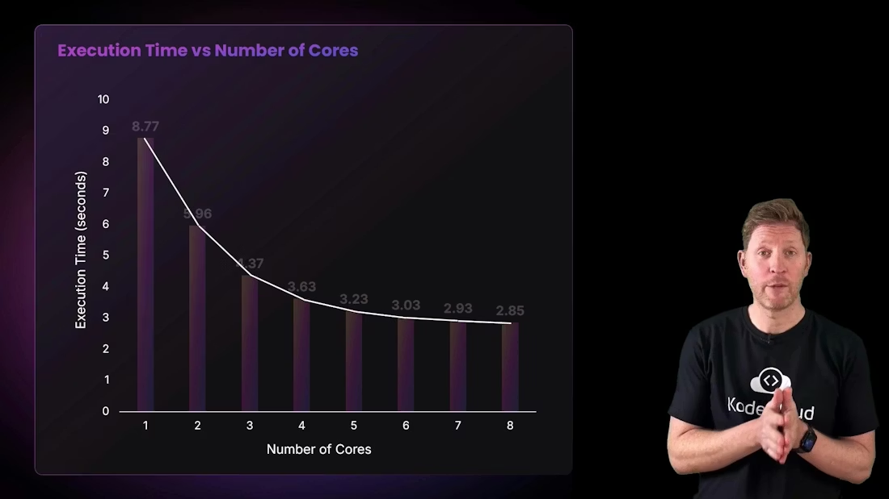

# CPU 执行时间 / CPU Execution Time

> 中文：这是一份中英文对照的性能笔记，重点解释为什么增加核心数可以提升性能，但提升不会线性增长，以及为什么 Amdahl 定律很重要。
>
> English: This is a bilingual performance note focused on why adding CPU cores can improve performance but not linearly, and why Amdahl’s Law matters.

## 1. 为什么核心越多不一定越快 / Why More Cores Are Not Always Linearly Faster

中文：更多处理能力通常会提升性能，但提升不会按理想比例增长。即使核心数翻倍、频率翻倍，执行时间也不一定减半，因为软件和硬件都要协调，且很多任务本身并不能完全并行。

English: More processing power usually improves performance, but the improvement is not linear. Even if you double core count or clock speed, execution time does not necessarily halve because software and hardware still need to coordinate, and many tasks cannot be fully parallelized.


中文：可以把它想成餐厅里多加几个厨师。厨师多了，出餐速度通常会提升，但如果他们要共享同一块操作台、同一套食材和同一个出餐口，效率就不会按人数简单翻倍。CPU 核心也是一样。

English: You can think of it like adding more chefs to a restaurant. More chefs usually help, but if they must share the same counter, the same ingredients, and the same serving area, efficiency will not simply double. CPU cores behave in a similar way.

---

## 2. 共享资源和协调开销 / Shared Resources and Coordination Overhead

中文：当任务被拆分给更多核心时，核心之间仍然要共享内存带宽、缓存、总线和其他系统资源。协调这些资源需要时间，这些协调成本会抵消一部分并行带来的收益。

English: When work is split across more cores, the cores still share memory bandwidth, cache, buses, and other system resources. Coordinating access to those resources takes time, and that coordination cost eats into the benefit of parallelism.

中文：所以我们经常看到“从 1 核到 2 核提升最明显，之后越来越慢”。这不是 CPU 失效，而是因为可并行的部分逐渐用完，剩下的是必须串行完成的部分。

English: That is why we often see “the biggest jump is from 1 core to 2 cores, and then the gains get smaller.” This is not because the CPU stopped working; it is because the parallelizable part gets used up, leaving only the serial part of the workload.

---

## 3. 示例实验 / Example Experiment

中文：这页演示了一个可拆分的计算任务在不同核心数下的运行时间。任务会被重复执行并记录耗时，然后画成一张“核心数 vs 执行时间”的图。

English: This page demonstrates a compute task that can be split across different numbers of cores. The task is executed repeatedly, its elapsed time is measured, and then the result is plotted as “core count vs execution time.”

运行命令 / Run command:

```bash
python3 cpu_demo.py
```

示例输出 / Sample output:

```bash
Testing with 1 CPUs...
CPUs: 1, Time: 9.94 seconds
Testing with 2 CPUs...
CPUs: 2, Time: 6.38 seconds
Testing with 3 CPUs...
CPUs: 3, Time: 4.73 seconds
Testing with 4 CPUs...
CPUs: 4, Time: 3.71 seconds
Testing with 5 CPUs...
CPUs: 5, Time: 3.25 seconds
Testing with 6 CPUs...
CPUs: 6, Time: 3.19 seconds
Testing with 7 CPUs...
CPUs: 7, Time: 2.97 seconds
Testing with 8 CPUs...
CPUs: 8, Time: 2.92 seconds
```

中文：你会发现时间确实下降了，但下降幅度越来越小。这正是“收益递减”的典型表现。

English: You will see that execution time does go down, but the improvement gets smaller and smaller. That is the classic pattern of diminishing returns.

---

## 4. 结果图 / The Resulting Graph

中文：下面这张图展示了核心数增加后，执行时间如何下降。趋势不是直线，而是逐渐变平。

English: The graph below shows how execution time decreases as core count increases. The trend is not a straight line; it gradually flattens out.



中文：这说明并行化是有价值的，但不是无限制有效的。你可以把它理解为给一个任务添加更多工人，但每增加一个人，收益都会变小。

English: This shows that parallelism is valuable, but it is not infinitely effective. You can think of it as adding more workers to a task, where each additional worker helps, but helps less than the previous one.

---

## 5. 为什么会出现递减收益 / Why Diminishing Returns Happen

中文：递减收益主要有两个原因。第一，程序里总有一些部分是必须串行执行的，没法拆给多个核心。第二，共享资源会产生争用，比如内存带宽、缓存容量和同步开销。

English: Diminishing returns mainly happen for two reasons. First, every program has some portion that must be executed serially and cannot be split across multiple cores. Second, shared resources create contention, such as memory bandwidth, cache capacity, and synchronization overhead.

> 中文：核心越多，系统并不一定越快地线性增长；它只会在工作能够并行拆分的时候更快。
>
> English: More cores do not make a system linearly faster; they only help when the work can actually be split in parallel.

中文：这就是为什么有些工作负载更适合 CPU，而有些大规模并行工作更适合 GPU。CPU 擅长通用逻辑和协调，GPU 擅长同时处理大量相似任务。

English: This is why some workloads are better suited to CPUs, while large-scale parallel tasks are better suited to GPUs. CPUs excel at general logic and coordination, while GPUs excel at handling many similar tasks simultaneously.

---

## 6. Amdahl 定律 / Amdahl’s Law

中文：Amdahl 定律说明，如果一个程序只有一部分能并行，那么再增加核心也会遇到上限。可并行的部分越少，整体加速的天花板就越低。

English: Amdahl’s Law states that if only part of a program can be parallelized, then adding more cores eventually hits a ceiling. The smaller the parallelizable portion, the lower the maximum speedup.

中文：这就是为什么性能分析时不能只问“有多少核心”，还要问“这项工作能并行到什么程度”。如果绝大多数步骤都必须顺序完成，那么多出的核心很可能大部分时间都在等待。

English: That is why performance analysis should not only ask “how many cores do we have?” but also “how parallel is this workload?” If most steps must happen in sequence, extra cores will spend much of their time waiting.

---

## 7. 实际理解 / Practical Interpretation

中文：如果某个应用从 1 核到 2 核提升很明显，但从 4 核到 8 核提升有限，那通常不是硬件坏了，而是这个应用的串行部分和共享资源已经成为主要瓶颈。

English: If an application improves a lot from 1 to 2 cores but only a little from 4 to 8 cores, that usually does not mean the hardware is broken. It means the serial portion of the workload and shared resources have become the main bottlenecks.

中文：所以在真实环境里，评价 CPU 不应该只看“最大核心数”，而应该结合软件类型、并行程度、内存带宽、缓存行为和散热条件一起判断。

English: In real environments, you should not evaluate a CPU only by its maximum core count. Instead, consider the software type, degree of parallelism, memory bandwidth, cache behavior, and cooling conditions together.


---

## 8. 小结 / Summary

中文：核心数可以提高吞吐量，但不会无限线性地降低执行时间。真正的上限由串行部分、资源争用和协调开销共同决定。

English: More cores can improve throughput, but they do not reduce execution time linearly forever. The real limit is determined by the serial portion, resource contention, and coordination overhead.

## Further Reading

- [Watch Video](https://learn.kodekloud.com/user/courses/computer-architecture/module/b128c92f-1260-4a45-8c3b-fe73eb53ea38/lesson/dc0eb78c-b07c-4dcf-9231-c318d12cb605)
- [Amdahl’s Law](https://en.wikipedia.org/wiki/Amdahl%27s_law)
- [GPU](https://en.wikipedia.org/wiki/Graphics_processing_unit)
