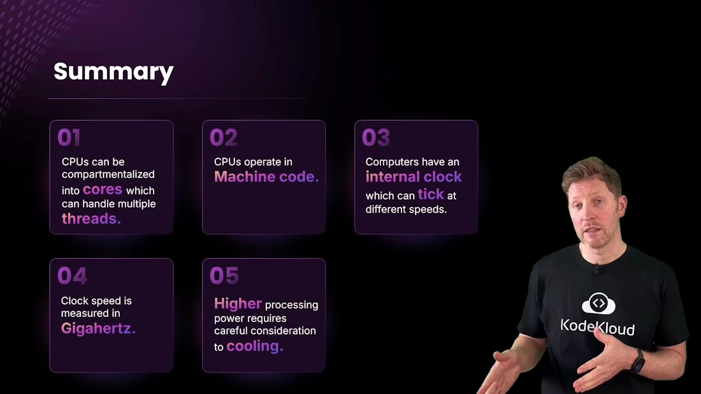

# CPU FDE Cycle

> Overview of CPU fundamentals including binary and transistors, von Neumann architecture, fetch decode execute cycle, ALU and control unit, memory hierarchy, clock speed and performance trade offs

But all this is making you wonder: how is all this possible?

It starts with the transistor and how many transistors are arranged inside a CPU. At the lowest level a CPU only understands binary: patterns of ones and zeros. Everything—numbers, text, images, even this lesson—is ultimately encoded as binary. When those binary patterns conform to the CPU's instruction format, they become machine code: the exact bit patterns the processor can execute.

Why binary? A transistor inside a CPU behaves like a tiny electronic switch: it can be on or off, representing `1` or `0` respectively. Humans prefer expressive, high-level languages. To bridge that gap we use tools:

* A compiler translates high-level code (C, Rust, Go, etc.) into machine code.
* An assembler converts human-readable assembly into machine code.

Both produce the binary instruction stream that the CPU executes.

At the next level, the CPU's architecture coordinates how execution occurs. The classic conceptual model is the von Neumann architecture, which organizes the processor into three primary parts: the control unit, the ALU (arithmetic logic unit), and memory. Modern CPUs often add optimizations such as separate instruction and data caches (a Harvard-style optimization) for better performance, but the von Neumann model remains a useful mental model.

<Frame>
    
</Frame>

* The control unit orchestrates the processor: it fetches instructions and signals which parts should act.
* The ALU performs arithmetic (addition, subtraction, increment) and logic operations (AND, OR, comparisons).
* Memory holds both instructions and data across multiple levels: registers (smallest, fastest), caches (L1/L2/L3), and RAM (larger, slower).

CPUs transfer data with memory and peripherals (keyboard, display, disk) using buses and memory-mapped I/O. All of this activity is driven by a repeating sequence known as the fetch–decode–execute (FDE) cycle.

<Frame>
    
</Frame>

The FDE cycle runs continuously, synchronized by the CPU clock. In brief:

* Fetch: read the next instruction from memory (often from cache) using the program counter (PC).
* Decode: interpret the instruction bits to determine the operation and which operands (registers or memory) to use.
* Execute: perform the operation in the ALU or other execution units, then write results back to registers or memory.
* 

<Frame>
    
</Frame>

To make the FDE cycle more intuitive, consider the "Motherboard" restaurant analogy:

* Customer places an order → user input.
* Fetch: the server (control unit) takes the order to the counter (memory).
* Decode: the server reads the order and tells the chef (ALU) what to prepare; the chef gathers ingredients (data) from the pantry (RAM) to the worktop (registers/cache).
* Execute: the chef prepares the dish (performs computation), places it on the counter (writes result back to memory/register), and the server delivers it to the customer (output).

This maps directly to how a CPU fetches an instruction, decodes which hardware units are needed, and executes operations on data stored in registers or loaded from RAM.

Now see the analogy applied to a concrete example: a program that computes `2 + 2`.

<Frame>
    
</Frame>

Execution steps for `2 + 2`:

* The program binary is stored on disk. When launched, the OS loads it into RAM for faster access.
* The FDE cycle begins, driven by the CPU clock:
  * Fetch: the control unit fetches the next instruction (e.g., `ADD R1, R2, R3`) from memory using the program counter, placing it into the instruction register.
  * Decode: the control unit decodes the bits, determining it is an `ADD` operation and where the operands `R2` and `R3` are located.
  * Execute: the ALU adds the values (for `2 + 2`) loaded into registers and writes the result (`4`) into the destination register or back to memory.
* The result may then be used by subsequent instructions or sent to an output device (display).
* 

<Frame>
    
</Frame>

The CPU repeats this tiny sequence billions of times per second. The internal clock sets the rhythm: each tick advances the cycle. Clock speed, measured in gigahertz (GHz), indicates how many clock cycles occur per second.

What changes if you increase the clock speed? Think of giving the chef an espresso—tasks complete faster. In CPU terms that is overclocking. Overclocking raises performance at the cost of:

* Increased power consumption
* More heat generation
* The need for better cooling
* Potential instability if thermal, electrical, or timing limits are exceeded

<Callout icon="warning" color="#FF6B6B">
  Overclocking can permanently damage hardware and void warranties. Ensure adequate cooling and stability testing before attempting higher clock speeds.
</Callout>

Quick recap — key CPU concepts:

| Concept                     | Role / Explanation                              | Example / Note                                   |
| --------------------------- | ----------------------------------------------- | ------------------------------------------------ |
| Control Unit                | Orchestrates instruction flow (fetch & decode)  | Manages program counter and instruction register |
| ALU (Arithmetic Logic Unit) | Performs arithmetic and logic operations        | `ADD`, `SUB`, `AND`, `OR`, comparisons   |
| Memory Hierarchy            | Registers → Cache (L1/L2/L3) → RAM → Storage | Faster, smaller to slower, larger                |
| Machine Code                | Binary instructions the CPU executes            | Produced by compilers/assemblers                 |
| Clock Speed                 | Number of cycles per second (`GHz`)           | Higher => faster but more heat                   |
| Cores & Threads             | Parallel execution units                        | Multi-core CPUs run multiple tasks concurrently  |

<Callout icon="lightbulb" color="#1CB2FE">
  Tip: To learn more about the von Neumann model and modern CPU optimizations (pipelines, caches, and out-of-order execution), see the [Von Neumann architecture](https://en.wikipedia.org/wiki/Von_Neumann_architecture) and [CPU caching](https://en.wikipedia.org/wiki/CPU_cache) resources.
</Callout>

Final summary:

* Modern CPUs are built from billions of transistors that implement binary logic.
* CPUs execute machine code produced by compilers and assemblers.
* The fetch–decode–execute cycle (FDE) is the fundamental loop that runs on every core.
* The CPU clock determines the pace of execution; higher clock speeds increase throughput but also increase heat and power use.
* Multi-core CPUs and threading enable parallel execution for better performance.

  

<Frame>
    
</Frame>

Links and References

* [Von Neumann architecture — Wikipedia](https://en.wikipedia.org/wiki/Von_Neumann_architecture)
* [CPU cache — Wikipedia](https://en.wikipedia.org/wiki/CPU_cache)
* [Compiler — Wikipedia](https://en.wikipedia.org/wiki/Compiler)
* [Assembler — Wikipedia](https://en.wikipedia.org/wiki/Assembler)

<CardGroup>
  <Card title="Watch Video" icon="video" cta="Learn more" href="https://learn.kodekloud.com/user/courses/computer-architecture/module/b128c92f-1260-4a45-8c3b-fe73eb53ea38/lesson/e8cb7828-2e46-4a12-906f-963f5297920b" />
</CardGroup>
