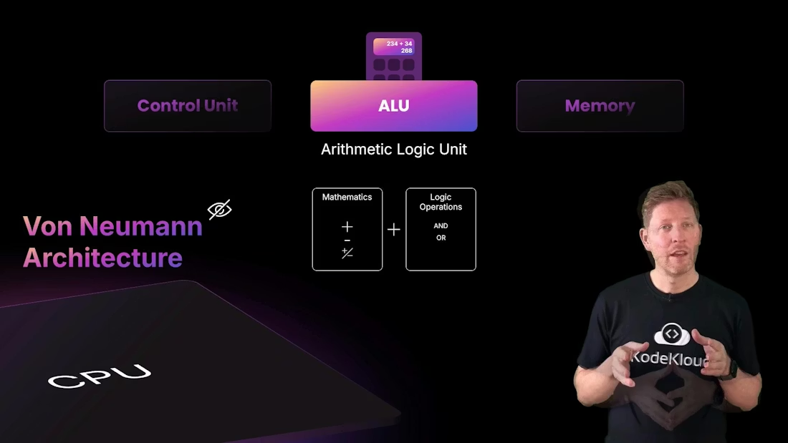
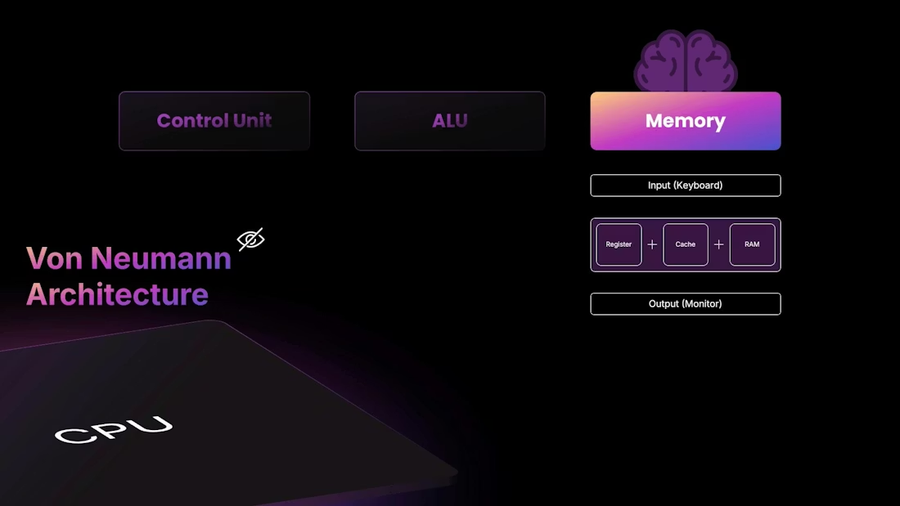
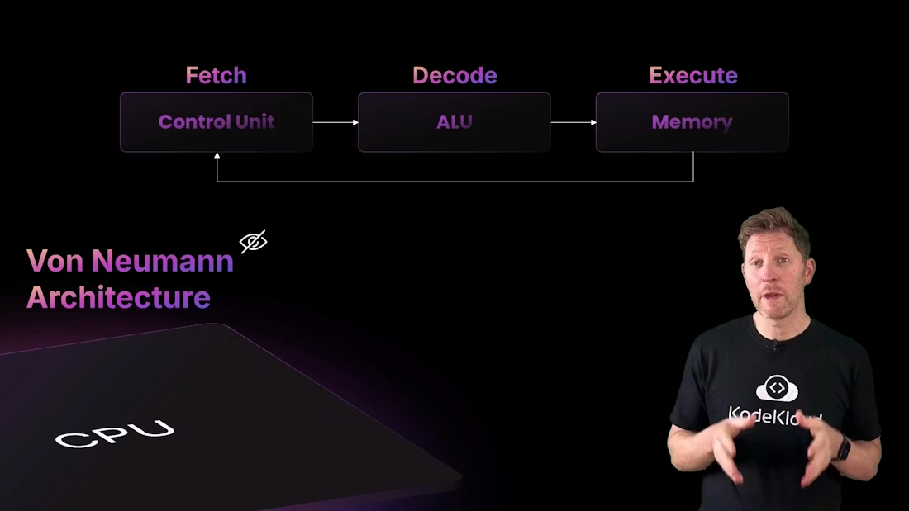
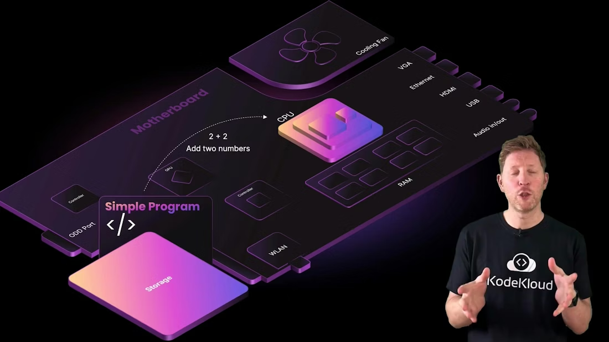
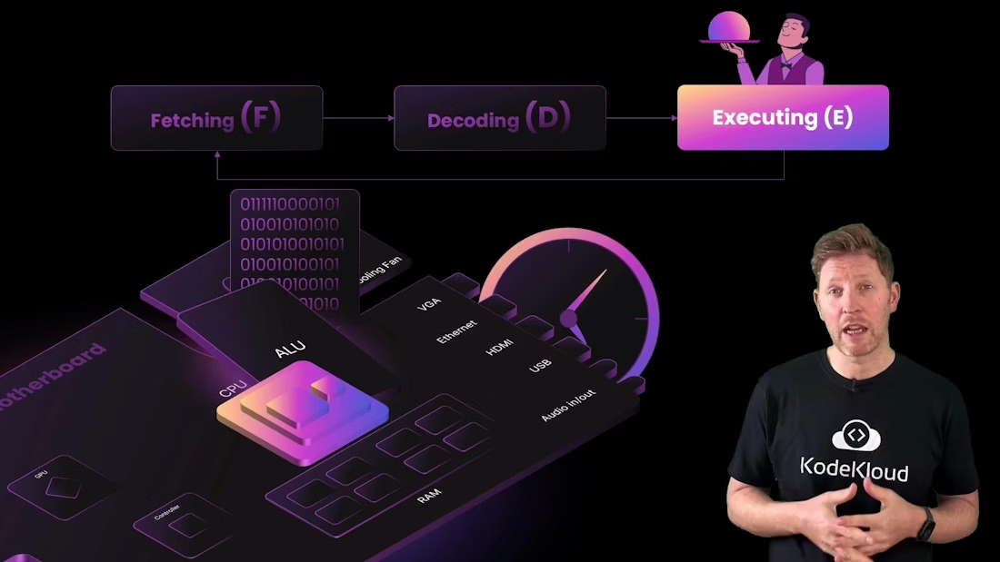

# CPU FDE Cycle / CPU 取指-译码-执行循环

> 中文：这是一份中英文对照的 CPU 工作原理笔记，重点解释二进制、机器码、冯·诺依曼结构，以及 CPU 为什么要不断重复取指、译码和执行。
>
> English: This is a bilingual note on how the CPU works, focused on binary, machine code, the von Neumann model, and why the CPU continuously repeats fetch, decode, and execute.

## 1. 从二进制开始 / Starting with Binary

中文：CPU 的底层只认识二进制，也就是 0 和 1。晶体管像微型开关，只能表示开或关，所以所有信息最终都要变成二进制形式。数字、文字、图片、视频，甚至这份笔记，最终都要以二进制数据存在于硬件里。

English: At the lowest level, the CPU understands only binary: 0s and 1s. Transistors behave like tiny switches and can only represent on or off, so all information must eventually become binary. Numbers, text, images, video, and even this note ultimately exist as binary data inside hardware.

中文：当二进制模式符合 CPU 的指令格式时，它们就变成机器码。机器码是 CPU 真正执行的指令，是硬件能直接读懂的最底层语言。

English: When a binary pattern matches the CPU’s instruction format, it becomes machine code. Machine code is what the CPU actually executes, and it is the lowest-level language the hardware can directly understand.

---

## 2. 高级语言如何变成机器码 / How High-Level Languages Become Machine Code

中文：人类更喜欢高级语言，因为它们更清晰、更接近思维方式。编译器会把 C、Rust、Go 等语言转换成机器码；汇编器会把汇编语言转换成机器码。无论是哪种方式，最后都会得到 CPU 可执行的二进制指令流。

English: Humans prefer high-level languages because they are clearer and closer to how we think. A compiler translates languages like C, Rust, or Go into machine code; an assembler translates assembly language into machine code. Either way, the end result is a binary instruction stream the CPU can execute.

中文：这也意味着 CPU 并不“理解”高级语言本身。高级语言只是给人看的，机器真正执行的是编译后或汇编后的指令。

English: This also means the CPU does not understand high-level languages directly. High-level languages are for humans; the machine executes only the compiled or assembled instructions.

---

## 3. 冯·诺依曼模型 / The Von Neumann Model

中文：经典的冯·诺依曼模型把 CPU 看成由控制单元、ALU 和存储系统组成。控制单元负责安排顺序和调度，ALU 负责算术与逻辑操作，存储负责保存指令和数据。现代 CPU 往往会加上更复杂的优化，但这个模型仍然很适合作为入门心智模型。

English: The classic von Neumann model describes the CPU as consisting of a control unit, an ALU, and a memory system. The control unit manages order and coordination, the ALU handles arithmetic and logic operations, and memory stores instructions and data. Modern CPUs add far more optimizations, but this model is still a very useful mental foundation.

中文：控制单元像指挥官，决定下一步做什么；ALU 像计算工具，负责加减、比较和逻辑运算；内存则像工作区，保存当前任务所需的数据和指令。

English: The control unit is like a commander deciding the next step; the ALU is like a calculation tool for addition, subtraction, comparison, and logic operations; and memory is like the workspace holding the data and instructions needed right now.

---

## 4. FDE 循环 / The Fetch-Decode-Execute Cycle

中文：CPU 的基本工作循环叫做 FDE，也就是 Fetch、Decode、Execute。这个循环不停重复，由 CPU 时钟驱动，每一拍都推动处理器前进一点点。

English: The CPU’s basic work loop is called FDE: Fetch, Decode, Execute. This cycle repeats continuously and is driven by the CPU clock, with each tick moving the processor forward a little bit.

### Fetch / 取指

中文：取指就是从内存中读取下一条指令，通常通过程序计数器 PC 指向下一条要执行的内容。CPU 往往会先从缓存中找，如果缓存命中，就能更快拿到指令。

English: Fetch means reading the next instruction from memory, usually using the program counter, or PC, to point to what should be executed next. The CPU often checks cache first, and if the instruction is found there, it can be retrieved faster.

### Decode / 译码

中文：译码就是分析指令位模式，确定这条指令是什么操作，需要哪些操作数，应该使用哪些寄存器或内存位置。控制单元在这一步发挥核心作用。

English: Decode means analyzing the instruction bits to determine what operation it is, what operands are needed, and which registers or memory locations should be used. The control unit plays the key role in this step.

### Execute / 执行

中文：执行就是让 ALU 或其他执行单元真正完成工作，比如加法、逻辑判断、数据搬运或跳转。结果会被写回寄存器或内存，供下一步继续使用。

English: Execute means letting the ALU or another execution unit actually do the work, such as arithmetic, logical comparisons, data movement, or branching. The result is written back to registers or memory for later use.

---

## 5. 生活类比 / A Restaurant Analogy

中文：你可以把 FDE 循环想成餐厅流程。顾客下单相当于输入；服务员去取订单相当于取指；服务员读懂订单相当于译码；厨师开始烹饪相当于执行；最后把餐点送回顾客手里，相当于输出。

English: You can think of the FDE cycle as a restaurant workflow. The customer placing an order is input; the server fetching the order is fetch; the server reading the order is decode; the chef cooking is execute; and delivering the dish back to the customer is output.

中文：这个类比之所以有用，是因为它说明 CPU 不是一次性做完整任务，而是不断执行很小的步骤。每一步都要依赖前一步的结果。

English: This analogy is useful because it shows that the CPU does not complete the whole task in one shot. It repeatedly performs very small steps, and each step depends on the result of the previous one.

---

## 6. 一个简单程序 / A Simple Program Example

中文：假设程序要计算 2 + 2。程序先被操作系统从磁盘加载到 RAM，然后 CPU 开始 FDE 循环：先取到加法指令，再译码出操作数位置，最后由 ALU 执行加法，得到结果 4。

English: Suppose a program needs to compute 2 + 2. The program is first loaded from disk into RAM by the operating system, and then the CPU starts the FDE cycle: it fetches the addition instruction, decodes the operand locations, and finally the ALU performs the addition and produces the result 4.

中文：结果可能被写入寄存器、内存，或者传给后续指令继续使用。如果需要显示给用户，它最终还会经过输出设备。

English: The result may be written to a register, to memory, or passed to later instructions. If it needs to be shown to the user, it will eventually be sent to an output device.

---

## 7. 时钟和频率 / Clock and Frequency

中文：CPU 重复 FDE 循环的速度由内部时钟控制。GHz 表示每秒多少十亿个时钟周期。更高的频率意味着每秒有更多节拍可以推动工作前进，但这并不等于每一拍都能完成一条完整指令。

English: The speed of the CPU’s FDE cycle is controlled by its internal clock. GHz means billions of clock cycles per second. A higher frequency means there are more beats per second to move work forward, but that does not mean one instruction is completed in every cycle.

中文：现代 CPU 会利用流水线、缓存、乱序执行和多个执行单元，把很多步骤重叠起来，所以“一个时钟周期做一件事”并不是现代 CPU 的真实工作方式。

English: Modern CPUs use pipelining, cache, out-of-order execution, and multiple execution units to overlap many steps, so “one cycle does one thing” is not how modern CPUs really work.

---

## 8. 超频与代价 / Overclocking and Trade-offs

中文：如果提高时钟频率，CPU 的吞吐量通常会上升，但同时也会增加功耗和发热。超频相当于给厨师灌咖啡，让他做事更快，但代价是更累、温度更高、稳定性压力更大。

English: If you increase clock frequency, CPU throughput usually increases, but power consumption and heat also rise. Overclocking is like giving the chef espresso so they work faster, but the trade-off is more fatigue, more heat, and greater stability risk.

> 中文：超频不是免费的性能提升。它需要更好的散热、更稳定的供电，并且有可能带来不稳定甚至损坏硬件的风险。
>
> English: Overclocking is not free performance. It requires better cooling, more stable power delivery, and it can introduce instability or even hardware damage.

---

## 9. 小结 / Summary

中文：CPU 的本质是不断执行 FDE 循环的计算引擎。它通过控制单元、ALU、寄存器、缓存和内存协同工作，把机器码变成现实中的动作。

English: The CPU is fundamentally an engine that continuously runs the FDE cycle. Through the cooperation of the control unit, ALU, registers, cache, and memory, it turns machine code into real-world actions.

## Further Reading

- [Watch Video](https://learn.kodekloud.com/user/courses/computer-architecture/module/b128c92f-1260-4a45-8c3b-fe73eb53ea38/lesson/e8cb7828-2e46-4a12-906f-963f5297920b)
