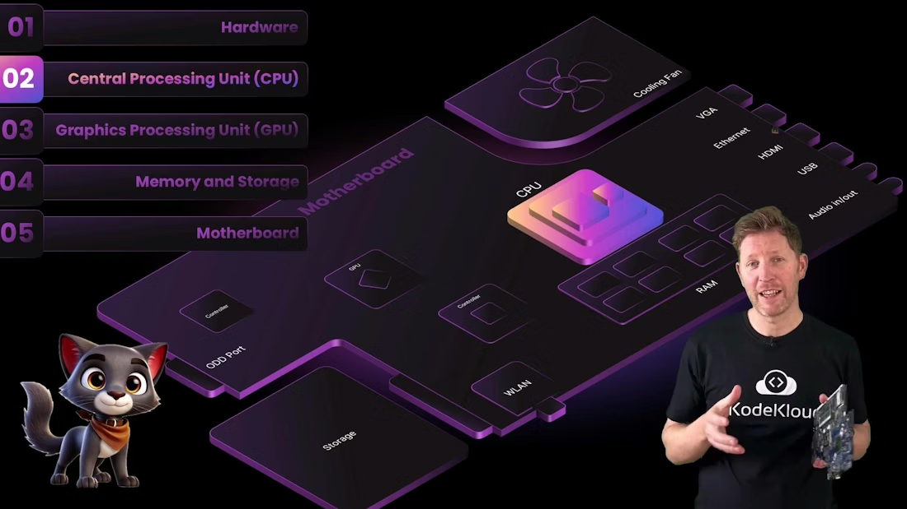
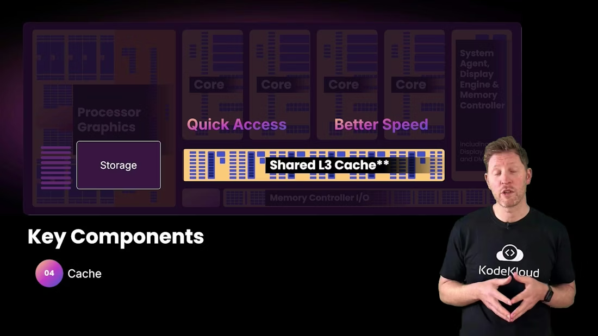
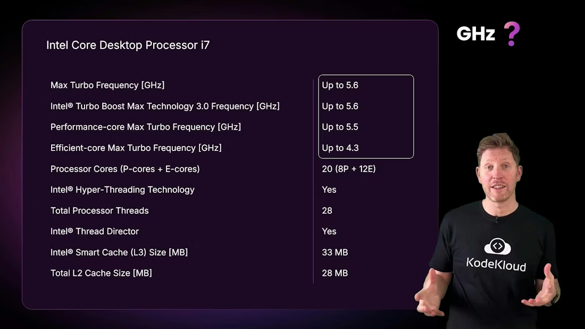
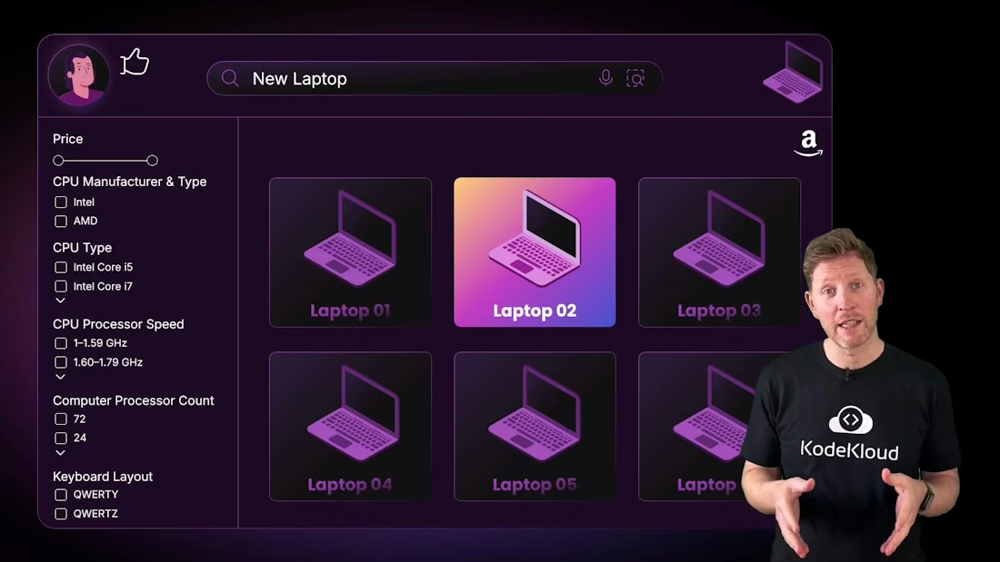

# CPU 导论 / CPU Introduction

> 中文：这是一份中英文对照的 CPU 学习笔记，重点解释 CPU 的内部组成、核心和线程的区别、频率到底是什么意思，以及为什么看参数不能只看一个数字。
>
> English: This is a bilingual CPU study note focused on the CPU’s internal components, the difference between cores and threads, what clock speed really means, and why you should never judge a processor by just one number.

## 1. CPU 是什么 / What the CPU Is

中文：中央处理器，也就是 CPU，是计算机里负责通用计算和流程控制的核心部件。它不是专门为某一种任务设计的，而是要面对各种不同类型的工作：运行操作系统、打开浏览器、执行程序、处理输入、协调外设、安排内存访问。CPU 像总指挥，负责让整台机器按照正确顺序工作。

English: The Central Processing Unit, or CPU, is the core component responsible for general-purpose computation and flow control. It is not designed for just one special task. Instead, it has to deal with many different kinds of work: running the operating system, opening a browser, executing programs, handling input, coordinating peripherals, and arranging memory access. The CPU acts like the chief coordinator that keeps the whole machine working in the correct order.

中文：如果没有 CPU，其他部件再强也无法形成完整系统。GPU 可以加速并行工作，RAM 可以存放临时数据，存储可以保存文件，但只有 CPU 负责决定“下一步做什么”。这也是为什么 CPU 一直是电脑架构中最重要的通用计算单元之一。

English: Without the CPU, even the strongest components cannot form a complete system. A GPU can accelerate parallel work, RAM can hold temporary data, and storage can keep files, but only the CPU decides “what happens next.” That is why the CPU has always been one of the most important general-purpose computing units in computer architecture.

---

## 2. CPU 的主要组成 / Major CPU Components

中文：现代 CPU 不是一块简单的芯片，而是由多个核心、缓存、寄存器、控制逻辑、内存控制相关电路以及有时的集成显卡组成。不同部分承担不同职责，共同把一个高层指令拆解成真正可执行的动作。

English: A modern CPU is not a simple chip. It is made up of multiple cores, cache, registers, control logic, memory-controller circuitry, and sometimes integrated graphics. Each part has a different role, and together they turn a high-level instruction into actual executable actions.

中文：核心可以理解为独立的执行单元；缓存负责把常用数据尽量留在离核心更近的地方；系统代理和内存控制器负责在核心、内存和 I/O 之间调度数据；集成显卡则为显示和轻量图形任务提供额外能力。你越理解这些部件之间的分工，就越能看懂 CPU 规格页上的每一个参数。

English: A core can be thought of as an independent execution unit; cache keeps frequently used data as close to the core as possible; the system agent and memory controller coordinate data movement between the cores, memory, and I/O; and integrated graphics provide extra capability for display and lightweight graphics tasks. The better you understand the division of labor among these parts, the easier it becomes to read every number on a CPU spec sheet.

---

## 3. 核心、线程和多任务 / Cores, Threads, and Multitasking

中文：核心数和线程数经常被一起提到，但它们不是一回事。物理核心是真实存在的执行单元，线程则是系统看到的执行路径。一个核心如果支持同时多线程，就可能在逻辑上表现成多个线程，但这不等于性能翻倍，因为多个线程仍然要共享部分执行资源。

English: Core count and thread count are often mentioned together, but they are not the same thing. A physical core is a real execution unit, while a thread is an execution path seen by the system. If a core supports simultaneous multithreading, it may appear as multiple logical threads, but that does not mean performance doubles, because those threads still share some execution resources.

中文：多任务也不等于多核。单核单线程时，任务其实是被操作系统快速切换出来的，形成“好像同时运行”的感觉。多核能让不同任务真正并行运行；多线程则让一个核心更充分地利用内部资源。系统里还有 GPU、NPU 和其他加速器，它们可以把某些专门任务从 CPU 手里接过去，减轻 CPU 负担。

English: Multitasking is not the same as multiple cores. On a single-core, single-threaded system, the operating system rapidly switches between tasks to create the illusion that they are running at the same time. Multiple cores allow different tasks to run truly in parallel; multithreading helps one core use its internal resources more efficiently. Systems also include GPUs, NPUs, and other accelerators that can take specialized work off the CPU and reduce its load.

---

## 4. 线程是什么 / What a Thread Is

中文：线程可以理解为一条执行路径，一段正在被 CPU 推进的程序流。程序不是一次性全部运行完的，而是由许多指令顺序组成。线程告诉操作系统：这条执行路径需要时间、寄存器状态和调度资源。

English: A thread can be understood as an execution path, a stream of program activity that the CPU advances over time. Programs do not run all at once; they are made of sequences of instructions. A thread tells the operating system that this execution path needs time, register state, and scheduling resources.

中文：在很多工作负载里，线程数增加会提高吞吐量，但对单个任务的收益并不总是线性的。真正决定体验的，不只是线程本身，还包括任务是否能被拆分、内存是否够快、缓存是否命中、系统是否有足够的协调能力。

English: In many workloads, more threads improve throughput, but the benefit for a single task is not always linear. The real user experience is determined not just by threads, but also by whether the work can be split, whether memory is fast enough, whether cache hits are good, and whether the system can coordinate efficiently.

---

## 5. 频率和 GHz / Clock Speed and GHz

中文：GHz 代表每秒多少十亿个时钟周期。5.6 GHz 就是每秒 56 亿次节拍。你可以把时钟想成节拍器：每一次跳动，CPU 就有机会开始或推进一部分工作。但一个时钟周期并不等于一条完整指令，更不等于一次完整任务。

English: GHz means billions of clock cycles per second. 5.6 GHz means 5.6 billion beats per second. You can think of the clock as a metronome: each tick gives the CPU a chance to begin or advance some work. But one clock cycle is not the same as one complete instruction, and it is definitely not the same as one complete task.

中文：更高频率通常意味着更高吞吐量，但也会带来更高功耗和更大的散热压力。现代 CPU 会使用流水线、乱序执行和多个执行单元，把多个指令片段交错处理，所以它们的表现远比“时钟数字”复杂。

English: A higher frequency usually means higher throughput, but it also brings higher power consumption and greater thermal pressure. Modern CPUs use pipelining, out-of-order execution, and multiple execution units to interleave pieces of multiple instructions, so their performance is far more complex than a single clock number suggests.

> 中文：不要把更高的 GHz 直接等同于更好的性能。不同架构、不同缓存、不同功耗设计和不同工作负载，都会让结果完全不一样。
>
> English: Do not equate a higher GHz directly with better performance. Different architectures, cache sizes, power designs, and workloads can produce very different outcomes.

---

## 6. 采购视角 / Practical Procurement View

中文：如果你是在选购或评估 CPU，正确的顺序不是先看最高频率，而是先看工作负载。办公、网页和轻量应用更看重单核性能和集成图形；编译、虚拟化和重度多任务更看重核心和线程；高性能持续负载则要看散热和功耗限制。

English: If you are purchasing or evaluating a CPU, the right order is not to start with the maximum frequency. Start with the workload. Office work, web browsing, and lightweight apps care more about single-core performance and integrated graphics; compilation, virtualization, and heavy multitasking care more about core and thread count; sustained high performance depends heavily on cooling and power limits.

中文：还要看缓存、内存支持和实际基准测试。很多 CPU 的参数页看起来很漂亮，但如果散热跟不上，实际使用中根本跑不到标称的高频；如果任务无法并行，增加核心也未必有明显提升。

English: You also need to look at cache, memory support, and real benchmarks. Many CPU spec sheets look impressive, but if cooling cannot keep up, the chip may never sustain its advertised high frequencies. And if a task cannot be parallelized, adding more cores may not help much.

---

## 7. 小结 / Summary

中文：CPU 是通用计算和流程控制的核心。理解核心、线程、频率、缓存和内存控制器之后，你就能更准确地理解“这颗处理器为什么快，为什么有时又不快”。

English: The CPU is the core of general-purpose computation and flow control. Once you understand cores, threads, frequency, cache, and the memory controller, you can better explain why a processor is fast in some situations and not in others.

## Further Reading

- [Watch Video](https://learn.kodekloud.com/user/courses/computer-architecture/module/b128c92f-1260-4a45-8c3b-fe73eb53ea38/lesson/f25621b6-002e-44b1-9b2e-b4a8aa0ef26d)
