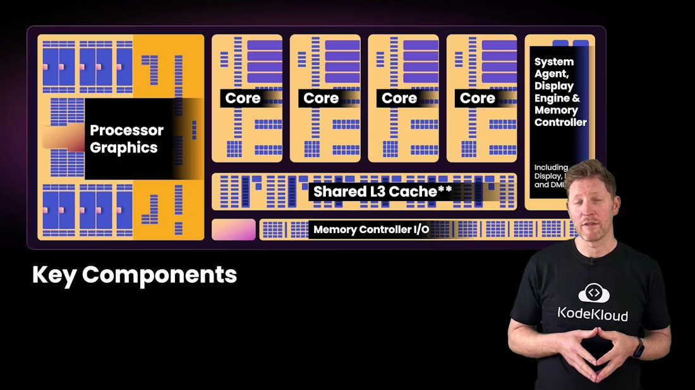
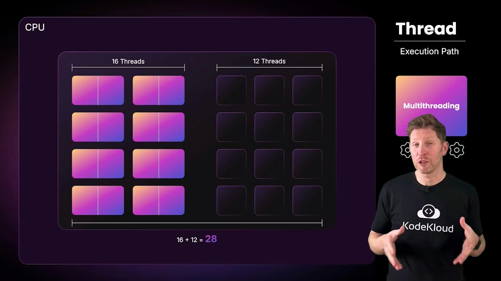
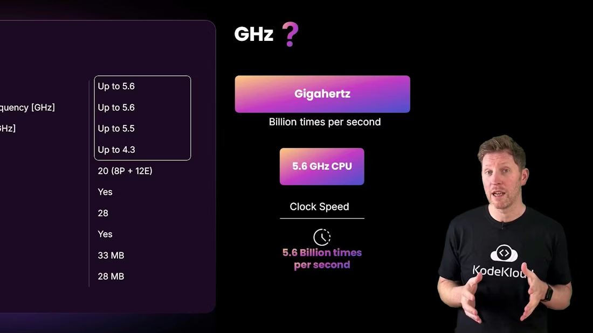
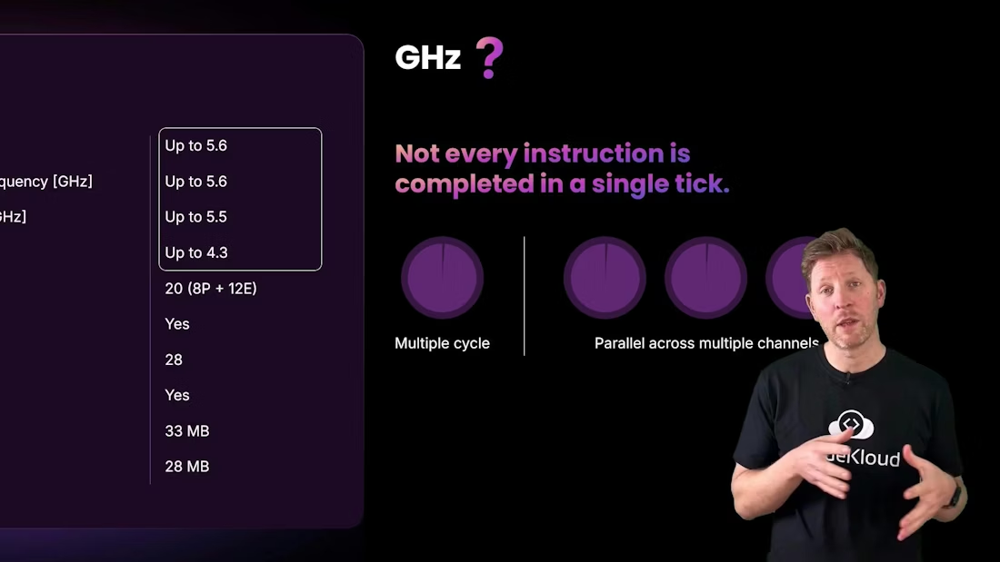

# CPU Introduction

> Overview of CPU architecture, components, cores, threads, clock speeds, and practical guidance for interpreting specs and selecting processors.

Welcome to the next module: a focused tour of the Central Processing Unit (CPU). Every action your computer or smartphone performs — from streaming video to running AI models or gaming — relies on this compact but powerful chip. Modern CPUs perform trillions of operations per second; if you tried to do that work at one operation per second, it would take roughly 30,000 years. How does a tiny piece of silicon achieve this? In this lesson we'll break down the CPU's internal structure, how it runs instructions, and what those marketing numbers (cores, threads, GHz) actually mean.

Learning objectives:

* Identify a CPU's major components and their roles.
* Explain how a CPU processes instructions, including multithreading and multitasking.
* Interpret common CPU specs (cores, threads, clock speed) and predict how multiple cores affect performance.

Cody will guide us through the concepts, so don’t worry if some terms are new.


<Frame>
    
</Frame>

Selecting CPUs for your team’s laptops can feel overwhelming: different brands, varying core counts, advertised clock speeds, and threads. Let’s make this concrete using a sample spec line: Intel Core i7 — "20 cores (8P + 12E), up to 5.6 GHz, 28 threads." We’ll decode what each number means and why they matter.

This simplified die diagram highlights where the CPU’s major subsystems live.



<Frame>
    
</Frame>

Key CPU components and their functions:

|                        Component | Role                                                                                                                                           |
| -------------------------------: | ---------------------------------------------------------------------------------------------------------------------------------------------- |
|                            Cores | Independent execution units; each core can fetch, decode, and execute instructions like a mini-CPU. More cores enable more true parallel work. |
|               Processor graphics | Integrated GPU for display and graphics workloads; reduces the need for a discrete GPU in many everyday scenarios.                             |
| System agent / Memory controller | Coordinates data movement between cores, RAM, and I/O devices; crucial for memory throughput and low latency.                                  |
|             Cache (L1 / L2 / L3) | Very fast on-chip memory that stores frequently used instructions and data close to cores to reduce access latency and increase throughput.    |

Returning to the example spec, the headline reads "20 cores (8P + 12E), 28 threads." What is a thread? A thread is a sequence of programmed instructions — an execution context. Multithreading lets a core present multiple execution contexts so it can make progress on several threads more efficiently.


<Frame>
    
</Frame>

How the 20 cores become 28 threads (for the pictured Core i7):

* The 8 performance (P) cores support simultaneous multithreading (SMT). Each P-core can run 2 threads → 8 × 2 = 16 threads.
* The 12 efficiency (E) cores do not support SMT and run 1 thread each → 12 × 1 = 12 threads.
* Total threads = 16 + 12 = 28.
* 

<Frame>
    
</Frame>

Multitasking at a glance

* Single-core, single-threaded: tasks run one after another. The OS scheduler swaps tasks quickly to give the illusion of concurrency.
* Multiple cores: truly parallel execution — different cores run different tasks simultaneously (e.g., video decoding, UI, background sync).
* Multithreading (SMT): a single core presents multiple logical threads and can interleave or parallelize work on replicated pipeline resources to improve utilization.

Example of three independent tasks producing text output:

```text
Hello, Kody!
Hello, KodeKloud!
Hello, World!
```

* If there are more runnable tasks than available physical cores, the OS performs context switches so each task gets time on the CPU.
* Modern systems also offload specialized work to GPUs, NPUs, or dedicated accelerators to free CPU cores for general-purpose tasks.

<Callout icon="lightbulb" color="#1CB2FE">
  SMT improves throughput by letting a core handle multiple execution paths, but it doesn't double performance for every workload. SMT helps most when threads have complementary resource usage (e.g., one thread stalls on memory while another uses execution units).
</Callout>

Next: clock speed and what “up to 5.6 GHz” means.


<Frame>
    
</Frame>

Giga = billion, hertz = cycles per second. 5.6 GHz = 5.6 billion clock cycles per second. Think of the clock as a regular beat: each tick is an opportunity for the CPU to start or continue micro-operations. However, several important caveats apply:

* Not every instruction completes in a single clock cycle; complex operations may take many cycles.
* CPUs use pipelining, out-of-order execution, and multiple execution units to complete parts of multiple instructions across overlapping cycles.
* “Turbo” or “Max Boost” frequencies are the highest achievable clocks for a limited time under favorable power/thermal conditions.
* 

<Frame>
    
</Frame>

Putting GHz into perspective:

* A hummingbird flaps \~80 times per second. 5.6 GHz is roughly 70 million times faster.
* An electric toothbrush vibrates \~1,000 times per second. 5.6 GHz is about 5.6 million times faster.

But remember: raw frequency is only one factor. Architecture efficiency, cache size and hierarchy, memory bandwidth and latency, core count, and the workload’s parallelism all shape real-world performance.



<Frame>
    
</Frame>

<Callout icon="warning" color="#FF6B6B">
  Do not equate higher GHz directly with better performance for all workloads. A newer CPU with lower clock speed can outperform an older, higher-clocked chip due to architectural improvements, larger caches, or more efficient execution pipelines.
</Callout>

Summary — evaluating laptop CPUs for procurement

* Prioritize the workload: many office apps and web browsing benefit from higher single-thread performance and good integrated graphics; software compilation, virtualization, and heavy multitasking benefit from more cores and threads.
* Consider thermal and power limits: thin laptops may not sustain turbo clocks for long due to cooling constraints.
* Look beyond headline numbers: compare cache sizes, memory support (LPDDR vs. DDR), and real-world benchmarks for your typical applications.
* 

<Frame>
    
</Frame>

Further reading and references

* Intel: Introduction to CPU architecture — [https://www.intel.com/](https://www.intel.com/)
* CPU basics and performance factors — [https://en.wikipedia.org/wiki/Central\_processing\_unit](https://en.wikipedia.org/wiki/Central_processing_unit)
* Multithreading and SMT overview — [https://en.wikipedia.org/wiki/Simultaneous\_multithreading](https://en.wikipedia.org/wiki/Simultaneous_multithreading)

Armed with these concepts, you can make informed CPU choices for your team and better interpret the marketing spec lines on product pages.

<CardGroup>
  <Card title="Watch Video" icon="video" cta="Learn more" href="https://learn.kodekloud.com/user/courses/computer-architecture/module/b128c92f-1260-4a45-8c3b-fe73eb53ea38/lesson/f25621b6-002e-44b1-9b2e-b4a8aa0ef26d" />
</CardGroup>
