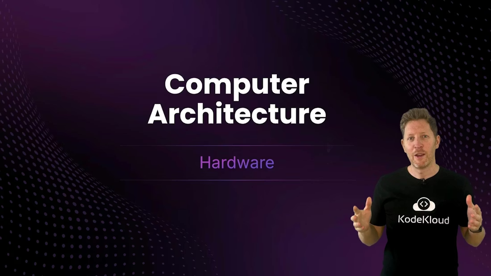
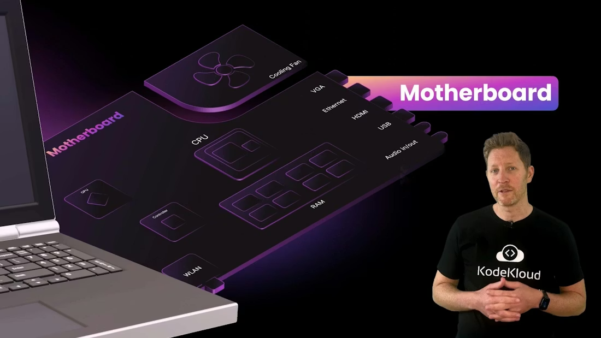
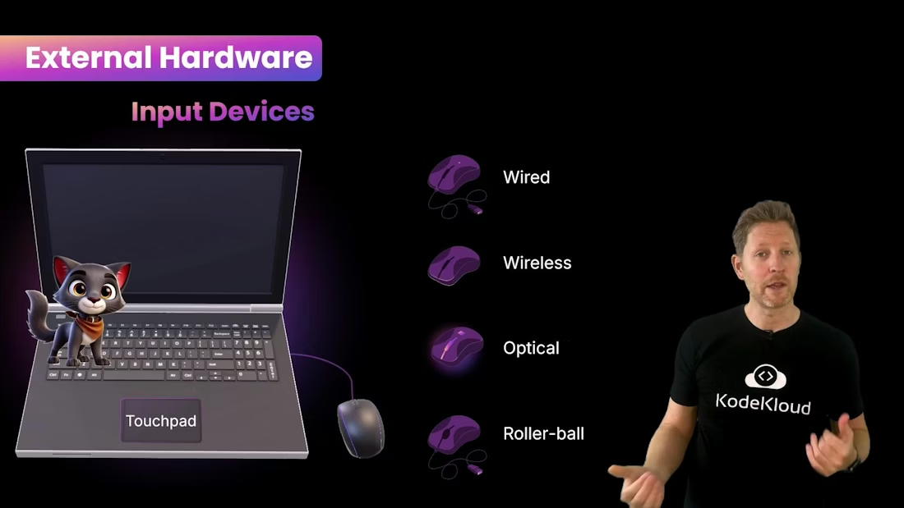
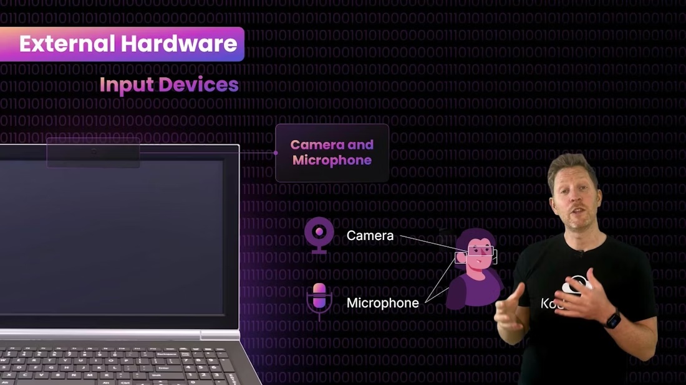
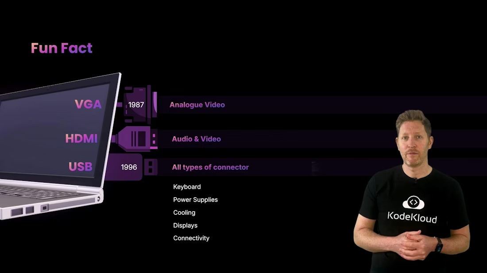
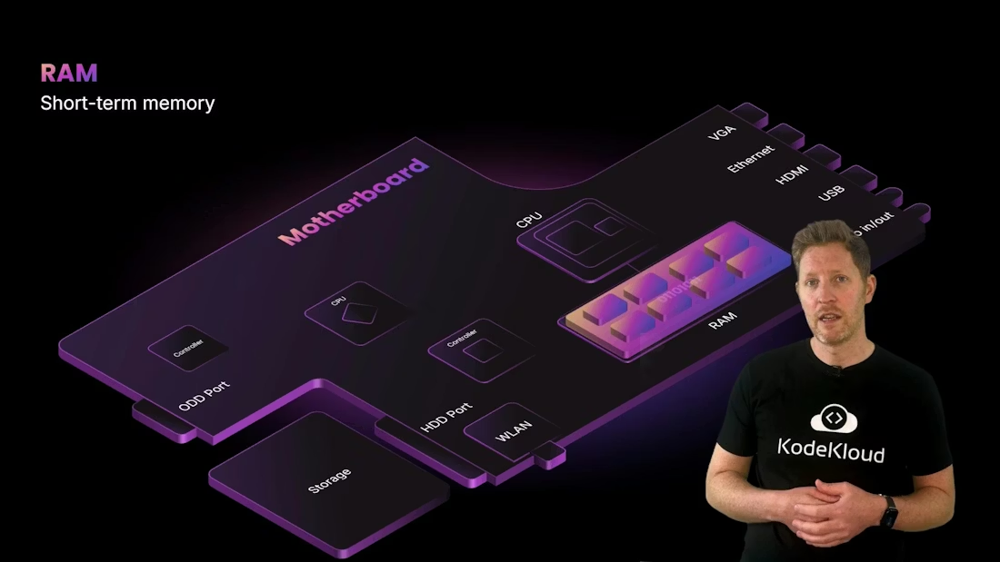
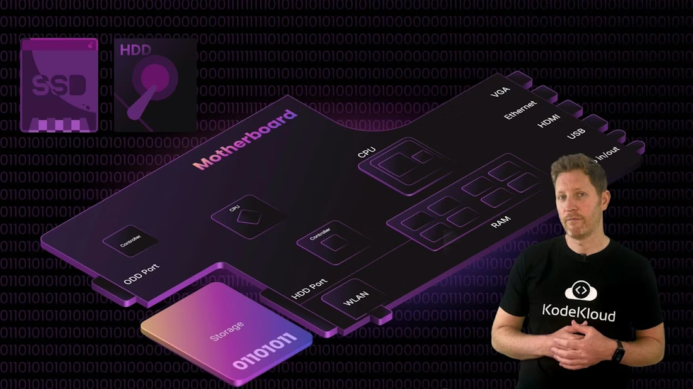

# Hardware

> Overview of computer hardware components and data flow from keyboard input through motherboard, covering CPUs, GPUs, memory, storage, power, cooling, and peripherals

Welcome! This lesson takes a practical, component-level look at computer hardware. We'll trace what happens when you press the letter "k" on a keyboard and use a human-body analogy to make each part's role easier to visualize. Along the way you'll learn about external and internal hardware and get a high-level overview of CPUs, GPUs, memory, storage, and motherboards. By the end you'll be able to identify key components, explain their responsibilities, and reason about how data flows through a system.



<Frame>
    
</Frame>

With Kody as our guide, we'll follow a keystroke from the keyboard through the internal hardware until it appears on screen. First, we'll cover the external components you can see and touch, grouped as inputs, outputs, and peripherals.



<Frame>
    
</Frame>

## External hardware: inputs, outputs, and peripherals

Inputs are how the outside world communicates with the computer; outputs are how the computer responds.

Input devices

* Keyboard and mouse are the computer's "hands": they let users send commands and text. Modern keyboards use a key matrix and a microcontroller to detect key presses. That microcontroller sends a scan code over an interface (commonly USB using the HID profile) to the operating system, which maps it to a character such as `k` (modified by keys like Shift or Caps Lock).
* Touchpads perform the same role as a mouse on many laptops. Mice exist as wired, wireless, optical, and older roller-ball designs.
* 

<Frame>
    
</Frame>

* Camera and microphone are the computer's "eyes and ears": they capture sight and sound and convert analog signals into digital data the computer can process. (Fun fact: the first webcam was set up in 1991 at the University of Cambridge to monitor the Trojan Room coffee pot so researchers wouldn't walk to an empty pot — read more at the [Trojan Room coffee pot](https://en.wikipedia.org/wiki/Trojan_Room_coffee_pot).)
* 

<Frame>
    
</Frame>

Power and cooling

* The power supply is the system's "heart": it converts mains power into voltages required by components. Laptops add a battery for portable operation.
* Cooling prevents overheating: fans, vents, heat sinks, heat pipes, and liquid cooling move heat away from hot components. Thermal paste improves the contact between CPU die and heat spreader.

<Callout icon="warning" color="#FF6B6B">
  Avoid abruptly removing laptop power or the battery while the system is running. Sudden power loss can cause data corruption and hardware issues.
</Callout>

Display and audio

* Monitors and speakers are the "face and mouth": they present visual and audio output. Speakers convert electrical signals into sound using vibrating diaphragms; larger diaphragms produce lower frequencies.

Peripherals and ports

* Physical connectors let us attach peripherals: USB, HDMI, Ethernet, VGA (legacy), and others. USB standardized peripheral connections in the late 1990s — see [USB](https://en.wikipedia.org/wiki/USB) for details. HDMI carries both audio and video and has largely replaced analog VGA for modern displays — more at [HDMI](https://en.wikipedia.org/wiki/HDMI).

  

<Frame>
    
</Frame>

Summary: external hardware at a glance

|            Category | Role / Analogy                                 | Examples                                      |
| ------------------: | ---------------------------------------------- | --------------------------------------------- |
|               Input | Hands / senses — let users send data          | Keyboard, mouse, touchpad, camera, microphone |
|              Output | Face / voice — show results                   | Monitor, speakers, headphones                 |
|     Power & Cooling | Heart & lungs — power and temperature control | PSU, battery, fans, heat sinks                |
| Ports & Peripherals | Connectors — expand functionality             | `USB`, `HDMI`, Ethernet, legacy `VGA`   |

These are the visible building blocks. Next, open the case: we'll follow the keystroke into the internal hardware.

## From keypress to character: tracing the signal

The journey begins at the keyboard (the computer's hands). When you press `k`:

1. The keyboard matrix closes a circuit and the keyboard microcontroller detects the keypress.
2. The microcontroller sends a scan code to the host (typically over USB/HID).
3. The operating system maps the scan code to the character `k` (or `K` if Shift/Caps Lock is active).

<Callout icon="lightbulb" color="#1CB2FE">
  A scan code is a hardware-level identifier for a key. The OS translates scan codes into characters depending on the active keyboard layout and modifier keys.
</Callout>

The electrical event and its encoded binary representation then flow through the system:

```text
01101011
```

Binary is the lingua franca of hardware: electronic components represent two states — on or off — naturally mapping to `1` and `0`.

All internal communication travels across the motherboard — the computer's "nervous system." The motherboard is a printed circuit board (PCB) that connects CPU, RAM, storage, GPU, and I/O devices so data can move between them. It's also called a mainboard, baseboard, or mobo.



<Frame>
    
</Frame>

## Core internal components

Processors and cooling

* The CPU is the computer's "brain." It interprets instructions and coordinates tasks. Modern CPUs contain multiple cores and functional units that execute instructions, perform arithmetic/logic, and manage control flow.
* CPUs are mounted under cooling modules (heat spreaders, fans, heat pipes). Thermal paste improves heat transfer between the CPU package and the cooler.

RAM and storage

* RAM (Random Access Memory) is short-term memory: the CPU keeps active data and instructions in RAM during processing. RAM is volatile — its contents are lost when power is removed.
* Long-term storage includes HDDs (mechanical, higher capacity per dollar) and SSDs (solid-state, much faster). HDDs are suitable for bulk storage and backups; SSDs dramatically improve boot and load times.
* 

<Frame>
    
</Frame>

Rendering and display

* The GPU (graphics processing unit) is the system's "visual cortex": it takes prepared frame data and renders pixels for the display. The GPU output is sent to the monitor, which converts the signal into visible pixels.

Quick-reference: responsibilities of major components

| Component         | Role / Analogy    | Typical responsibilities                      |
| ----------------- | ----------------- | --------------------------------------------- |
| CPU               | Brain             | Execute instructions, manage processes        |
| GPU               | Visual cortex     | Render graphics, offload parallel workloads   |
| RAM               | Short-term memory | Store active data and instructions (volatile) |
| Storage (SSD/HDD) | Filing cabinet    | Persistent data storage                       |
| Motherboard       | Nervous system    | Connects components, provides buses and I/O   |

That's the end of our keystroke journey. You should now have a clear mental model of how a single keypress moves from an external input device through the motherboard and internal components to become a visible character on the screen. This foundation will help you explore deeper topics like CPU architecture, memory hierarchies, storage technologies, and peripheral interfaces.

<CardGroup>
  <Card title="Watch Video" icon="video" cta="Learn more" href="https://learn.kodekloud.com/user/courses/computer-architecture/module/1fdcb0d1-7a06-4ea5-8a79-5598e809a097/lesson/cb5d281e-8b98-440a-ae22-2a01b7336c98" />
</CardGroup>
