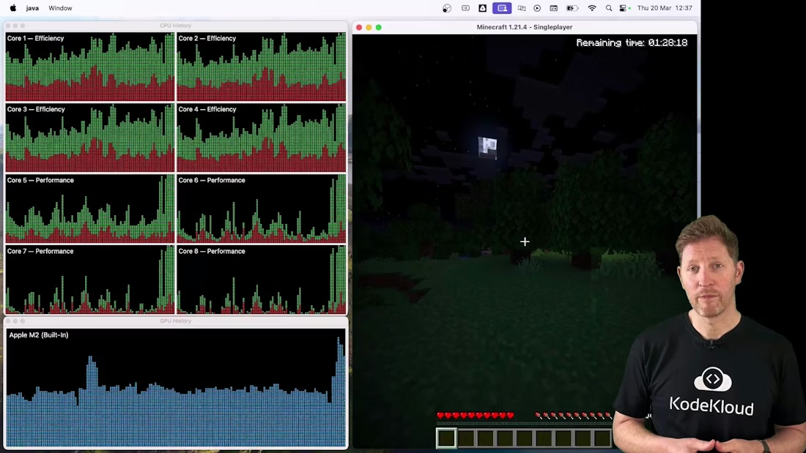

# GPU Applications

> How GPUs accelerate AI, graphics, and scientific workloads by parallelizing large matrix computations, contrasted with CPU roles, and practical uses in gaming, research, medical imaging, and autonomous systems.

When your phone suggests the next word as you type, it uses short, local patterns computed on-device. Modern large language models (LLMs) do something far more extensive: they analyze whole sentences, context, and statistical relationships across billions of words to generate coherent text.


<Frame>
    
</Frame>

Your phone handles short-pattern predictions locally and sequentially. LLMs must process massive datasets and perform trillions of numerical operations to learn language structure and generate responses. That scale is why GPU hardware is central to modern AI.

Why not rely only on CPUs? Consider this analogy:

* A CPU is like a careful reader flipping through a dictionary entry by entry — excellent at complex, branching logic and low-latency tasks.
* A GPU is like thousands of eyes scanning many pages in parallel — optimized for carrying out many similar calculations at once.

AI training and inference depend heavily on linear algebra (large matrix multiplications and tensor operations). GPUs are architected for massive parallelism and high memory bandwidth, making them far faster than CPUs for these workloads. Training a model on CPUs would be impractically slow: days or weeks on GPUs could become months or years on CPUs.

Here’s a tiny numeric example resembling an isolated operation that’s part of much larger matrix computations during training or evaluation:

```python
# Simple division example
2788374 / 71134
# Output: 39.19889223157
```

Before 2017 many sequence models processed tokens sequentially (for example using recurrent neural networks like LSTMs). The transformer architecture (introduced in 2017) changed this by using self-attention, enabling the model to compare tokens across the entire input in parallel. That shift to parallel token processing maps directly to GPU strengths.

<Callout icon="lightbulb" color="#1CB2FE">
  Transformers process tokens in parallel using self-attention, producing many simultaneous matrix operations — exactly the sort of compute GPUs accelerate.
</Callout>

Because GPUs can execute the required dense linear algebra operations quickly and at scale, they made practical the widespread adoption of large conversational models used in chatbots, voice assistants, and semantic search. GPUs provide the compute density and VRAM bandwidth required to run these models interactively.

Beyond AI: GPUs in science, engineering, and real-time systems
GPUs accelerate many scientific and engineering problems by enabling large-scale parallel computation that turns multi-day or multi-week jobs into interactive or same-day results.


<Frame>
    
</Frame>

Common GPU-accelerated domains:

* Scientific research: climate simulations, molecular dynamics, and genomics pipelines run far faster using GPU kernels.
* Autonomous vehicles: GPUs perform sensor fusion (camera, LiDAR, radar) and perception inference in real time.
* Medical imaging: accelerated reconstruction and analysis for MRI and CT scans.
* Cybersecurity: rapid anomaly detection across large log datasets.
* Graphics and gaming: real-time rendering, shading, and ray tracing.

Platform teams and DevOps engineers ensure GPU workloads are efficient and cost-effective — handling scheduling, multi-tenant sharing, scaling, and monitoring for both research and production workloads.


<Frame>
    
</Frame>

Practical example: CPU and GPU roles while gaming
To see CPUs and GPUs in action, consider running a graphics-intensive game while watching system performance. This demonstrates how work is split across CPU cores and the GPU.

On many systems the CPU workload is shown as multiple separate core graphs (one per core), while GPU usage is shown as a single combined graph. At idle, both CPU and GPU are mostly unused. When the game launches, GPU usage typically jumps immediately.



<Frame>
    
</Frame>

The GPU spikes because it renders 3D geometry, shading, lighting, and textures in real time. The CPU also gets busier but usually to a lesser extent.

Why is the CPU still active?

* Game logic and AI decision-making
* Physics coordination and collision handling
* Input processing and OS interactions
* Asset streaming, file I/O, and orchestrating data transfers to the GPU

  

<Frame>
    
</Frame>

When you close the game, both GPU and CPU activity drop quickly as rendering and related tasks stop.

Quick summary: GPU vs CPU at a glance

| Characteristic    |                                                       GPU | CPU                                                  |
| ----------------- | --------------------------------------------------------: | :--------------------------------------------------- |
| Best for          |               Thousands of similar, parallel computations | Complex, branching, low-latency tasks                |
| Architecture      |                Many parallel cores; high memory bandwidth | Few powerful cores; deep pipelines and caches        |
| Typical workloads | Matrix multiplications, image/vision inference, rendering | OS tasks, scheduling, control logic, sequential code |
| Memory            |              High-bandwidth VRAM optimized for throughput | System RAM with lower bandwidth per channel          |
| Examples          |       AI training/inference, scientific kernels, graphics | Game logic, I/O, database coordination               |

Hardware components that matter for GPU workloads:

* Many parallel CUDA/OpenCL cores or tensor cores
* High-bandwidth VRAM for fast data access
* High throughput for compute-intensive kernels

GPUs power a wide range of applications: gaming and real-time graphics, large-scale AI, scientific computing, medical imaging, autonomous systems, and cybersecurity.

Next up: memory and storage
We'll next examine how CPUs and GPUs store, move, and access the data they need — including VRAM, system RAM, caches, and I/O paths.


<Frame>
    
</Frame>

Links and references

* Transformer architecture: "Attention Is All You Need" (Vaswani et al., 2017) — [https://arxiv.org/abs/1706.03762](https://arxiv.org/abs/1706.03762)
* Overview of GPU computing: NVIDIA CUDA documentation — [https://developer.nvidia.com/cuda-zone](https://developer.nvidia.com/cuda-zone)
* GPU use in scientific computing: Examples from climate modeling and genomics research
* Further reading on deep learning and hardware acceleration: common ML/AI textbooks and vendor guides

<CardGroup>
  <Card title="Watch Video" icon="video" cta="Learn more" href="https://learn.kodekloud.com/user/courses/computer-architecture/module/e3c31d19-97a9-464e-b94f-5ff231dc9677/lesson/6910a132-0863-41bd-8764-43e3dc133f04" />
</CardGroup>
