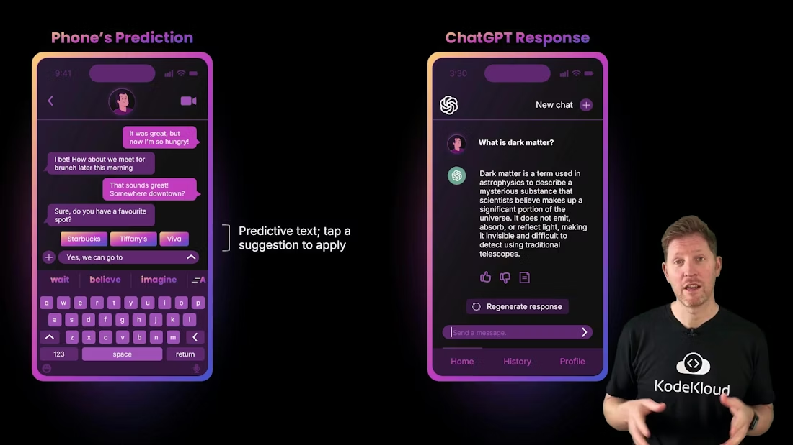
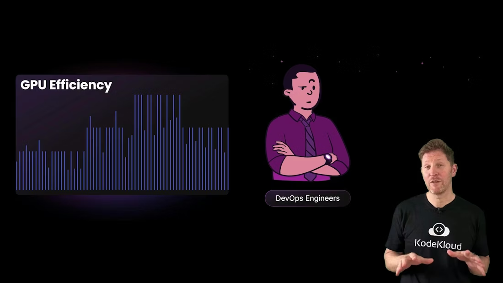
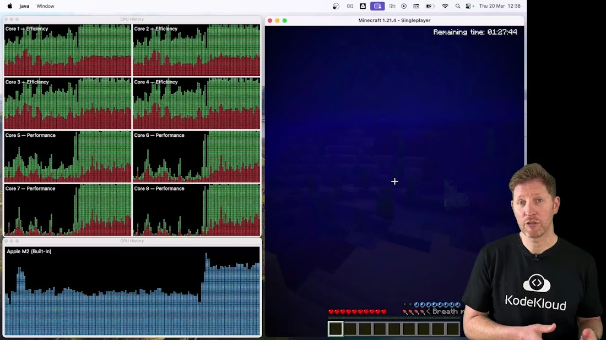
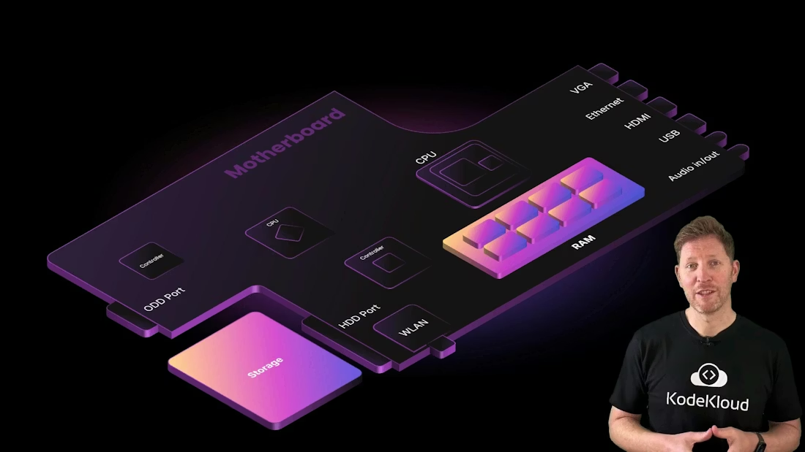

# GPU 应用 / GPU Applications

> 中文：这是一份中英文对照的 GPU 应用笔记，重点解释 GPU 为什么适合大规模并行任务，以及它在科学研究、AI、图像处理、自动驾驶和医疗成像中的具体作用。
>
> English: This is a bilingual note on GPU applications, focused on why GPUs are well suited for large-scale parallel work and how they are used in scientific research, AI, image processing, autonomous driving, and medical imaging.

## 1. GPU 为什么会被广泛使用 / Why GPUs Are So Widely Used

中文：GPU 最初是为图形渲染设计的，但它的核心优势并不只是在“画图”。真正重要的是它能同时处理大量结构相似、彼此独立的小任务。只要一个问题可以拆成很多并行的小计算，GPU 往往就能提供很高的吞吐量。

English: GPUs were originally designed for graphics rendering, but their core strength is not only “drawing pictures.” What really matters is that they can process a huge number of similar, independent small tasks at the same time. If a problem can be split into many parallel computations, a GPU can often deliver very high throughput.

中文：CPU 更适合复杂控制和逻辑分支，GPU 更适合大规模重复计算。也就是说，CPU 像总工程师，GPU 更像能同时开很多条生产线的工厂。这个差异决定了它们在现实世界里的应用范围。

English: CPUs are better for complex control flow and branching logic, while GPUs are better for large-scale repeated computation. In other words, a CPU is like a chief engineer, while a GPU is like a factory that can run many production lines at once. That difference defines their roles in the real world.

---

## 2. AI 和自然语言处理 / AI and Natural Language Processing

中文：像预测文本、聊天机器人和大语言模型这样的应用，都需要处理大量矩阵运算和向量运算。模型越大，参数越多，单次推理和训练中需要并行处理的数据量就越大。GPU 正是因为擅长这类并行数值计算，才成为 AI 工作负载的核心硬件之一。

English: Applications such as predictive text, chatbots, and large language models rely on a huge amount of matrix and vector computation. The larger the model and the more parameters it has, the more data must be processed in parallel during training and inference. GPUs are especially good at this kind of parallel numerical work, which is why they became core hardware for AI workloads.

中文：你手机上的智能输入提示、对话式 AI 回复、语音转文字和图像识别，背后都可能有 GPU 在工作。用户看到的是一个简单按钮或一个流畅的回复，背后实际上是成千上万次并行计算。

English: Predictive text on your phone, chatbot replies, speech-to-text, and image recognition may all rely on GPUs behind the scenes. The user sees a simple suggestion or a smooth answer, but underneath there may be thousands of parallel computations taking place.

---

## 3. 科学研究与数据分析 / Scientific Research and Data Analysis

中文：科学研究经常要处理非常大的数据集，例如气候模型、分子模拟、天体物理和流体计算。这些任务通常可以拆成大量独立计算点，因此非常适合 GPU。与其让一个 CPU 核心慢慢处理，不如让 GPU 同时处理成百上千个计算单元。

English: Scientific research often involves very large datasets, such as climate models, molecular simulations, astrophysics, and fluid dynamics. These tasks can usually be split into many independent computation points, which makes them well suited to GPUs. Rather than having one CPU core work through everything slowly, a GPU can process hundreds or thousands of units in parallel.

中文：这也是为什么 GPU 在科研、数据科学和工程仿真里越来越重要。它们不是只为“游戏画面”服务，而是为大量数值运算服务。

English: That is why GPUs are becoming more important in research, data science, and engineering simulation. They are not only for “game graphics”; they are for massive numerical computation.

<blockquote>
中文：如果一个任务的计算结构非常规则，而且每一步都很相似，那么 GPU 往往会比 CPU 更高效。

English: If a task has a very regular computation structure and each step looks similar, a GPU will often be more efficient than a CPU.
</blockquote>

---

## 4. 自动驾驶和医疗成像 / Autonomous Vehicles and Medical Imaging

中文：自动驾驶需要处理摄像头、雷达、激光雷达和地图数据，并快速做出判断。医疗成像也类似：CT、MRI、超声和病理图像都包含大量需要并行处理的数据。GPU 可以帮助这些系统更快完成图像重建、特征提取和模式识别。

English: Autonomous driving systems need to process camera, radar, lidar, and map data, then make decisions quickly. Medical imaging is similar: CT, MRI, ultrasound, and pathology images all contain large amounts of data that need to be processed in parallel. GPUs help these systems perform image reconstruction, feature extraction, and pattern recognition faster.

中文：在这些场景中，速度不仅仅是“体验更好”，而是直接关系到安全和诊断效果。更快的计算意味着车辆能更快判断环境，医生也能更快查看和分析图像。

English: In these scenarios, speed is not just about a better experience; it directly affects safety and diagnosis. Faster computation means a car can understand its environment sooner, and doctors can inspect and analyze images more quickly.

---

## 5. 气候模型与复杂模拟 / Climate Models and Complex Simulation

中文：气候模型是典型的 GPU 应用场景之一。大气、海洋、温度、云层、辐射和风场都可以被拆分成大量网格点，并在每个时间步进行计算。GPU 擅长这种“很多点一起算”的模式，因此很适合气候模拟。

English: Climate modeling is one of the classic GPU use cases. Atmosphere, oceans, temperature, cloud layers, radiation, and wind fields can all be split into many grid points and computed over each time step. GPUs are well suited to this “many points at once” pattern, which makes them ideal for climate simulation.

中文：这类任务的重点不是某一颗芯片“算得快”，而是整个系统能否在合理时间里处理海量并行数据。GPU 就在这里发挥了决定性作用。

English: In these workloads, the point is not that one chip is “fast,” but that the whole system can process massive parallel data in a reasonable amount of time. That is where the GPU becomes decisive.

---

## 6. GPU 的效率和价值 / GPU Efficiency and Value

中文：GPU 的效率体现在它能用很多小核心同时做事。它不是像 CPU 那样专注于少量复杂分支，而是把计算拆得尽量细，然后用并行来换取总吞吐量。对于高度并行的任务，这种设计非常划算。

English: The efficiency of a GPU comes from its ability to have many small cores work at once. It does not focus on a few complex branches the way a CPU does. Instead, it breaks computation into small pieces and uses parallelism to maximize total throughput. For highly parallel tasks, this design is extremely effective.

中文：对于 DevOps、数据平台、AI 团队和研究团队来说，GPU 的价值不只是“更快”，还包括“更能处理规模化任务”。当工作负载越来越大时，GPU 常常比单纯堆 CPU 更合适。

English: For DevOps teams, data platforms, AI teams, and research groups, the value of a GPU is not only that it is “faster,” but also that it handles scale much better. As workloads grow larger, GPUs are often a better fit than simply adding more CPU power.

---

## 7. 应用总结 / Application Summary

中文：GPU 适合图像、视频、AI、科学计算、自动驾驶和医疗成像等场景。只要任务具备“同类计算多、并行度高、重复性强”这些特征，GPU 就很有优势。

English: GPUs are well suited for graphics, video, AI, scientific computing, autonomous driving, and medical imaging. As long as a task has lots of similar computations, high parallelism, and strong repetition, a GPU usually has a major advantage.

## Further Reading

- [Watch Video](https://learn.kodekloud.com/user/courses/computer-architecture/module/1a4d7f10-3ff2-4c31-b5de-7b8d2e6e84a8/lesson/gpu-applications)
