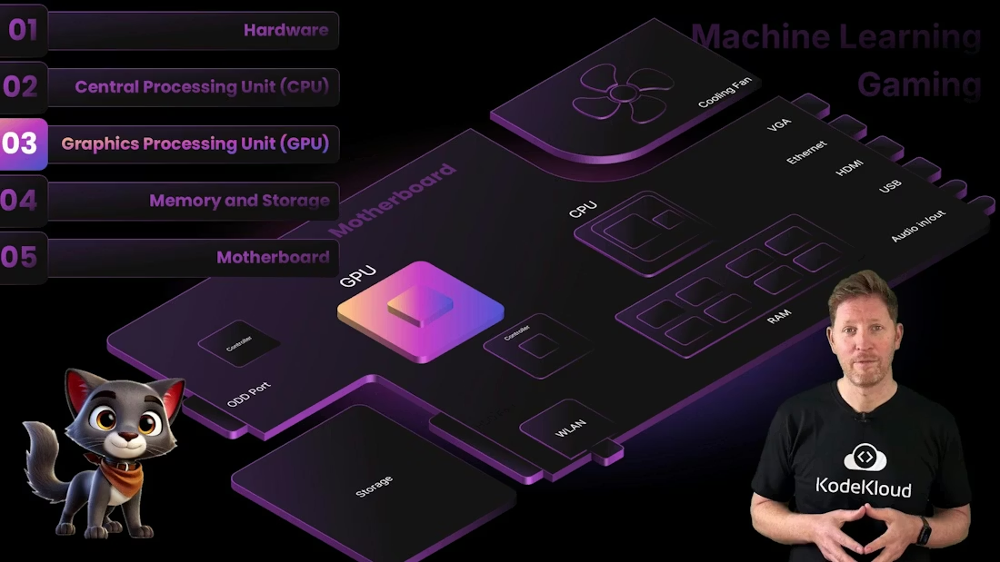
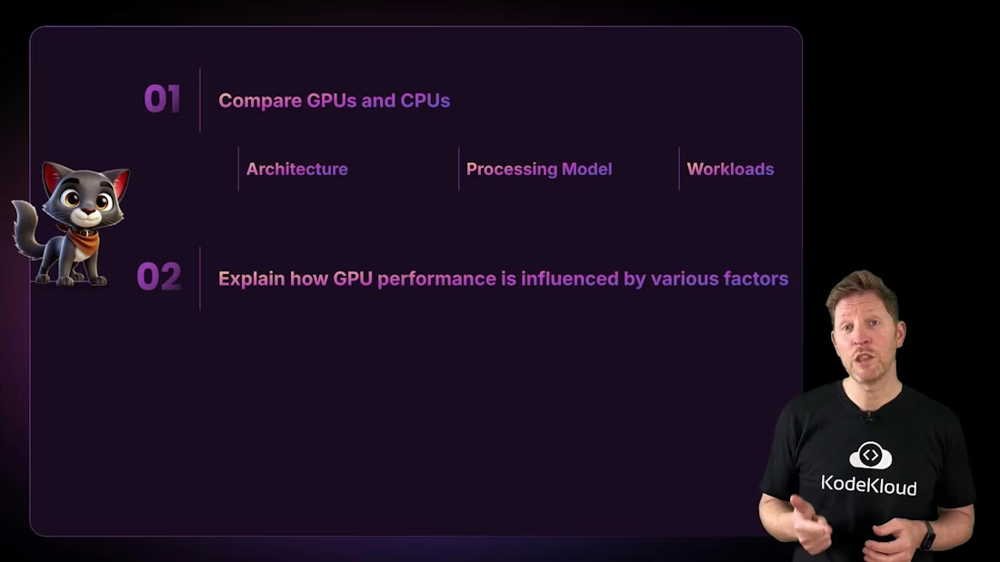
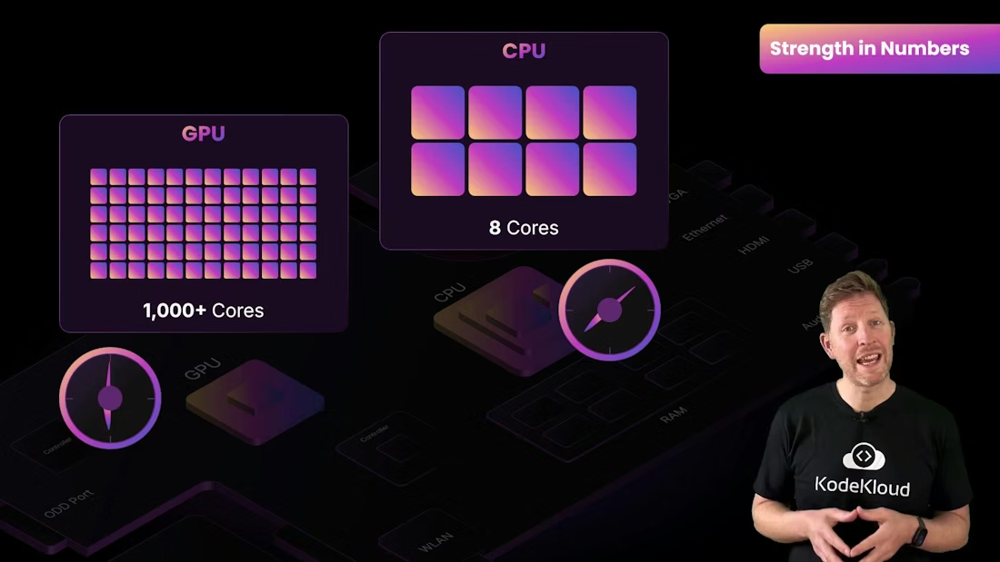
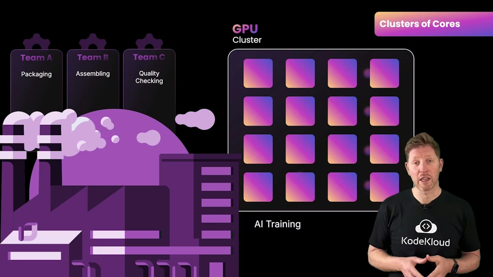
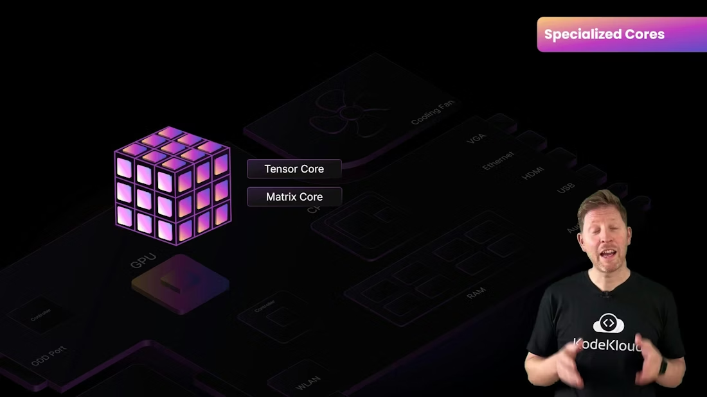
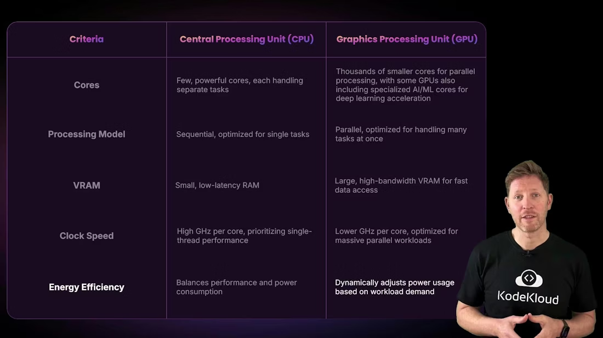
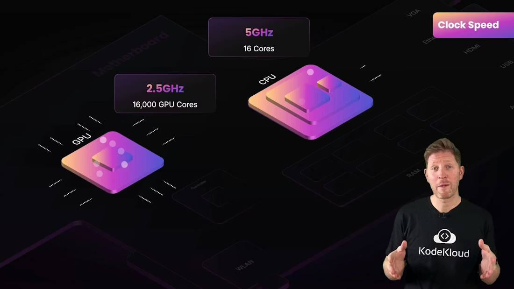

# GPU 架构 / GPU Architecture

> 中文：这是一份中英文对照的 GPU 架构笔记，重点解释 GPU 和 CPU 的结构差异、GPU 如何并行处理、为什么 VRAM 很重要，以及为什么 GPU 更适合大规模同类计算。
>
> English: This is a bilingual GPU architecture note focused on structural differences between GPUs and CPUs, how GPUs process in parallel, why VRAM matters, and why GPUs are better suited to massive similar computations.

## 1. GPU 和 CPU 的区别 / GPU vs CPU

中文：CPU 和 GPU 的根本区别不是“谁更高级”，而是“优化目标不同”。CPU 追求低延迟和复杂控制，GPU 追求高吞吐量和大规模并行。CPU 常见的是少量强核心，GPU 则是大量较小的并行核心。

English: The fundamental difference between a CPU and a GPU is not “which one is better,” but “which one is optimized for what.” CPUs aim for low latency and complex control, while GPUs aim for high throughput and massive parallelism. CPUs usually have a small number of powerful cores, while GPUs have many smaller parallel cores.

中文：如果工作负载需要频繁分支判断、复杂控制流和顺序处理，CPU 更合适；如果工作负载是大量相似运算、矩阵计算和图像处理，GPU 就会更有优势。

English: If a workload requires frequent branching, complex control flow, and sequential processing, a CPU is a better fit. If the workload consists of many similar operations, matrix math, and image processing, a GPU will usually have the advantage.

---

## 2. GPU 的并行结构 / GPU Parallel Structure

中文：GPU 的设计目标是让成百上千个计算单元同时工作。它不是把资源集中在少数“聪明核心”上，而是把大量核心组织成集群或簇，然后一起处理同一种类型的任务。

English: A GPU is designed so that hundreds or thousands of compute units can work at the same time. It does not concentrate resources into a few “smart cores.” Instead, it organizes many cores into clusters and has them work together on the same kind of task.

中文：这种结构非常适合 AI 训练、图像渲染、视频编码、科学模拟和大规模数值分析。只要计算可以被切成很多小块，GPU 就能把它们一起处理。

English: This structure is excellent for AI training, image rendering, video encoding, scientific simulation, and large-scale numerical analysis. As long as the computation can be broken into many small pieces, the GPU can process them together.

---

## 3. 特殊核心 / Specialized Cores

中文：现代 GPU 已经不只是“很多简单核心”。它们还会加入特殊用途的核心，比如 Tensor Core、Matrix Core、RT Core 等，用来加速深度学习、矩阵运算或光线追踪任务。

English: Modern GPUs are no longer just “many simple cores.” They also include specialized units such as Tensor Cores, Matrix Cores, and RT Cores to accelerate deep learning, matrix operations, and ray tracing.

中文：这些专用单元的意义在于把常见的重计算任务直接硬件化，从而把某些算法的执行速度提升到很高的水平。

English: The purpose of these specialized units is to move common heavy workloads directly into hardware, allowing certain algorithms to run much faster.

---

## 4. VRAM 和带宽 / VRAM and Bandwidth

中文：GPU 不是只靠计算核心快，显存也很重要。VRAM 是 GPU 用来存放图像、模型、纹理、中间结果和工作数据的高速内存。对于 GPU 来说，显存的带宽和容量都非常关键。

English: A GPU’s speed does not depend only on its compute cores. VRAM is also crucial. VRAM is the high-speed memory used to store images, models, textures, intermediate results, and working data. For GPUs, both bandwidth and capacity matter a great deal.

中文：如果显存太小，GPU 就不得不频繁和主内存交换数据，性能会明显下降。因此，做 AI 或高分辨率图形任务时，VRAM 往往和核心数一样重要。

English: If VRAM is too small, the GPU has to exchange data with main memory too often, and performance drops sharply. That is why in AI or high-resolution graphics workloads, VRAM is often just as important as core count.

---

## 5. 频率、吞吐量和能效 / Frequency, Throughput, and Efficiency

中文：GPU 的时钟频率并不一定比 CPU 更高，但这并不妨碍它在并行任务中表现优异。GPU 的目标不是单线程极限速度，而是在大量核心上提供高吞吐量。

English: A GPU does not necessarily run at a higher clock speed than a CPU, but that does not stop it from excelling at parallel tasks. A GPU’s goal is not maximum single-thread speed; it is high throughput across many cores.

中文：随着硬件设计进步，现代 GPU 更重视每瓦性能，也就是在消耗更合理电力的前提下完成更多计算。早期高性能 GPU 可能非常耗电，而现代 GPU 更强调性能与能效的平衡。

English: As hardware design improved, modern GPUs place more emphasis on performance per watt, meaning they do more computation while consuming a more reasonable amount of power. Early high-performance GPUs could be extremely power-hungry, while modern GPUs focus more on balancing performance and efficiency.

---

## 6. GPU 的内部组织 / Internal GPU Organization

中文：GPU 里的核心通常被组织成大规模的计算阵列，任务被拆成许多线程一起运行。与 CPU 的少量复杂核心相比，GPU 更像是成批处理工人，每个人负责同类小任务。

English: GPU cores are usually organized into large compute arrays, and tasks are split into many threads that run together. Compared with a CPU’s small number of complex cores, a GPU is more like a large group of workers each doing similar small jobs.

中文：这就是为什么 GPU 在“很多相同计算一起做”的场景里特别高效。它不是为了一个任务特别聪明，而是为了很多任务一起做得更快。

English: That is why GPUs are especially efficient in scenarios where many identical computations are performed together. They are not designed to be especially clever on one task; they are designed to make many tasks run faster together.

---

## 7. GPU 架构总结 / GPU Architecture Summary

中文：GPU 的核心优势来自并行核心、专用加速单元、VRAM 和高吞吐量设计。它适合图像处理、AI、科学计算和其他能被拆成很多小任务的工作。

English: A GPU’s core strength comes from parallel cores, specialized accelerators, VRAM, and a throughput-oriented design. It is suitable for image processing, AI, scientific computing, and other workloads that can be split into many small tasks.

## Further Reading

- [Watch Video](https://learn.kodekloud.com/user/courses/computer-architecture/module/1a4d7f10-3ff2-4c31-b5de-7b8d2e6e84a8/lesson/gpu-architecture)
