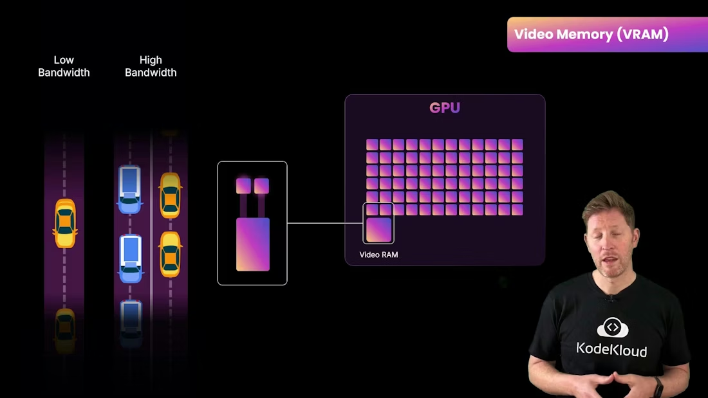
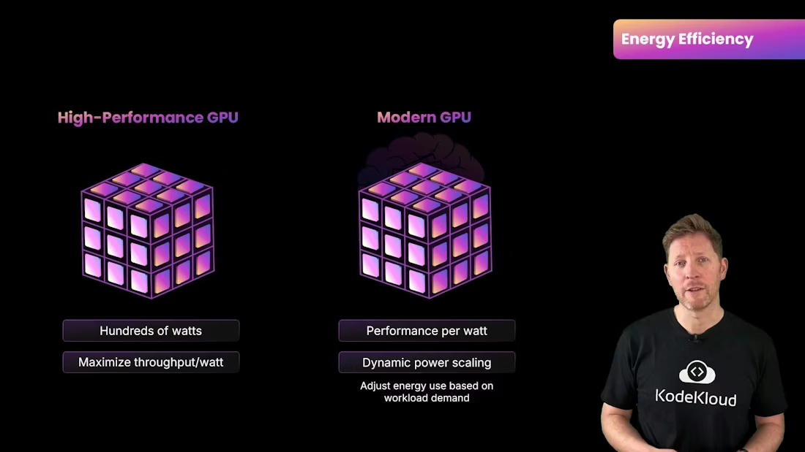

# GPU Architecture

> Explains GPU architecture differences from CPUs and how cores, memory, clock speed, and specialized units affect AI training and inference performance and efficiency

Welcome back. In the previous section you rolled out laptops across your company. Now your R\&D team is building an internal chatbot (think ChatGPT trained on company data). Training that model is painfully slow on CPUs alone—it's like trying to read a library one page at a time. To accelerate training we need to run thousands of calculations in parallel, which is exactly what GPUs are designed to do.

In this lesson you'll learn:

* What architectural differences make GPUs better for certain workloads than CPUs.
* How GPU performance depends on core structure, clock speed, and memory.
* Which GPU features matter for AI training and inference.

  

<Frame>
    
</Frame>

High-level comparison: CPUs versus GPUs

* CPU: A few powerful cores optimized for complex, branching, single-threaded or moderately parallel tasks.
* GPU: Thousands of simpler cores optimized for performing the same operation over large data sets in parallel.

The GPU approach—massive parallelism—matches workloads such as rendering pixels, applying shaders across vertices, and dense matrix math in machine learning. For deep learning, GPUs can run thousands of arithmetic operations at once, reducing training time from days to hours compared to CPU-only training.

<Frame>
    
</Frame>

Why thousands of cores?

GPUs organize their many cores into clusters—often called streaming multiprocessors (NVIDIA) or compute units (AMD). These clusters let teams of cores work in lockstep, increasing throughput and reducing coordination overhead. Imagine a factory: teams specialize in packaging, assembly, and quality checks; the coordinated teams achieve far higher throughput than the same number of lone workers.

<Frame>
    
</Frame>

<Frame>
    
</Frame>

Specialized AI hardware

Many modern GPUs include dedicated accelerators—tensor cores, matrix cores, or vendor-specific AI units—designed for dense matrix operations and mixed-precision math (FP16, BF16). These units dramatically increase throughput for neural-network operations. A training job that takes many hours on a general-purpose GPU can finish in a fraction of that time on a GPU with specialized AI cores.

<Frame>
    
</Frame>

Memory and data movement: VRAM matters

GPU cores only run as fast as they can get data. Video RAM (VRAM) is high-bandwidth memory attached directly to the GPU and stores textures, frame buffers, or large matrices for ML. Two key properties:

* Capacity: how large a model or batch you can store on-device.
* Bandwidth: how fast data moves between VRAM and compute cores.

<Callout icon="lightbulb" color="#1CB2FE">
  VRAM capacity and bandwidth are crucial for AI workloads: capacity limits the size of models and batch sizes you can process, while bandwidth reduces stalls by keeping compute units fed. Running out of VRAM forces data transfers or smaller batches, which slow training.
</Callout>

<Frame>
    
</Frame>

Clock speed vs parallelism

GPUs typically run at lower per-core clock speeds than CPUs (for example, `2.5 GHz` vs `5 GHz`), but they compensate by having orders of magnitude more cores. Think of a race car (`high single-thread speed`) versus a freight train (`lots of throughput`). GPU designs prioritize total operations per second over single-thread latency.

<Frame>
    
</Frame>

Power and efficiency

High-performance GPUs can draw hundreds of watts. Data centers running continuous AI workloads must account for power delivery and cooling. Modern GPU architectures emphasize performance-per-watt with dynamic boost clocks and power scaling to improve cost efficiency.

<Callout icon="warning" color="#FF6B6B">
  High-performance GPUs require adequate cooling and power. When planning for continuous AI training, include power consumption and data-center cooling in hardware selection and total cost calculations.
</Callout>

<Frame>
    
</Frame>

Quick comparison table

| Feature           |                                                    CPU | GPU                                                         |
| ----------------- | -----------------------------------------------------: | ----------------------------------------------------------- |
| Cores             | Few, powerful cores optimized for complex control flow | Thousands of simpler cores optimized for parallel workloads |
| Processing model  |                  Serial / branching tasks, low latency | SIMD / SIMT parallelism, high throughput                    |
| Specialized units |                    Vector units, general-purpose cores | Tensor/matrix cores for AI acceleration                     |
| Memory            |                           System RAM (lower bandwidth) | High-bandwidth VRAM (higher throughput)                     |
| Clock speed       |                 Higher per-core clocks (`~3–5 GHz`) | Lower per-core clocks (`~1–3 GHz`) but many cores        |
| Energy            |  Optimized for response latency and single-thread perf | Performance-per-watt focus; can draw high total power       |

Choosing the right GPU for AI

When selecting GPUs for training or inference, weigh:

* VRAM capacity: large models and big batch sizes require more memory.
* Memory bandwidth: reduces stalls and speeds up compute.
* Specialized cores: tensor/matrix cores accelerate common NN ops.
* Power and cooling: ensure infrastructure can support continuous loads.
* Price vs performance: the most expensive GPU isn’t always the best fit—consider workload characteristics (training, inference, or graphics) and cost efficiency.

References and further reading

* [NVIDIA CUDA Documentation](https://developer.nvidia.com/cuda-zone)
* [NVIDIA Tensor Cores overview](https://developer.nvidia.com/tensorcores)
* [AMD GPU Architecture](https://www.amd.com/en/technologies/graphics-architecture)
* [Deep Learning &amp; Mixed Precision Training](https://arxiv.org/abs/1710.03740)

Now that you understand GPU architecture and how it differs from CPUs, you’re better equipped to pick hardware for AI training, inference, or graphics workloads.

<CardGroup>
  <Card title="Watch Video" icon="video" cta="Learn more" href="https://learn.kodekloud.com/user/courses/computer-architecture/module/e3c31d19-97a9-464e-b94f-5ff231dc9677/lesson/4e354eef-e308-46e6-aca0-5ff0325d8743" />
</CardGroup>

Built with [Mintlify](https://mintlify.com).
