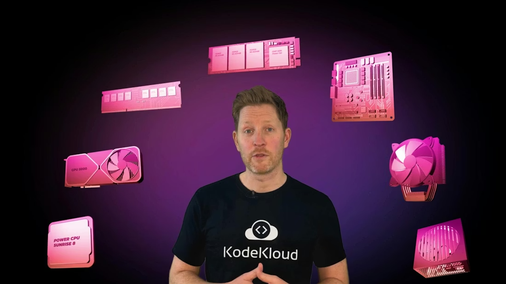
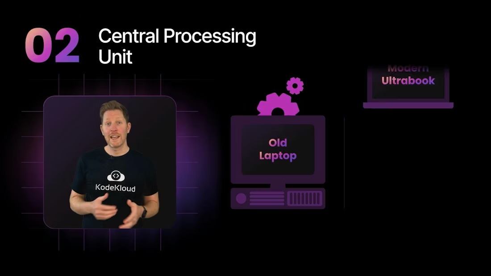
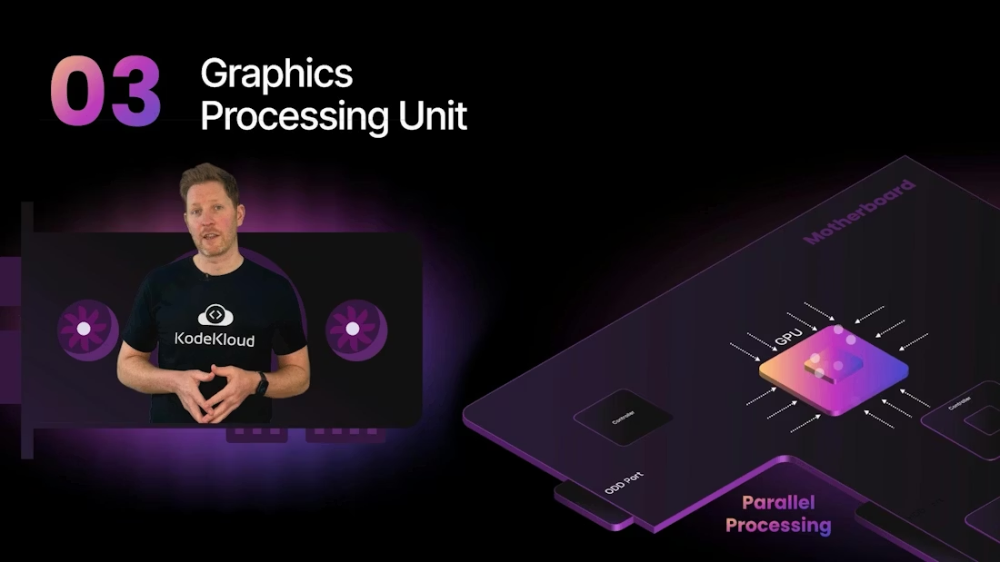
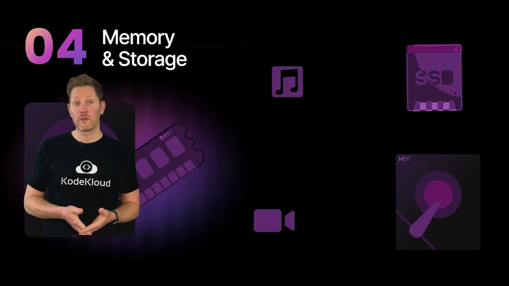
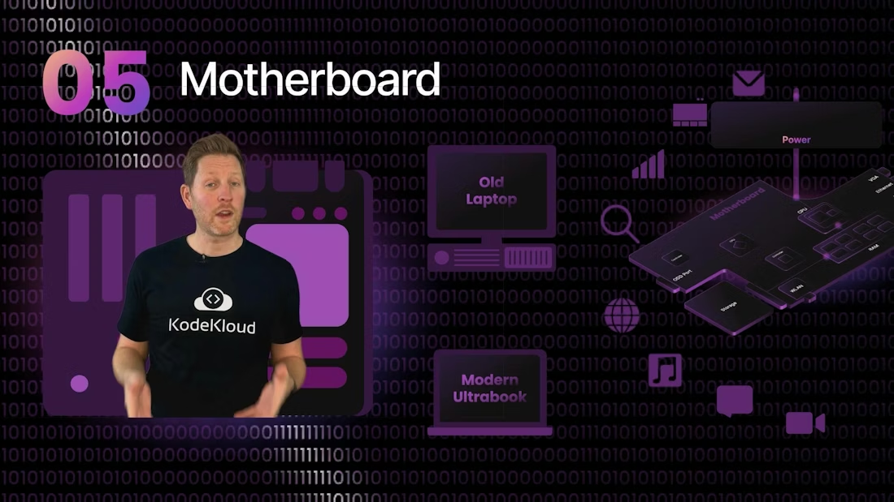

# 计算机体系结构导论 / Computer Architecture Introduction

> 中文：这是一份更完整的中英文对照学习笔记。它保留了课程的主线，但把原本只在讲解里提到的逻辑补齐了：为什么不同部件分工不同，为什么性能不只看一个数字，为什么“看起来很快”的机器也可能因为内存、存储、散热或供电而变慢。
> English: This is a more complete bilingual study note. It keeps the lecture’s main storyline, but fills in the logic that is often only hinted at in the spoken explanation: why different components have different responsibilities, why performance is never determined by one number alone, and why a machine that “looks fast” can still feel slow because of memory, storage, cooling, or power delivery.

---

## 1. 为什么要学计算机体系结构 / Why Learn Computer Architecture

中文：计算机体系结构研究的是一台计算机内部各个关键部件如何协作，把输入变成输出。它不是只研究某一块芯片，而是研究一个完整系统的组织方式：CPU 负责通用计算，GPU 负责并行处理，内存负责临时工作区，存储负责长期保存，主板负责连接和传输，外设负责与人交互。理解这些分工后，你看见一台机器就不再只是看“配置”，而是能看出它的工作方式。

English: Computer architecture studies how the key components inside a computer cooperate to turn input into output. It is not about one chip alone; it is about the organization of a complete system: the CPU handles general-purpose computation, the GPU handles parallel processing, memory provides temporary workspace, storage provides long-term retention, the motherboard handles connection and transfer, and peripherals provide human interaction. Once you understand these roles, a machine stops being just a “spec sheet” and becomes a system whose behavior you can reason about.

中文：几十年前的个人电脑已经很令人惊叹，但和今天的设备相比又非常有限。今天的笔记本和台式机之所以能完成以前需要整间机房才能完成的工作，不是因为某一个部件突然“变聪明”了，而是因为 CPU、GPU、内存、存储、主板、供电、散热和固件等多个层面一起进步了。体系结构课的价值，就在于把这些进步重新拼成一张有逻辑的图。

English: Personal computers from decades ago were impressive for their time, but very limited compared with today’s devices. The reason modern laptops and desktops can do work that once required entire rooms of equipment is not that one component suddenly became “smarter.” It is because the CPU, GPU, memory, storage, motherboard, power delivery, cooling, and firmware all improved together. The value of computer architecture is that it helps you assemble those improvements into one coherent picture.

---

## 2. 这门课的五个核心角色 / The Five Core Roles

中文：你可以把计算机想成一个不断循环的信息处理系统。外部世界通过键盘、鼠标、摄像头、麦克风和触摸屏输入数据；系统内部对这些数据进行处理；处理后的结果被暂时放进内存或长期放进存储；最后通过显示器、扬声器、网络或其他输出设备呈现给用户。这个循环看似简单，但每一步都涉及硬件、固件、操作系统和应用程序之间的协作。

English: You can think of a computer as a continuously repeating information-processing system. The outside world sends data in through a keyboard, mouse, camera, microphone, or touchscreen; the system processes that data; the result is stored temporarily in memory or permanently in storage; and finally it is presented to the user through a monitor, speaker, network, or another output device. The loop looks simple, but every step depends on cooperation among hardware, firmware, the operating system, and applications.

中文：理解计算机时，一个非常实用的视角是把它拆成五个角色：输入、处理、临时保存、长期保存和输出。外设负责输入和输出，CPU 和 GPU 负责处理，RAM 负责临时保存当前正在使用的数据，SSD 或 HDD 负责长期保存数据，主板则像交通枢纽一样把所有部件连接起来。你以后看到任何设备，都可以先问一句：它在这五个角色里扮演什么？

English: A very useful way to understand a computer is to divide it into five roles: input, processing, temporary storage, long-term storage, and output. Peripherals handle input and output, the CPU and GPU handle processing, RAM temporarily stores the data currently in use, SSDs or HDDs provide long-term storage, and the motherboard acts like a transport hub connecting all components. When you see any device later, you can first ask: which of these five roles does it play?

---

## 3. 外设 / Peripherals

中文：外设是计算机和人类之间最直接的接触点。键盘和鼠标把人的动作变成系统能理解的输入；显示器、扬声器和耳机把系统处理后的结果变成人能看到和听到的输出；摄像头和麦克风则把外部环境中的图像和声音采集进来。没有外设，计算机即使在运行，人也几乎无法直接使用它。

English: Peripherals are the most direct contact point between the computer and the human user. The keyboard and mouse turn human actions into inputs the system can understand; the monitor, speakers, and headphones turn processed results into output humans can see and hear; the camera and microphone capture images and sound from the outside world. Without peripherals, the computer may still be running, but it would be nearly impossible for a person to use it directly.

中文：输入和输出并不只是“插上就能用”这么简单。键盘按下一个键以后，内部会产生扫描码，系统再根据键盘布局和修饰键状态把它映射成字符；摄像头和麦克风需要把模拟信号转换成数字数据；显示器和音频设备则要把数字信号再转换回人类可感知的图像和声音。也就是说，外设经常承担着模拟世界与数字世界之间的翻译工作。

English: Input and output are not as simple as “plug it in and it works.” When you press a key on a keyboard, the device generates a scan code, and the system maps that code to a character based on the keyboard layout and modifier-key state; cameras and microphones convert analog signals into digital data; displays and audio devices convert digital signals back into images and sound that humans can perceive. In other words, peripherals often act as translators between the analog world and the digital world.

中文：外设之所以重要，还因为它们决定了交互效率。键盘适合快速输入文字，鼠标适合精确定位，触摸屏适合直接触控，摄像头适合视觉采集，麦克风适合语音输入。不同设备对应不同场景，系统设计得越合理，人与机器之间的互动就越自然。

English: Peripherals are important because they determine interaction efficiency. Keyboards are good for fast text entry, mice are good for precise pointing, touchscreens are good for direct touch interaction, cameras are good for visual capture, and microphones are good for voice input. Different devices fit different scenarios, and the better the system is designed, the more natural the interaction between human and machine becomes.

---

## 4. CPU / The Central Processing Unit

中文：中央处理器，也就是 CPU，是计算机里最核心的通用计算单元。它负责取指、译码、执行指令，并协调系统中的很多操作。你可以把 CPU 想成总指挥，它不一定是所有任务里绝对最快的那个，但它最擅长处理各种不同类型的逻辑和控制任务。操作系统、浏览器、文档编辑、网络请求和程序调度，这些任务都离不开 CPU。

English: The Central Processing Unit, or CPU, is the core general-purpose computing unit in a computer. It fetches instructions, decodes them, executes them, and coordinates many operations in the system. You can think of the CPU as the chief coordinator. It may not be the fastest part for every task, but it is the best at handling a wide variety of logic and control workloads. The operating system, browser, document editor, network requests, and program scheduling all depend on the CPU.

中文：CPU 的内部并不是一整块神奇芯片，而是由多个核心、缓存、寄存器、控制单元、算术逻辑单元和内存控制相关电路组成。核心是独立的执行引擎；缓存是靠近核心的高速临时存储；寄存器则是速度更快、容量更小的内部工作区。CPU 之所以快，不只是因为频率高，更因为它通过流水线、乱序执行、分支预测、缓存层级和并行执行单元，把每个时钟周期尽量利用起来。

English: A CPU is not a single magical chip, but a collection of cores, caches, registers, control logic, arithmetic and logic units, and memory-controller circuitry. A core is an independent execution engine; cache is high-speed temporary storage close to the core; registers are even faster and smaller internal working areas. A CPU is fast not only because its frequency is high, but also because it uses pipelining, out-of-order execution, branch prediction, cache hierarchies, and parallel execution units to make the best use of each clock cycle.

中文：现代 CPU 常常会同时宣传核心数、线程数、频率和缓存大小。核心数越多，理论上能同时处理的独立工作就越多；线程数反映了逻辑执行路径的数量；频率表示每秒钟能产生多少时钟周期；缓存大小则影响 CPU 是否需要频繁去更慢的内存中取数。真正的性能从来不是单个数字决定的，而是这些因素共同作用的结果。

English: Modern CPUs are often marketed by core count, thread count, clock speed, and cache size. More cores generally mean more independent work can be handled at the same time; thread count reflects how many logical execution paths are available; frequency shows how many clock cycles occur each second; cache size affects how often the CPU has to fetch data from slower memory. Real performance is never determined by a single number. It is the combined result of these factors.

中文：核心和线程不是同一个概念。一个物理核心是真实存在的执行单元，而线程更像是系统看到的执行路径。某些核心支持同时多线程，也就是一个核心在逻辑上表现为多个线程；但这不等于性能翻倍，因为多个线程仍然要共享某些执行资源。线程数增加通常提高吞吐量，但对单个任务的提升并不总是线性的。

English: A core and a thread are not the same thing. A physical core is a real execution unit, while a thread is more like an execution path seen by the system. Some cores support simultaneous multithreading, which means one physical core appears as multiple logical threads; however, this does not double performance, because those threads still share certain execution resources. More threads usually improve throughput, but the benefit for a single task is not always linear.

中文：时钟频率也很容易被误解。GHz 代表每秒多少十亿个时钟周期，但并不意味着每个周期都能完成一条完整指令。现代 CPU 会把指令拆成更小的微操作，并在多个周期里重叠执行。换句话说，频率只是节拍，不是完成能力的全部。更高的频率可能带来更高性能，但也可能带来更高功耗和更强散热压力。

English: Clock speed is also easy to misunderstand. GHz means billions of clock cycles per second, but it does not mean that one instruction is completed in one cycle. Modern CPUs break instructions into smaller micro-operations and overlap them across multiple cycles. In other words, frequency is only the beat, not the whole measure of completion ability. A higher frequency may deliver higher performance, but it can also bring higher power consumption and greater thermal pressure.

---

## 5. GPU / The Graphics Processing Unit

中文：GPU，图形处理器，最初是为图像渲染而设计的。因为图像和视频任务往往包含大量相似、重复、彼此独立的计算，所以 GPU 非常适合这种工作模式。相比 CPU，GPU 更强调数量庞大的并行执行单元，而不是少量非常聪明的核心。它擅长同时处理很多小任务，而不是一次把单个复杂任务想得特别深。

English: The GPU, or Graphics Processing Unit, was originally designed for image rendering. Because graphics and video workloads often contain a huge number of similar, repetitive, and independent computations, the GPU is very well suited to this pattern. Compared with a CPU, a GPU emphasizes a very large number of parallel execution units rather than a small number of very smart cores. It is good at handling many small tasks at once, rather than deeply reasoning through a single complex task.

中文：GPU 最常见的应用当然是图形渲染，但它的用途早已不止于此。视频编码和解码、图像处理、三维建模、科学计算、密码学、机器学习训练和推理，都可能大量利用 GPU 的并行能力。只要任务能被拆成很多结构相似的小计算，GPU 往往都能表现出很高的吞吐量。

English: The most common GPU application is of course graphics rendering, but its use has long gone far beyond that. Video encoding and decoding, image processing, 3D modeling, scientific computing, cryptography, machine-learning training, and inference can all make heavy use of GPU parallelism. As long as a task can be split into many similar small computations, a GPU can often deliver very high throughput.

中文：GPU 和 CPU 的区别，不只是“谁快谁慢”，而是优化目标不同。CPU 更适合延迟敏感、分支复杂、逻辑多变的任务；GPU 更适合吞吐量敏感、结构统一、并行度高的任务。也就是说，CPU 像一个擅长统筹的总工程师，GPU 更像一支能同时开很多条生产线的工厂。

English: The difference between a GPU and a CPU is not simply “which one is faster,” but “which one is optimized for what.” CPUs are better for latency-sensitive tasks with complex branching and changing logic; GPUs are better for throughput-sensitive tasks with uniform structure and high parallelism. In other words, a CPU is like a chief engineer who is good at coordination, while a GPU is like a factory that can run many production lines at the same time.

---

## 6. 内存与存储 / Memory and Storage

中文：内存和存储最容易被初学者混在一起，但它们的职责完全不同。RAM 是运行中的工作区，负责临时保存当前正在被 CPU 使用的数据和程序；存储则负责长期保存操作系统、应用程序、文档、照片、视频和其他文件。简单说，内存回答“现在要用什么”，存储回答“以后还要不要保留”。

English: Memory and storage are one of the easiest concepts for beginners to confuse, but their responsibilities are completely different. RAM is the working area of a running system, responsible for temporarily holding the data and programs currently being used by the CPU; storage is responsible for long-term retention of the operating system, applications, documents, photos, videos, and other files. In simple terms, memory answers “what do we need right now,” while storage answers “do we need to keep it later.”

中文：RAM 之所以重要，是因为 CPU 必须非常快地访问它所处理的数据。如果数据一直在慢速存储里，CPU 就会空等。RAM 速度快，但断电后内容会消失，所以它是易失性的。存储设备比如 SSD 和 HDD 则是非易失性的，即使断电也能保留内容，但访问速度远慢于 RAM。性能差距并不是一点点，而是往往跨越几个数量级。

English: RAM matters because the CPU must access the data it is processing very quickly. If the data stays in slow storage, the CPU will sit idle and wait. RAM is fast, but its contents disappear when power is lost, so it is volatile. Storage devices such as SSDs and HDDs are non-volatile, which means they retain their contents even without power, but their access speed is far slower than RAM. The performance gap is not small; it is often several orders of magnitude.

中文：存储内部也有明显差异。HDD 使用机械磁盘和磁头，容量通常更大、单位成本更低，但寻道和旋转延迟让它在随机访问方面很慢；SSD 使用闪存，没有机械运动，因此延迟低、速度快、启动和加载体验明显更好。很多用户第一次从 HDD 换到 SSD 之后，会突然感觉整台机器复活了，这不是错觉，而是存储延迟被大幅降低后的真实体验。

English: Storage also has clear internal differences. HDDs use spinning platters and a moving head, so they usually offer larger capacity and lower cost per gigabyte, but their seek and rotational delays make them slow for random access; SSDs use flash memory, so they have no moving parts, lower latency, and much better speed, which dramatically improves boot and loading experiences. Many users feel that a machine comes back to life after switching from HDD to SSD. That is not an illusion; it is the real effect of dramatically reduced storage latency.

中文：除了 RAM 和硬盘，计算机里还有寄存器和缓存。寄存器位于 CPU 核心内部，是最快的一层工作区，但容量极小；缓存位于 CPU 附近，是用来保存高频访问数据的高速缓冲区，通常分为 L1、L2 和 L3。内存层级的核心思想是：越靠近 CPU，速度越快，容量越小，成本越高；越远离 CPU，容量越大，成本越低，速度越慢。

English: In addition to RAM and disk storage, a computer also has registers and cache. Registers are inside the CPU core and are the fastest working area, but their capacity is tiny; cache sits near the CPU and stores frequently accessed data as a high-speed buffer, usually divided into L1, L2, and L3. The central idea of the memory hierarchy is: the closer to the CPU, the faster, smaller, and more expensive it is; the farther away, the larger, cheaper, and slower it becomes.

中文：当 RAM 不够用时，系统会借助虚拟内存把一部分页面换到磁盘上，也就是常说的 paging 或 swapping。这个机制能避免程序立刻崩溃，但会显著降低响应速度，因为磁盘比 RAM 慢得多。很多电脑突然卡住的问题，本质上不是 CPU 不够快，而是内存不足导致系统开始频繁交换页面。

English: When RAM runs out, the system uses virtual memory to move some pages to disk, a process often called paging or swapping. This mechanism prevents programs from crashing immediately, but it significantly reduces responsiveness because disk is much slower than RAM. Many sudden “my computer is lagging” problems are not really caused by a slow CPU. They are caused by insufficient memory, which forces the system to swap pages frequently.

---

## 7. 主板 / The Motherboard

中文：主板是把所有部件连在一起的基础平台。它像一张地图，也像一个交通网络：CPU、RAM、存储、GPU、网卡、音频控制器、USB 接口和供电模块都要通过主板完成连接。没有主板，单个部件再强也无法形成完整系统。

English: The motherboard is the base platform that ties all components together. It is like both a map and a transportation network: the CPU, RAM, storage, GPU, network controller, audio controller, USB interfaces, and power circuitry all rely on the motherboard for connection. Without the motherboard, even the strongest individual components cannot form a complete system.

中文：主板不仅是插槽的集合，它还是电气、逻辑和物理设计的综合体。它决定了你能装什么 CPU，能插多少内存，能接什么存储，能不能加独立显卡，能提供多少 USB 或视频接口，以及系统的扩展能力有多强。很多人以为电脑性能主要看 CPU，但实际上主板的设计也会决定整机上限。

English: A motherboard is not just a collection of slots. It is a combined electrical, logical, and physical design. It determines which CPU you can install, how much memory you can add, what storage you can connect, whether you can use a discrete GPU, how many USB or video interfaces you get, and how strong the system’s expansion ability is. Many people assume computer performance is mainly about the CPU, but motherboard design also determines the system’s upper limit.

中文：主板上的控制器和总线负责管理数据流。控制器会协调设备识别、协议转换、中断管理、直接内存访问和电源状态管理；总线则是数据传输的通道。可以把主板想象成一座城市，控制器是交通警察，总线是道路，而 CPU、内存和设备就是不同地点之间不断流动的车辆。

English: The controllers and buses on the motherboard manage data flow. Controllers coordinate device detection, protocol conversion, interrupt handling, direct memory access, and power-state management; buses are the channels through which data moves. You can think of the motherboard as a city, where controllers are traffic officers, buses are roads, and the CPU, memory, and devices are vehicles constantly moving between different locations.

中文：理解主板时，最重要的三个概念是供电、连接和传输。供电保证部件能稳定运行，连接保证部件能物理插上并被识别，传输保证数据可以快速、正确地在部件之间流动。如果这三件事中任何一件出了问题，系统就会出现性能下降、启动失败、设备缺失或随机不稳定。

English: When understanding the motherboard, the three most important concepts are power delivery, connectivity, and transmission. Power delivery ensures the components run stably, connectivity ensures the components can be physically installed and recognized, and transmission ensures data can move quickly and correctly between them. If any one of these three fails, the system may show reduced performance, boot failure, missing devices, or random instability.

---

## 8. 电源、散热与固件 / Power, Cooling, and Firmware

中文：计算机并不是靠“插电就行”这么简单地工作。主板会通过电源管理电路把外部电源转换成各个部件需要的电压和电流。特别是 CPU 和 GPU，它们对供电稳定性要求很高，所以主板上会有稳压模块，也就是 VRM，用来把电压调整到合适范围并减少波动。供电不稳会引发重启、蓝屏、性能波动，严重时甚至可能损坏硬件。

English: A computer does not simply work because you plug it in. The motherboard uses power-management circuitry to convert the external power source into the voltage and current each component needs. CPU and GPU are especially demanding, so the motherboard includes voltage regulator modules, or VRMs, to adjust voltage to the correct range and reduce fluctuations. Unstable power can cause reboots, blue screens, performance swings, and in severe cases even hardware damage.

中文：散热和供电其实是同一件事的两面。芯片运行时会发热，温度过高后，系统为了自我保护会降低频率，这就是热降频，也就是 thermal throttling。散热系统通常由导热材料、散热片、热管、风扇或液冷组成，它们的任务不是制造冷气，而是尽快把热量从芯片带走并排到环境中。

English: Cooling and power are two sides of the same issue. Chips generate heat while running, and if temperatures get too high, the system lowers frequency to protect itself. This is thermal throttling. Cooling systems usually consist of thermal interface materials, heat sinks, heat pipes, fans, or liquid cooling. Their job is not to make cold air, but to move heat away from the chip as quickly as possible and release it into the environment.

中文：固件是很多学习者第一次接触时容易忽视的部分，但它非常关键。BIOS 或 UEFI 是计算机启动时最早运行的代码之一，它会进行开机自检，也就是 POST，初始化最基本的硬件，然后把控制权交给引导程序，再交给操作系统。换句话说，固件是从按下电源键走到看到桌面之间那段非常关键的桥梁。

English: Firmware is often overlooked by beginners, but it is extremely important. BIOS or UEFI is among the first code to run when the computer starts. It performs power-on self-test, or POST, initializes the most basic hardware, and then hands control to the boot loader and finally the operating system. In other words, firmware is the critical bridge between pressing the power button and seeing the desktop.

中文：还有一点经常被忽略，那就是静电和物理接触风险。内存条、主板接口、供电模块和存储连接器都属于敏感部件，安装时需要注意防静电、对准缺口、确认卡扣、避免强行插拔。很多硬件故障并不是零件坏了，而是安装方式不正确。

English: Another commonly overlooked point is static electricity and physical-contact risk. Memory modules, motherboard connectors, power modules, and storage interfaces are sensitive components, so installation requires anti-static precautions, proper alignment of notches, checking the latches, and avoiding forced insertion or removal. Many hardware failures are not caused by broken parts, but by incorrect installation.

---

## 9. 地址、数据和控制 / Address, Data, and Control

中文：主板上的数据传输可以抽象成三类总线：地址总线、数据总线和控制总线。地址总线告诉系统去哪儿找数据，数据总线负责真正搬运数据，控制总线负责现在要做什么动作。如果把整个系统看成一次物流运输，那么地址就是目的地，数据就是货物，控制信号就是调度指令。

English: Data transfer on a motherboard can be abstracted into three types of buses: the address bus, the data bus, and the control bus. The address bus tells the system where to look for data, the data bus carries the actual data, and the control bus tells the system what action to perform. If you think of the whole system as a logistics operation, the address is the destination, the data is the cargo, and the control signal is the dispatch order.

中文：地址总线通常负责指定读写目标，数据总线负责把真实内容送过去或取回来，控制总线则传递读写、时钟、中断等信号。虽然现代系统内部的实现比这个抽象模型复杂得多，但这种模型非常适合入门，因为它帮助你理解谁在说话，谁在搬东西，谁在指挥。

English: The address bus usually specifies the target for a read or write, the data bus carries content to or from that target, and the control bus carries signals such as read/write, clock, and interrupts. Although the real implementation in modern systems is much more complex than this abstract model, the model is excellent for beginners because it helps you understand who is speaking, who is moving the data, and who is giving orders.

中文：总线宽度和字长也是很重要的概念。总线越宽，一次可以并行传输的数据越多；字长越大，CPU 一次能处理的数据粒度通常也越大。你可以把总线宽度想成高速公路的车道数，把字长想成每辆卡车能装多少货。车道越多，车越大，运货效率通常越高，但这也会增加设计复杂度和成本。

English: Bus width and word size are also important concepts. The wider the bus, the more data can be transferred in parallel at one time; the larger the word size, the larger the data unit the CPU can usually process in one operation. You can think of bus width as the number of lanes on a highway and word size as how much cargo each truck can carry. More lanes and bigger trucks usually improve transport efficiency, but they also increase design complexity and cost.

---

## 10. 从按键到屏幕 / From Keypress to Screen

中文：把所有部件串起来看，最经典的例子就是按下键盘上的一个键，然后屏幕出现字符。这条路径能很好地说明输入、处理、存储和输出是如何协作的。键盘检测到按键后发送扫描码，操作系统把扫描码映射成字符，应用程序接收字符并决定怎么显示，CPU 和内存负责整个过程的调度和计算，GPU 或显示子系统负责把结果绘制到屏幕上。

English: The classic example that ties all components together is pressing a key on the keyboard and seeing a character appear on the screen. This path clearly shows how input, processing, storage, and output work together. After the keyboard detects the keypress, it sends a scan code; the operating system maps the scan code to a character; the application receives the character and decides how to display it; the CPU and memory manage the entire process; and the GPU or display subsystem renders the result on the screen.

中文：这个例子之所以重要，是因为它说明计算机不是某一个部件单独完成任务，而是一个层层传递的系统。输入设备把信息送进来，操作系统负责解释，CPU 负责调度，内存负责暂存，GPU 负责显示，最后输出设备把结果呈现给用户。任何一个环节变慢，整个体验都会被拖慢。

English: This example matters because it shows that a computer is not a system where one component completes the task alone. It is a layered system of handoffs. Input devices send information in, the operating system interprets it, the CPU schedules it, memory stores it temporarily, the GPU handles display, and output devices present the result to the user. If any step slows down, the whole experience slows down.

---

## 11. 为什么这些差异会影响体验 / Why These Differences Matter in Practice

中文：现实里，用户感受到的快或慢，往往不是某一项指标决定的，而是多个部件一起决定的。打开大型软件时，存储速度会影响加载时间；软件真正运行起来后，RAM 容量会影响是否需要频繁交换页面；CPU 决定复杂逻辑和调度效率；GPU 决定图形和并行任务的表现；主板和散热则决定这些性能能否长期稳定维持。换句话说，性能不是单点，而是系统整体。

English: In real life, whether a user feels a system is fast or slow is usually not determined by a single metric, but by several components working together. When opening a large application, storage speed affects loading time; once the software is running, RAM capacity affects whether the system has to page frequently; the CPU determines the efficiency of complex logic and scheduling; the GPU determines graphics and parallel-task performance; and the motherboard and cooling determine whether that performance can be sustained over time. In short, performance is not a single point. It is a property of the whole system.

中文：这也是为什么采购或升级时不能只盯着一个数字。高 GHz 不一定比低 GHz 更好，高核心数也不一定对每个场景都更有用，大容量硬盘也不等于高性能系统。真正合理的判断方式，是先明确负载类型，再看瓶颈在哪里，最后决定预算应该投向哪一层：处理器、内存、存储、散热还是图形能力。

English: This is why purchasing or upgrading a computer should never be based on just one number. Higher GHz is not always better than lower GHz, a higher core count is not always more useful in every scenario, and a larger drive does not automatically mean a high-performance system. The right way to evaluate a system is to first identify the workload, then locate the bottleneck, and only then decide whether the budget should go to the processor, memory, storage, cooling, or graphics.

中文：对学习者来说，最重要的能力不是听懂一遍，而是能够解释原因。你如果能解释为什么 RAM 比 SSD 快，为什么 GPU 适合并行任务，为什么主板需要 VRM，为什么热降频会让机器变慢，为什么虚拟内存会让系统卡顿，那么你对体系结构的理解就已经开始成形了。

English: For a learner, the most important skill is not understanding it once, but being able to explain why. If you can explain why RAM is faster than SSD, why GPU suits parallel tasks, why the motherboard needs VRMs, why thermal throttling slows a machine down, and why virtual memory can make the system lag, then your understanding of computer architecture has already started to take shape.

---

## 12. 快速参考 / Quick Reference

| 组件 / Component | 中文理解 / Chinese meaning | English meaning | 关键点 / Key point |
| --- | --- | --- | --- |
| CPU | 通用处理器，负责执行指令与协调任务 | General-purpose processor that executes instructions and coordinates tasks | 核心数、线程数、频率、缓存共同影响性能 |
| GPU | 并行处理器，擅长大量相似任务 | Parallel processor optimized for many similar tasks | 适合图形、视频、科学计算和 AI |
| RAM | 临时工作区，断电即失 | Temporary working memory, lost on power loss | 影响多任务、响应速度和虚拟内存触发概率 |
| SSD / HDD | 长期保存数据的存储设备 | Persistent storage for data and programs | SSD 低延迟，HDD 低成本高容量 |
| Motherboard | 连接所有部件的系统骨架 | System backbone connecting all components | 决定接口、扩展性、供电和总线能力 |
| Peripherals | 人和计算机交互的外部设备 | External devices for human-computer interaction | 输入和输出的入口与出口 |
| VRM | 电压调节模块 | Voltage regulator module | 为 CPU 或 GPU 提供稳定供电 |
| BIOS / UEFI | 启动固件 | Boot firmware | 初始化硬件并把控制权交给操作系统 |

---

## 13. 术语补充 / Additional Terms Worth Knowing

中文：如果你想把这份导论和后续章节连起来，下面这些概念值得先知道。指令集架构，简称 ISA，描述 CPU 对外承诺能理解哪些指令；微架构则描述这些指令在芯片内部具体怎么实现。操作系统负责进程调度、内存管理、设备管理和文件系统；驱动程序负责让操作系统与具体硬件沟通；固件负责在最早阶段把硬件带到可运行状态。

English: If you want to connect this introduction to later chapters, the following concepts are worth knowing first. Instruction set architecture, or ISA, describes the instructions a CPU promises to understand; microarchitecture describes how those instructions are actually implemented inside the chip. The operating system is responsible for process scheduling, memory management, device management, and the file system; drivers allow the operating system to communicate with specific hardware; firmware brings the hardware into a runnable state during the earliest boot stages.

中文：这些术语之所以有必要，是因为能用和能解释是两回事。你在日常使用电脑时只需要能用，但你在学习体系结构时需要能解释。如果你知道某个瓶颈是来自 CPU、内存、存储、GPU、主板供电还是散热，那么你就能更准确地判断问题，也能更有把握地做硬件选择。

English: These terms matter because being able to use something and being able to explain it are two different things. In daily use, you only need the system to work; in computer architecture, you need to explain why it works. If you can identify whether a bottleneck comes from the CPU, memory, storage, GPU, motherboard power delivery, or cooling, then you can diagnose problems more accurately and make hardware choices with much more confidence.

---

## 14. 小结 / Summary

中文：这一章的核心，不是单独认识 CPU、GPU、RAM 或主板，而是把它们放在一个完整系统里理解。外设负责输入和输出，CPU 负责通用计算，GPU 负责并行任务，RAM 负责临时工作区，存储负责长期保存，主板负责连接和传输，电源和散热负责稳定运行，固件负责启动和初始化。只要你能把这些角色串起来，你就已经掌握了计算机体系结构最基础也最重要的框架。

English: The core idea of this chapter is not to recognize the CPU, GPU, RAM, or motherboard as isolated pieces, but to understand them as part of a complete system. Peripherals handle input and output, the CPU handles general-purpose computation, the GPU handles parallel workloads, RAM provides temporary workspace, storage provides long-term retention, the motherboard handles connection and transmission, power and cooling keep the system stable, and firmware handles startup and initialization. Once you can connect these roles together, you have already grasped the most basic and most important framework of computer architecture.

中文：如果以后你继续学习 CPU、内存层级、GPU 架构、主板和虚拟化，这一章会一直作为底层背景存在。很多更复杂的主题其实只是把这里的关系讲得更细、更深。换句话说，这一章不是前菜，而是后面所有内容的基础地基。

English: If you continue later with CPU internals, memory hierarchy, GPU architecture, motherboards, and virtualization, this chapter will remain the underlying background. Many more advanced topics are simply deeper and more detailed versions of the relationships introduced here. In other words, this chapter is not an appetizer. It is the foundation on which everything else is built.

---

## Further Reading

中文：如果你想继续往下学，可以依次阅读同目录里的 CPU、Memory and Storage、Motherboard、Hardware 等章节。建议的顺序通常是：先看 CPU 理解指令和核心，再看内存与存储理解数据层级，然后看主板理解连接和供电，最后回头看硬件总览，把所有概念串起来。

English: If you want to keep going, you can read the CPU, Memory and Storage, Motherboard, and Hardware chapters in this folder. A good order is usually: start with CPU to understand instructions and cores, then read memory and storage to understand the data hierarchy, then read the motherboard to understand connectivity and power, and finally return to the hardware overview to connect all the concepts.

中文：课程视频链接保留在这里，方便你在读笔记时回看讲解。如果你在某个概念上卡住了，建议先看对应章节的视频，再回到笔记里把双语段落重新读一遍，这样通常比单纯重复阅读更有效。

English: The course video link is kept here so you can revisit the lecture while reading the note. If you get stuck on a concept, a good approach is to watch the corresponding video first and then reread the bilingual paragraphs in this note. That is usually more effective than just reading the same paragraph repeatedly.

视频链接：

- [Watch Video](https://learn.kodekloud.com/user/courses/computer-architecture/module/960b647b-9129-4f10-ac03-7f598a5ca09f/lesson/10a5b425-c045-4ed2-b1cb-8ddcf45c2530)
