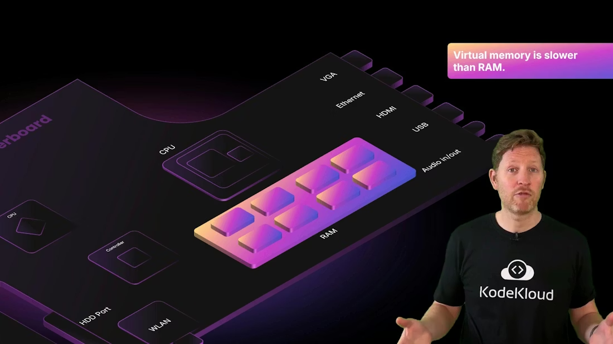
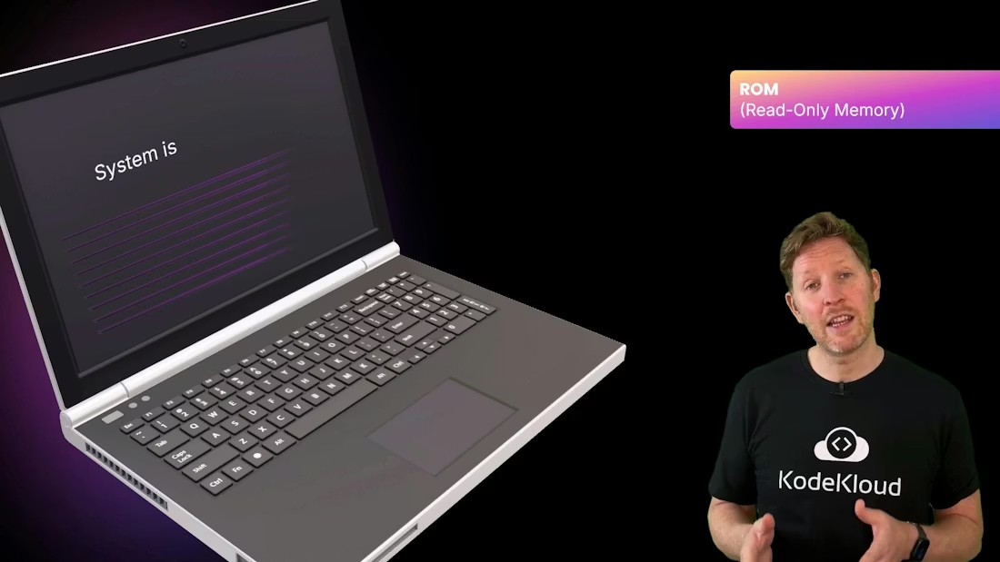
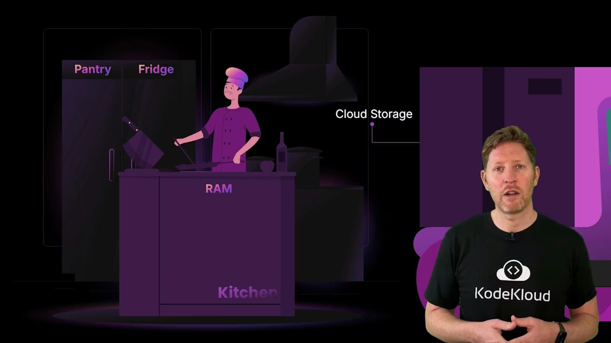
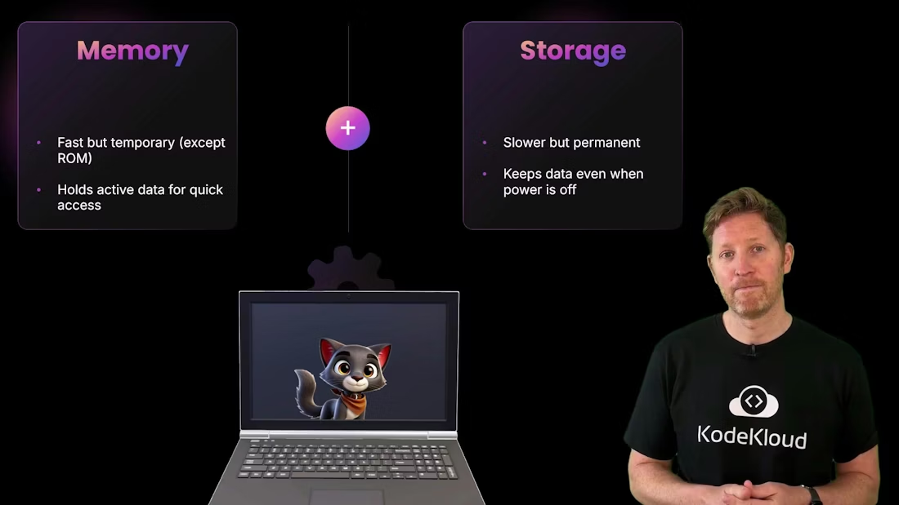

# 内存与存储如何协作 / Memory and Storage Working Together

> 中文：这是一份中英文对照学习笔记，重点解释 CPU、寄存器、缓存、RAM、ROM 和存储如何协同工作，为什么虚拟内存能救急但会变慢，以及为什么“保存”和“暂存”是两种完全不同的动作。
>
> English: This is a bilingual study note focused on how the CPU, registers, cache, RAM, ROM, and storage work together, why virtual memory can save a system in a pinch but slow it down, and why “saving” and “temporarily holding data” are two very different operations.

## 1. 协作的核心 / The Core Idea of Cooperation

中文：CPU 速度非常快，但它并不直接把所有数据都从硬盘里一点一点读出来。为了保持高性能，系统会让数据在不同层级之间流动：存储负责长期保存，RAM 负责运行时工作区，缓存负责保存高频访问内容，寄存器则保存当前正在处理的最小数据单元。这样 CPU 就不必一直等待慢速设备。

English: The CPU is extremely fast, but it does not directly pull every piece of data from disk one by one. To keep performance high, the system moves data through several layers: storage provides long-term persistence, RAM provides the runtime workspace, cache holds frequently accessed content, and registers hold the smallest units of data currently being processed. That way, the CPU does not have to keep waiting on slow devices.

中文：如果把 CPU 比作厨房里的厨师，那么 RAM 就像工作台，缓存像厨师手边的小碗，寄存器像手里正拿着的食材，而存储则像冰箱或仓库。任务越频繁需要访问的数据，就越应该放在离 CPU 更近的层级里。

English: If the CPU is a chef in a kitchen, RAM is the worktop, cache is the small bowl beside the chef, registers are the ingredients already in hand, and storage is the refrigerator or warehouse. The more frequently data is accessed, the closer it should be to the CPU.

---

## 2. 数据如何在各层之间移动 / How Data Moves Between Layers

中文：程序启动时，操作系统会把程序和数据从存储加载到 RAM。CPU 执行时，会不断从 RAM 读取指令和数据，再把经常重复使用的部分放入缓存，甚至放入寄存器。如果结果需要长期保留，系统再把它写回存储。

English: When a program starts, the operating system loads its code and data from storage into RAM. As the CPU runs, it repeatedly reads instructions and data from RAM, then places frequently reused pieces into cache and even registers. If the result needs to be kept long term, the system writes it back to storage.

中文：这个过程的关键不是“哪一层最好”，而是“哪一层最适合当前任务”。热数据应该留在高速层，冷数据可以留在慢速层。系统如果做得好，CPU 就能持续被喂饱，不会因等数据而停下来。

English: The key point is not “which layer is best,” but “which layer is best for the current job.” Hot data should stay in fast layers, while cold data can remain in slower layers. If the system is designed well, the CPU stays fed with data and does not stall waiting for it.

---

## 3. 缓存和寄存器 / Cache and Registers

中文：寄存器是 CPU 最小、最快的存储单元，保存当前正要使用的值。缓存比寄存器大，但比 RAM 快得多，通常分为 L1、L2 和 L3。L1 最快、最小，L3 更大但更慢。缓存的作用就是减少 CPU 去主内存取数据的次数。

English: Registers are the smallest and fastest storage units in the CPU, holding values being used right now. Cache is larger than registers but much faster than RAM, and it is usually divided into L1, L2, and L3. L1 is the fastest and smallest, while L3 is larger but slower. The role of cache is to reduce how often the CPU has to go back to main memory.

中文：缓存命中率越高，CPU 等待的时间就越少。对于运行中的程序来说，缓存常常决定了“看起来很快”还是“实际很慢”。很多性能优化，本质上都是在减少缓存未命中和内存访问延迟。

English: The higher the cache hit rate, the less time the CPU spends waiting. For a running program, cache often determines whether the system feels fast or slow. Many performance optimizations are really about reducing cache misses and memory-access latency.

---

## 4. 虚拟内存 / Virtual Memory

中文：当 RAM 不够用时，操作系统会使用虚拟内存，也就是把一部分页面放到磁盘上的交换文件或 pagefile 中。这样可以避免程序因为内存不足而立刻崩溃，但代价是明显更高的延迟，因为存储设备比 DRAM 慢得多。

English: When RAM runs short, the operating system uses virtual memory, moving some pages into a swap file or pagefile on disk. That can prevent a program from crashing due to lack of memory, but the trade-off is much higher latency, because storage devices are far slower than DRAM.

> **提示 / Tip**
> 中文：虚拟内存不是“更快的 RAM”，而是“更慢但能救急的扩展区”。它适合应急，不适合当常态工作区。
> English: Virtual memory is not “faster RAM.” It is a slower emergency extension area. It is useful as a safety net, not as a normal working area.

中文：如果你看到系统频繁卡顿、磁盘灯一直亮、应用切换变慢，虚拟内存往往是重点排查对象。它能让系统继续运行，但不能让系统保持流畅。

English: If the system keeps stuttering, the disk stays busy, and app switching becomes slow, virtual memory is often a key thing to inspect. It allows the system to keep running, but it does not keep it smooth.

---

## 5. ROM 和启动固件 / ROM and Firmware

中文：ROM 存放的是开机所需的基础代码，也就是 BIOS 或 UEFI 等固件。它们负责最早期的硬件初始化，并在电源刚打开的时候把机器带入可启动状态。与 RAM 不同，ROM 是非易失性的，即使断电也不会丢失内容。

English: ROM stores the basic code needed during startup, such as BIOS or UEFI firmware. These components perform the earliest hardware initialization and bring the machine into a bootable state when power is first applied. Unlike RAM, ROM is non-volatile, so it does not lose its contents when power is removed.

中文：这意味着 ROM 更像一本永久放在厨房里的菜谱，而不是临时记下来的便签。便签可以随时改，但断电就没了；菜谱稳定、可靠、适合做启动时的基础工作。

English: Think of ROM more like a permanent recipe book kept in the kitchen rather than a temporary note. A note can be changed anytime, but it disappears when power is lost; a recipe book is stable, reliable, and suited for foundational boot-time tasks.

---

## 6. 存储 / Storage

中文：如果 RAM 是工作台，存储就是冰箱、储物柜或仓库。它负责长期保存文件、程序和系统数据。存储的特点是容量更大、成本更低、但速度更慢，而且它通常是非易失性的。

English: If RAM is the worktop, storage is the refrigerator, cabinet, or warehouse. It is responsible for long-term retention of files, programs, and system data. Storage typically offers larger capacity, lower cost, and slower speed, and it is usually non-volatile.

中文：SSD、HDD、光盘和云存储分别适合不同场景。SSD 更快，适合系统盘和应用；HDD 更便宜、容量更大，适合大文件和归档；云存储方便共享、备份和远程访问，但性能依赖网络。

English: SSDs, HDDs, optical media, and cloud storage are suited to different scenarios. SSDs are faster and ideal for system drives and applications; HDDs are cheaper and larger, so they are better for large files and archives; cloud storage is convenient for sharing, backup, and remote access, but its performance depends on the network.

---

## 7. 云存储 / Cloud Storage

中文：云存储的本质不是“数据飘在云里”，而是把数据放在远程数据中心，由网络来访问。它通常提供更好的弹性、共享能力和备份能力，但速度、成本和可用性都受到网络条件影响。

English: Cloud storage is not “data floating in the sky.” It simply means your data is stored in a remote data center and accessed over the network. It usually offers better elasticity, sharing, and backup capabilities, but speed, cost, and availability are all affected by network conditions.

中文：因此，云存储特别适合协作、同步和容灾，但不适合所有低延迟本地 I/O 场景。理解这一点后，你就能更准确地决定什么时候本地存、什么时候上云。

English: Cloud storage is therefore great for collaboration, synchronization, and disaster recovery, but it is not ideal for every low-latency local I/O scenario. Once you understand this, you can decide more accurately when to keep data local and when to move it to the cloud.

---

## 8. 保存与未保存 / Saved vs Unsaved

中文：一个很重要但容易忽略的事实是：你在编辑器里看到的未保存内容只存在于 RAM 中，而真正写入磁盘的内容才会被长期保留。也就是说，“保存”就是把工作区中的内容从内存写到存储里。

English: One important but easy-to-ignore fact is that unsaved content in an editor exists only in RAM, while the content written to disk is what gets retained long term. In other words, “saving” means writing the working copy from memory into storage.

> **警告 / Warning**
> 中文：如果你关闭了未保存的文件，内存中的改动就会丢失。文件本身保存在存储里，但未保存的编辑内容只活在 RAM 中。
> English: If you close an unsaved file, the changes that existed only in memory are lost. The file itself remains on storage, but the unsaved edits lived only in RAM.

中文：这个例子非常适合帮助初学者理解“内存和存储”的分工。RAM 快，但临时；存储慢，但持久。保存按钮的意义，就是把临时工作变成永久记录。

English: This example is excellent for helping beginners understand the division of labor between memory and storage. RAM is fast but temporary; storage is slower but persistent. The save button’s job is to turn temporary work into permanent record.

---

## 9. 复盘 / Recap

中文：这节课最核心的结论是：内存负责快速、临时的工作，存储负责慢一些但永久的保存。RAM 和 cache 是易失性的，ROM 和存储是非易失性的。系统性能的关键，不是单看某个部件的绝对速度，而是看数据有没有被放在最合适的层级。

English: The core conclusion of this lesson is that memory handles fast, temporary work, while storage handles slower but permanent retention. RAM and cache are volatile, while ROM and storage are non-volatile. The key to system performance is not just the absolute speed of one component, but whether data is placed in the most appropriate layer.

中文：如果某个项目的工作集太大，最先受影响的往往是 RAM；如果某个文件需要长期保存，最先依赖的就是存储。理解这条边界，后面学虚拟内存、缓存、SSD、HDD 和云存储时会轻松很多。

English: If a project’s working set is too large, RAM is usually the first thing affected; if a file needs to be preserved long term, storage is what it depends on first. Once you understand this boundary, later topics like virtual memory, cache, SSDs, HDDs, and cloud storage become much easier.

---

## 快速表格 / Summary Table

| 类别 / Category | 作用 / Purpose | 例子 / Examples | 特点 / Characteristics |
| --- | --- | --- | --- |
| Memory (volatile) | CPU 的快速临时工作区 | Registers, cache, RAM | 低延迟、容量较小、断电即失 |
| Firmware (non-volatile) | 启动与初始化代码 | ROM, BIOS, UEFI | 持久、容量小、负责开机 |
| Storage (non-volatile) | 长期数据保存 | SSD, HDD, optical, cloud | 容量更大、速度较慢、成本更低 |

## Further Reading

- [Watch Video](https://learn.kodekloud.com/user/courses/computer-architecture/module/79580b70-d812-41b0-9704-6c333005a949/lesson/75a4b6bb-80e5-4d06-937a-e8a6c2629a0d)
