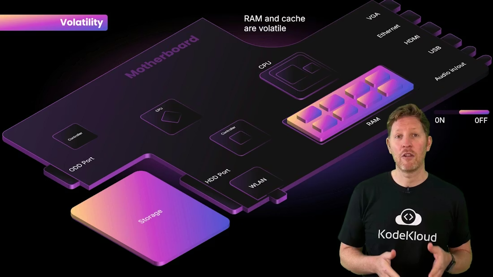

> ## Documentation Index
>
> Fetch the complete documentation index at: https://notes.kodekloud.com/llms.txt
> Use this file to discover all available pages before exploring further.

# Memory and Storage Working Together

> Explains how memory and storage work together on a computer, covering CPU registers, cache, RAM, virtual memory, ROM, storage types, and performance versus persistence trade offs

Let's revisit the motherboard to understand how memory and storage cooperate to keep a computer responsive. Think of the CPU as a busy kitchen: without organized workspaces, cooks would spend too much time fetching ingredients from a distant pantry. In computers, memory and storage provide those workspaces so the CPU can process data efficiently.

Memory gives the CPU a fast, easily reachable workspace that minimizes the time data spends traveling between the processor and long-term storage. Different memory and storage layers balance speed, capacity, volatility, and cost to meet the system's needs.


<Frame>
    
</Frame>

How data moves: CPU ↔ RAM ↔ Storage

* The CPU repeatedly fetches data and instructions from storage into RAM, executes or transforms them, and writes results back to storage when needed.
* Larger RAM lets a system keep more tasks or datasets in the fast workspace at once, improving multitasking and responsiveness.
* RAM is volatile: its contents are cleared when power is removed—like a worktop that’s wiped clean when the kitchen closes.

Registers and cache: closer to the CPU

Registers are the CPU’s smallest, fastest storage elements — like sticky notes on a chef’s hand for the exact value being used right now. Cache memory is slightly larger and slower than registers but much faster than RAM; it stores frequently used data so the CPU spends less time waiting.

* Cache levels (L1, L2, L3) are arranged by proximity and speed: L1 is fastest and smallest, L3 is larger but slower.
* More and better cache reduces CPU stalls and improves performance.

  

<Frame>
    
</Frame>

Virtual memory: extending RAM with storage

When RAM runs out of space, the operating system uses virtual memory (a swap file or pagefile) to extend the working area by moving pages between RAM and storage. This lets more programs run simultaneously but comes at the cost of greatly increased latency.

<Callout icon="lightbulb" color="#1CB2FE">
  Virtual memory (swap or pagefile) helps prevent crashes when RAM is exhausted, but performance drops because storage devices are much slower than DRAM.
</Callout>

<Frame>
    
</Frame>


ROM: persistent firmware

ROM (Read-Only Memory) stores essential startup firmware such as BIOS or UEFI. Unlike RAM, ROM is non-volatile and retains the code needed to initialize hardware every time the system boots—similar to a restaurant’s permanent recipe book.


<Frame>
    
</Frame>

Storage: long-term persistence

If RAM is the kitchen worktop, storage is the fridge or pantry—where items are kept until needed. Storage is non-volatile (data survives power loss) but slower than RAM. Typical storage options include SSDs, HDDs, optical media, and remote cloud storage, each offering different combinations of speed, capacity, durability, and cost.


<Frame>
    
</Frame>

Cloud storage: offsite persistence

Cloud storage keeps data remotely and serves it over the Internet. It’s convenient for backup, sharing, and scaling storage needs, but access latency and bandwidth depend on network connectivity.


<Frame>
    
</Frame>

Demo: the difference between RAM and storage (quick exercise)

Before the demo, note this important behavior about unsaved changes:

<Callout icon="warning" color="#FF6B6B">
  Unsaved edits exist only in RAM. If you close the editor without saving, those edits are lost even though the file itself persists on storage.
</Callout>

Here’s a brand-new file that doesn’t yet exist on disk. Save it to write its contents to persistent storage (SSD/HDD):

```text
Hello Kody
```

After saving, the file’s text is written to non-volatile storage. If you add new text but do not save, those changes remain only in RAM. Closing the editor without saving discards the unsaved content; reopening the file will show only the last saved contents from storage.


<Frame>
    
</Frame>

This simple exercise highlights the core distinction: memory (fast, typically volatile) vs. storage (slower, persistent).

Recap: key takeaways


<Frame>
    
</Frame>

* Volatility: RAM and cache are volatile; ROM and storage are non-volatile and retain data when power is off.

  

<Frame>
    
</Frame>

* Memory types: registers (fastest and smallest), cache (L1/L2/L3), RAM (main working memory), and ROM (firmware).
* Storage types: SSDs, HDDs, optical media, and cloud storage — each offers different speed, capacity, durability, and cost trade-offs.
* Trade-offs: faster memory has lower latency but is more expensive per gigabyte and usually volatile; slower storage is cheaper per gigabyte and persistent, but higher latency means the CPU must wait longer to load data into RAM.

Summary table: memory vs storage

| Category                | Purpose                                | Examples                               | Characteristics                                                      |
| ----------------------- | -------------------------------------- | -------------------------------------- | -------------------------------------------------------------------- |
| Memory (volatile)       | Fast, temporary workspace for CPU      | Registers, L1/L2/L3 cache, DRAM (RAM)  | Very low latency, limited capacity, cleared on power loss            |
| Firmware (non-volatile) | Startup code & hardware initialization | ROM, EEPROM, UEFI/BIOS chips           | Persistent, small capacity, stores boot instructions                 |
| Storage (non-volatile)  | Long-term data persistence             | SSD, HDD, optical media, cloud storage | Higher capacity, persistent, higher latency than RAM, cheaper per GB |

Links and References

* [Kubernetes Basics](https://kubernetes.io/docs/concepts/overview/what-is-kubernetes/) (overview of system architecture concepts)
* [Wikipedia: Computer Memory](https://en.wikipedia.org/wiki/Computer_memory)
* [Wikipedia: Cache (computing)](https://en.wikipedia.org/wiki/CPU_cache)
* [Wikipedia: Virtual Memory](https://en.wikipedia.org/wiki/Virtual_memory)
* [Understanding SSD vs HDD](https://www.howtogeek.com/356198/what-is-the-difference-between-ssd-and-hdd/)

Memory provides the speed your CPU needs to stay responsive; storage provides the persistence that keeps your work safe between power cycles. Understanding their roles and trade-offs helps you choose the right hardware and configure systems for better performance and reliability.

<CardGroup>
  <Card title="Watch Video" icon="video" cta="Learn more" href="https://learn.kodekloud.com/user/courses/computer-architecture/module/79580b70-d812-41b0-9704-6c333005a949/lesson/75a4b6bb-80e5-4d06-937a-e8a6c2629a0d" />
</CardGroup>

Built with [Mintlify](https://mintlify.com).
