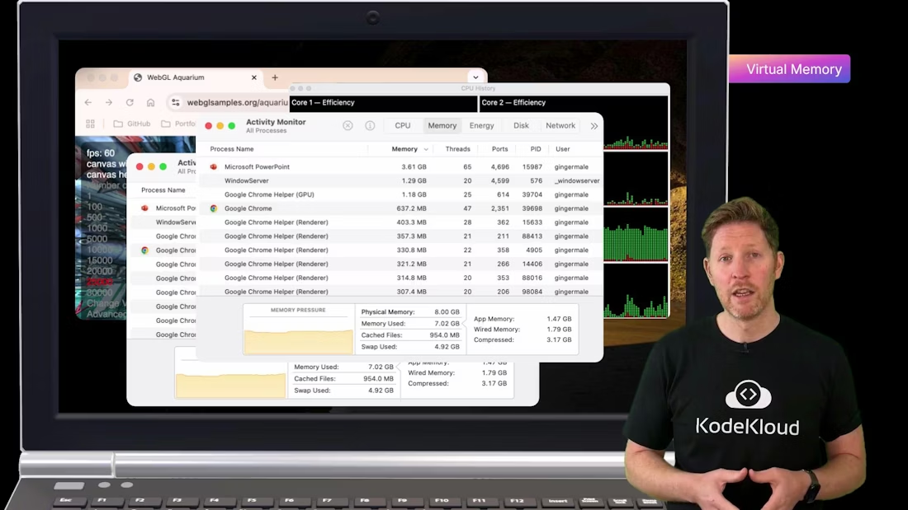
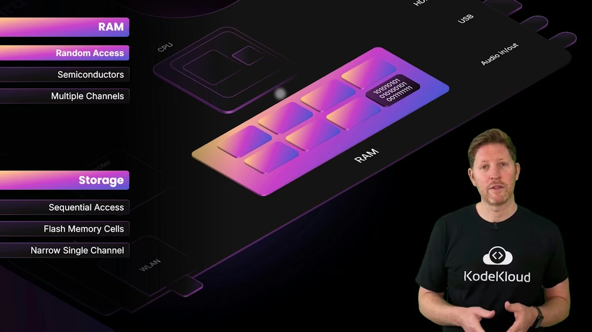
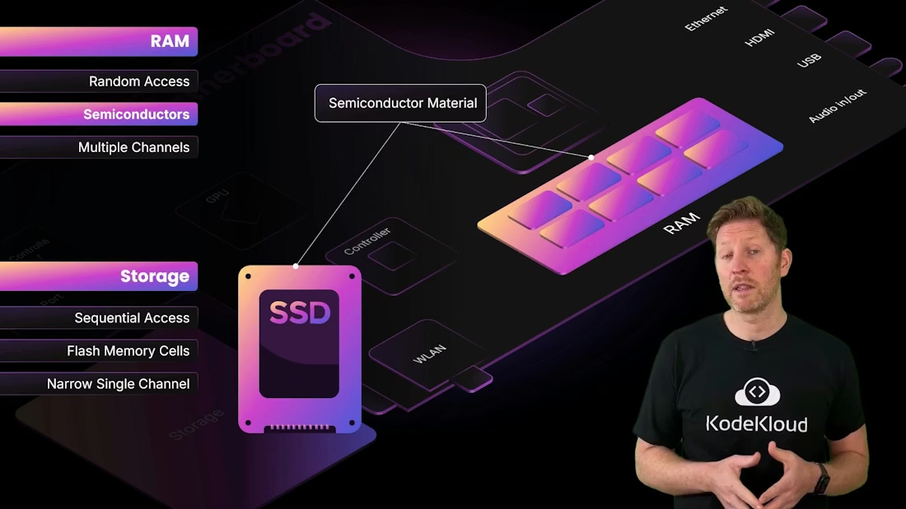
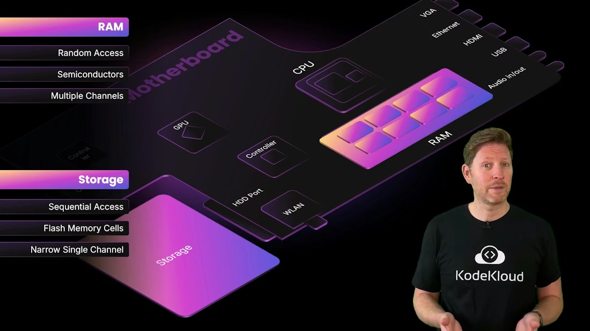
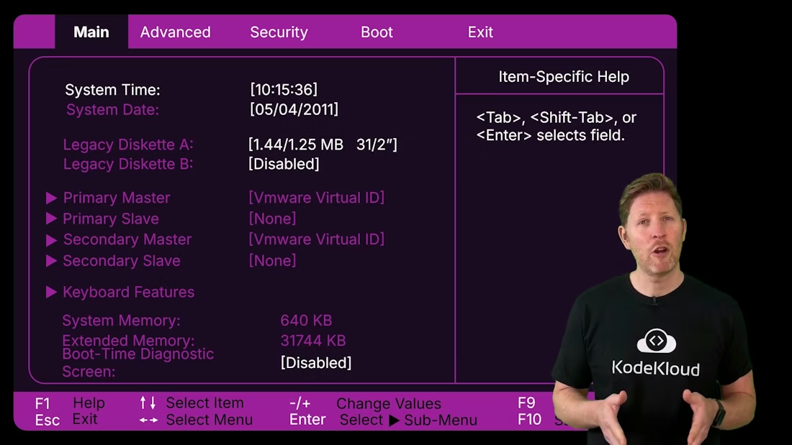

# Memory vs Storage

> Explains how memory and storage differences affect system performance, covering RAM, virtual memory swapping, caches, storage types, latency trade offs, and troubleshooting slow systems

Welcome back. This lesson explains why machines with powerful CPUs and GPUs can still feel sluggish: the bottleneck is often memory and storage rather than raw processing power. We’ll cover RAM vs storage, virtual memory (swapping/paging), cache and registers, and the practical trade-offs that affect real-world performance.


<Frame>
    
</Frame>

Scenario: You selected laptops with capable CPUs/GPUs for the design team, but they report frequent slowdowns and freezing on large projects. As an IT investigator, the first step is diagnosis — check the activity/performance monitors for CPU, GPU, memory, and disk activity.

Example performance overlay from an application (canvas settings and interactive options):

```text
fps: 60
canvas width: 1024
canvas height: 1024
Number of Fish
1
100
500
1000
5000
10000
15000
20000
25000
30000
Change View
Advanced
```

If CPU/GPU were the bottleneck, you’d see near 100% usage. In this case, both are within normal ranges, but the system is out of RAM and is using virtual memory — swapping pages to disk. Disk-based swapping is orders of magnitude slower than RAM access, which causes system-wide sluggishness.



<Callout icon="lightbulb" color="#1CB2FE">
  When a system runs out of RAM it swaps pages to disk (virtual memory). Disk-based swapping is much slower than RAM and is a common cause of freezing, lag, and poor responsiveness.
</Callout>

<Frame>
    
</Frame>

Quick diagnosis tip: check both physical RAM size and working set usage. A laptop with 512 GB storage but only 4 GB RAM will frequently page to disk under heavy workloads — storage capacity is not a substitute for RAM speed.

Learning objectives

* Explain volatile vs non-volatile memory and how that affects performance and persistence.
* Classify memory and storage types (registers, cache, DRAM, SSD, HDD, virtual/cloud storage).
* Describe trade-offs in access speed (latency), bandwidth, cost per GB, and durability.

Why this matters: modern CPUs execute billions of operations per second, but if data arrives slowly from storage the CPU idles waiting. Files and applications are stored on non-volatile storage; RAM holds the working set that the CPU actively uses. RAM is volatile but much faster, so ensuring the working set fits in RAM usually yields the largest performance gains.

We can compare RAM and storage along three principal dimensions: access method, physical composition, and architecture.

## 1) Access method

* Random access memory (RAM): roughly constant time to read/write any address — ideal for CPU workloads that require quick, arbitrary reads and writes.
* Sequential-access media (e.g., magnetic tape): must be read in order, much slower for random reads.

Traditional hard disk drives (HDDs) are relatively slow for random access because of mechanical seek and rotational latency. Solid-state drives (SSDs) improve throughput and eliminate many mechanical delays, but their access latency still cannot match DRAM.



<Frame>
    
</Frame>

## 2) Physical composition

Both RAM and SSDs use semiconductor technology, but they differ in construction and behavior.



<Frame>
    
</Frame>

* DRAM (typical system RAM): implemented with capacitors and transistors. Very fast charge/discharge cycles allow quick reads/writes. DRAM is volatile — it loses contents when power is removed.
* NAND flash (SSDs): stores data by trapping charge in memory cells. Flash is non-volatile (retains data without power) but has higher read/write latency than DRAM and limited write endurance compared to RAM cells.
* HDDs: magnetic platters and moving heads — high capacity and lower cost per GB, but much higher latency for random access.

## 3) Architecture

How memory connects to the CPU affects throughput and latency. Wider buses and multiple channels increase parallel transfer capacity.

```text
10101001
01001001
00111111
```

* Multi-channel memory (dual/tri/quad) increases throughput by sending more bits per cycle — analogous to widening lanes on a highway.
* Storage interfaces (SATA, NVMe over PCIe) can provide high sequential bandwidth, but still introduce higher latency compared to system memory (DRAM).
* Even with high PCIe bandwidth, DDR memory attached directly to the memory controller is much lower latency than NVMe.

  

<Frame>
    
</Frame>

Even with fast RAM, the system bus and physical distance add nanoseconds of latency. CPUs reduce this wait time using an internal memory hierarchy.

### CPU memory hierarchy (fastest → slowest)

* Registers: inside CPU cores, store current operands and pointers (fastest, smallest).
* CPU cache (L1, L2, L3): on-die or very near the CPU, stores frequently accessed data (very fast, small).
* Main memory / DRAM: larger working store for processes (fast, larger, volatile).
* Local storage (SSD/HDD): non-volatile, large capacity, higher latency.
* Remote/cloud storage: very large capacity and persistence, highest latency.

Cache and registers are critical for performance: they keep the CPU fed with data without trips to main memory.


<Frame>
    
</Frame>

Another non-volatile memory important for boot and firmware is ROM (or flash-based BIOS/UEFI). ROM holds essential startup code and firmware — stable across power cycles but not designed for frequent writes.



<Frame>
    
</Frame>

Putting this together, here’s a concise comparison table for memory/storage tiers:

| Tier               | Example(s)               |       Typical latency |  Volatility  | Typical capacity |
| ------------------ | ------------------------ | --------------------: | :----------: | ---------------: |
| Registers          | CPU registers            |        sub-nanosecond |   Volatile   | bytes–kilobytes |
| Cache (L1/L2/L3)   | On-die cache             |       single-digit ns |   Volatile   |           KB–MB |
| Main memory (DRAM) | System RAM               |            tens of ns |   Volatile   |              GBs |
| Local storage      | NVMe SSD, SATA SSD, HDD  | hundreds of µs to ms | Non-volatile |         GBs–TBs |
| Remote/cloud       | S3, network file systems |         ms to 10s+ ms | Non-volatile |  potentially PBs |

Practical takeaway: faster memory is physically closer to the CPU, uses higher-speed semiconductor technology, and costs more per GB. Slower storage is farther from the CPU and is cheaper per GB, but swapping to it causes dramatic slowdowns.

<Callout icon="warning" color="#FF6B6B">
  Upgrading storage capacity (e.g., larger SSD) does not replace the speed advantage of RAM. If applications exceed available RAM, add more RAM or reduce the working set — high-capacity storage will still cause swapping and slower performance.
</Callout>

When troubleshooting sluggish systems, prioritize:

* Checking RAM usage and paging metrics.
* Ensuring the working set fits in RAM for critical workloads.
* Using faster RAM (higher frequency / dual-channel) and sufficient capacity before investing only in larger storage.

Links and references

* [Understanding Virtual Memory and Paging](https://en.wikipedia.org/wiki/Virtual_memory)
* [DRAM vs NAND Flash Overview](https://en.wikipedia.org/wiki/DRAM)
* [SSD vs HDD: How They Differ](https://www.howtogeek.com/356275/ssd-vs-hdd-whats-the-difference/)
* [Memory Hierarchy (computer architecture)](https://en.wikipedia.org/wiki/Memory_hierarchy)

By the end of this module you should be able to explain volatile vs non-volatile memory, classify memory/storage types including virtual memory and cloud storage, and describe performance trade-offs across latency, bandwidth, cost, and durability.

<CardGroup>
  <Card title="Watch Video" icon="video" cta="Learn more" href="https://learn.kodekloud.com/user/courses/computer-architecture/module/79580b70-d812-41b0-9704-6c333005a949/lesson/b7dc2762-8197-4c99-90d6-6e96cf61a75c" />
</CardGroup>
