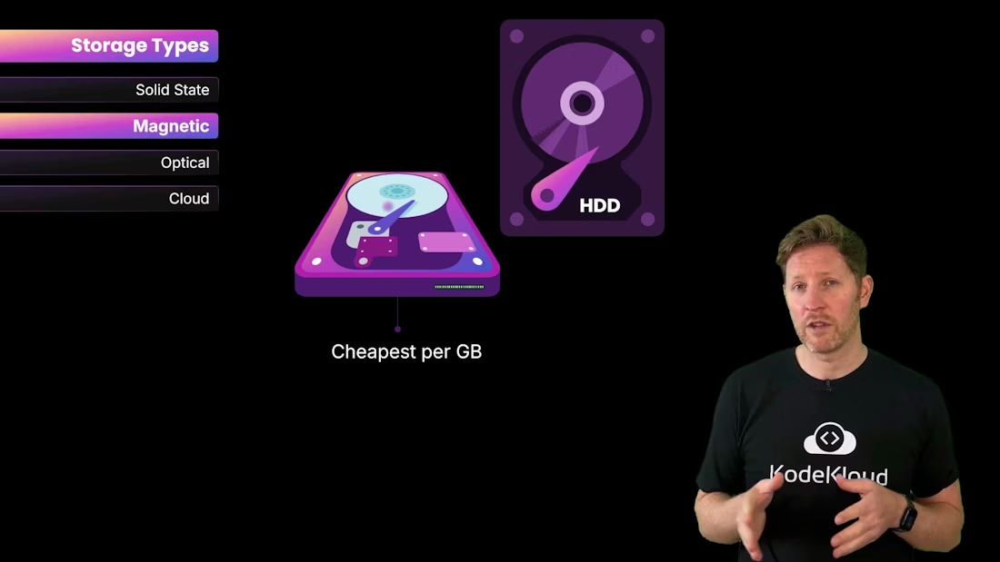
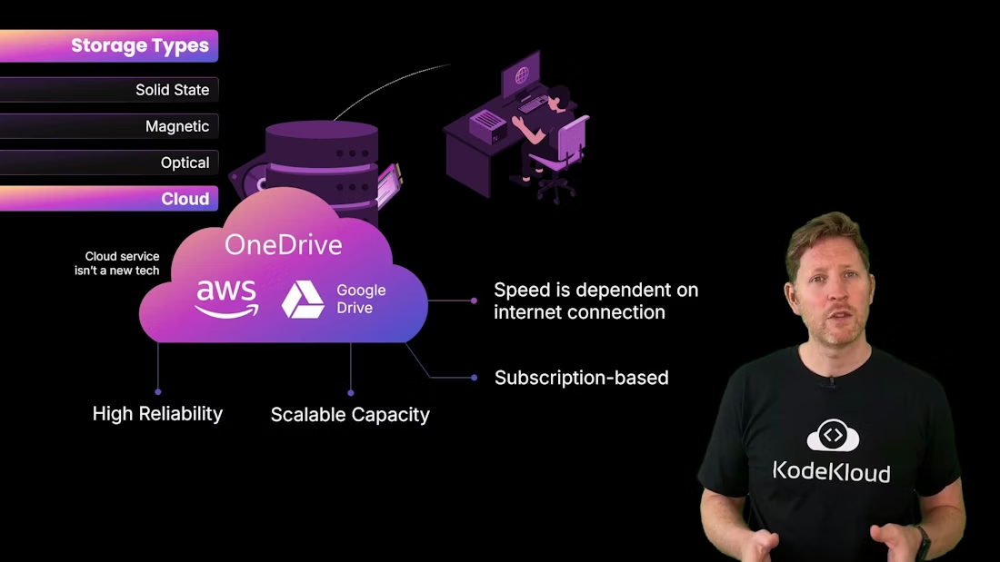

# Types of Storage

> Overview of memory versus storage and major storage types including magnetic, optical, solid-state, and cloud, their trade offs, hierarchy, capacities, and guidance for choosing appropriate storage

This guide explains the main storage types, how they differ from memory, and where each fits in the overall computing stack. It keeps the original technical diagrams and their order while improving clarity and SEO for terms like "storage vs memory", "magnetic storage", "optical media", "solid-state storage", and "cloud storage".

## Memory vs. Storage — what's the difference?

* Memory (primary memory) generally means the fast, temporary storage that the CPU uses directly: registers, CPU caches, and RAM. These are typically volatile — they lose their contents when power is removed.
* Storage (secondary storage) means long-term, persistent storage for files, operating systems, backups, and saved data. Storage is optimized for capacity and permanence rather than raw speed.

Note: Read-Only Memory (ROM) and non-volatile firmware storage (EEPROM, SPI flash) are exceptions: they are non-volatile but not the same as RAM in performance or purpose.

## Core storage families and the cloud model

We'll focus on three physical storage families plus cloud storage:

* Magnetic: hard disk drives (HDDs), floppy disks, magnetic tape.
* Optical: CDs, DVDs, Blu-rays.
* Flash / Solid-state: SSDs, USB flash drives, memory cards.
* Cloud: remote storage hosted by third-party datacenters (built on magnetic/solid-state media and exposed over the network).

Traditionally you bought physical drives up front. Cloud storage enables on-demand, subscription-based capacity without handling physical media.

## Data sizes and the binary pyramid

Computers store information in bits and bytes:

* A bit is the smallest unit: `0` or `1`.
* Eight bits = one byte (enough for a single character in many encodings).

Example 8-bit byte:

```text
01101000
```

Common binary multiples (preferred for precision):

| Unit                 | Value          |
| -------------------- | -------------- |
| `1 KiB` (kibibyte) | `1024` bytes |
| `1 MiB` (mebibyte) | `1024 KiB`   |
| `1 GiB` (gibibyte) | `1024 MiB`   |
| `1 TiB` (tebibyte) | `1024 GiB`   |

SI prefixes (`kilo`, `mega`, `giga`) formally mean powers of 10 (1000), while binary prefixes (`kibi`, `mebi`, `gibi`) mean powers of 2 (1024). In practice many systems label `1024` bytes as `KB`, so you will see these terms used interchangeably.

<Callout icon="lightbulb" color="#1CB2FE">
  Terminology note: For precise capacity reporting (e.g., when comparing drives vs. OS-reported sizes), prefer binary prefixes (`KiB`, `MiB`, `GiB`) to avoid confusion. Drive manufacturers often advertise decimal sizes (1 GB = 1,000,000,000 bytes) while some OS tools report binary sizes but may still use the `GB` label.
</Callout>

Also useful: a nibble is 4 bits (half a byte) — mainly relevant for low-level encoding and historical contexts.

## Storage trade-offs: speed, cost, durability

Storage technologies trade off access speed, cost per GB, durability, and form factor. The table below summarizes these trade-offs and typical uses.

| Storage Type                         | Mechanism                                          | Pros                                                                | Cons                                                                         | Typical Uses                                                   |
| ------------------------------------ | -------------------------------------------------- | ------------------------------------------------------------------- | ---------------------------------------------------------------------------- | -------------------------------------------------------------- |
| Optical (CD/DVD/Blu-ray)             | Laser reads pits on a disc                         | Low manufacturing cost per disc, long shelf life if stored properly | Slow random access, lower capacity vs modern media, susceptible to scratches | Media distribution, offline backups                            |
| Magnetic (HDD / Tape)                | Spinning platters or tape + movable head           | High capacity, lowest cost per GB                                   | Mechanical parts (wear/failure), higher seek latency vs SSD                  | Bulk storage, archives, backups                                |
| Solid-state / Flash (SSD / USB / SD) | Electrically stored data with no moving parts      | Fast access, robust to shock, great for OS and apps                 | Higher cost per GB, limited write/erase cycles                               | System drives, performance-sensitive workloads, mobile devices |
| Cloud (S3 / Drive / OneDrive)        | Remote datacenter storage exposed via network APIs | Scalable, highly durable via replication, no hardware to manage     | Dependent on network bandwidth/latency, recurring costs                      | Backups, collaboration, scalable app storage                   |

### Magnetic storage (details and visual)

Magnetic media uses spinning platters (HDDs) or tape with a movable read/write head. It offers excellent capacity at low cost per gigabyte but has mechanical failure risks and higher latency compared to solid-state storage.



<Frame>
    
</Frame>

### Solid-state (flash) storage (details)

Flash memory stores data electrically with no moving parts, giving much faster access times and better shock resistance than HDDs. Flash endurance is finite (write/erase cycles), so modern devices use wear leveling and over-provisioning to extend lifespan.

<Callout icon="warning" color="#FF6B6B">
  Flash endurance warning: Flash cells have a limited number of write/erase cycles. For write-heavy workloads (e.g., database logs), choose enterprise-grade SSDs or configure storage to minimize unnecessary writes.
</Callout>

### Cloud storage (details and visual)

Cloud storage providers expose scalable storage over the network. Behind the scenes, cloud providers use magnetic or solid-state media and add replication, versioning, and geographic redundancy for durability.

* Examples: [Google Drive](https://www.google.com/drive/), [OneDrive](https://www.microsoft.com/en-us/microsoft-365/onedrive/), [AWS S3](https://aws.amazon.com/s3/)
* Pros: scalable, subscription-based, no upfront hardware.
* Cons: performance depends on internet bandwidth and latency; not ideal for extremely low-latency local I/O.
* 

<Frame>
    
</Frame>

## Where storage sits in the memory hierarchy

From the CPU outward:

* Registers and CPU caches — fastest, smallest, for immediate computations.
* RAM — fast, volatile, holds the active working set.
* SSDs (solid-state storage) — non-volatile, fast relative to spinning disks, used for OS and apps.
* HDDs (magnetic storage) — non-volatile, large capacity, lower cost per GB.
* Optical media — non-volatile, inexpensive per unit, slow for random access.

As you descend this hierarchy: capacity and cost-efficiency increase while access speed and latency generally decrease.

## Choosing storage — a quick checklist

* Performance-sensitive workloads: prefer NVMe/SSD.
* Large-capacity, low-cost storage: choose HDDs or cloud object storage.
* Long-term offline retention: optical media or magnetic tape (with proper storage).
* Portable small-scale transfers: USB flash drives or SD cards.
* Scalable, managed storage with global access: cloud storage (S3, Drive, OneDrive).

## Summary

* Memory (RAM, cache) and storage (SSD, HDD, optical, cloud) serve complementary roles: memory for fast temporary data, storage for long-term persistence.
* Evaluate storage by performance, capacity, durability, and cost per GB.
* Cloud storage adds flexibility and redundancy but depends on network performance.
* Use binary prefixes (`KiB`, `MiB`, `GiB`) when you need precise capacity reporting.

Further reading and references:

* [Kubernetes Documentation](https://kubernetes.io/docs/) (for storage classes in containerized environments)
* [AWS S3](https://aws.amazon.com/s3/), [Google Drive](https://www.google.com/drive/), [OneDrive](https://www.microsoft.com/en-us/microsoft-365/onedrive/)

<CardGroup>
  <Card title="Watch Video" icon="video" cta="Learn more" href="https://learn.kodekloud.com/user/courses/computer-architecture/module/79580b70-d812-41b0-9704-6c333005a949/lesson/6c3b0277-d9f7-4fe1-9ced-b97f17ab4a2a" />
</CardGroup>
