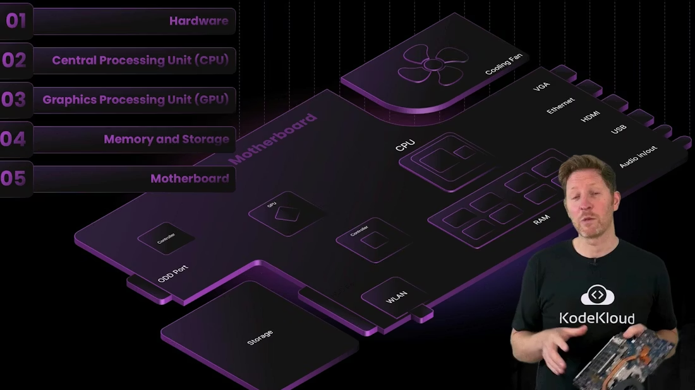
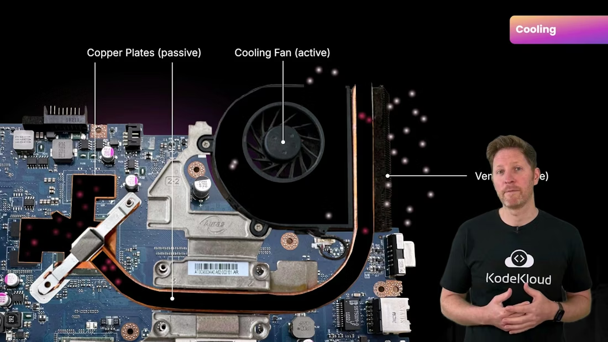
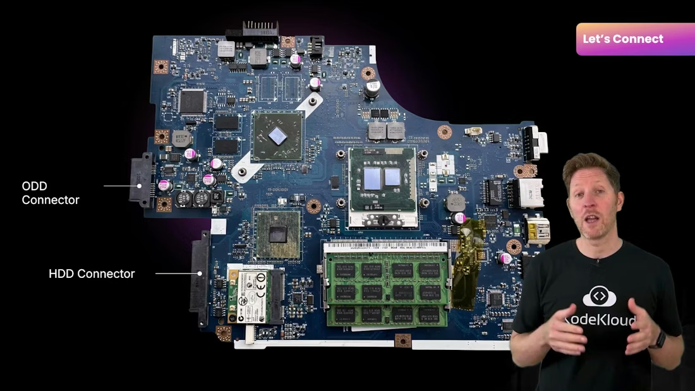
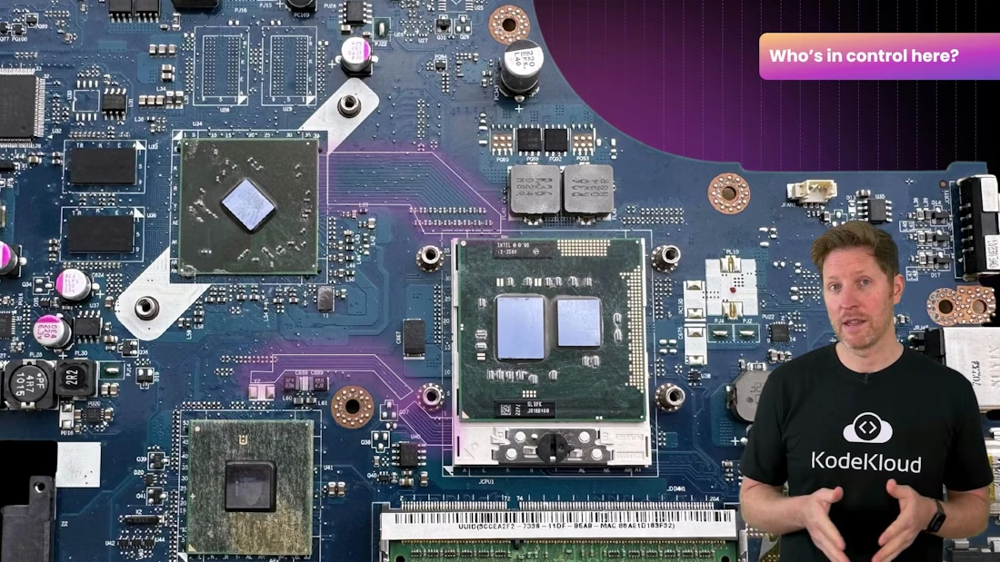
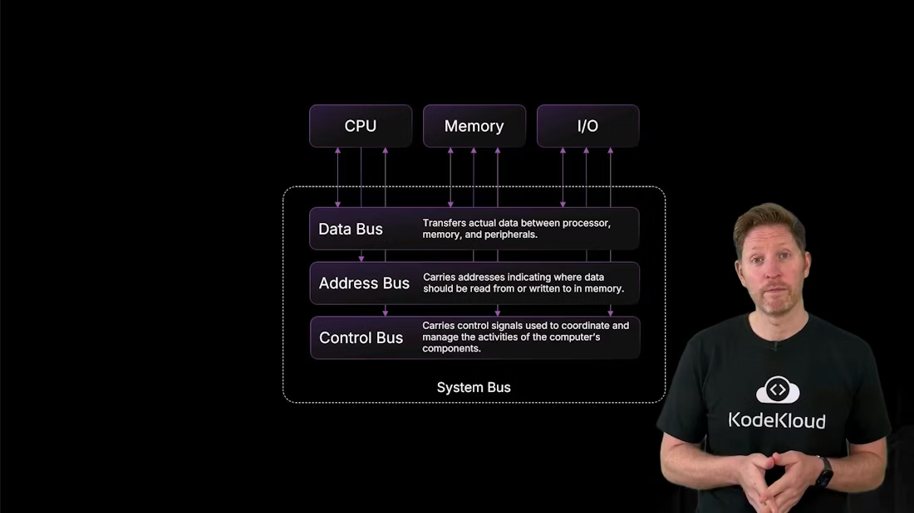

# Motherboard

> Overview of motherboard functions including power delivery, cooling, ports and slots, controllers and buses, and practical RAM installation and boot initialization

Welcome back to the computer architecture course. This lesson focuses on the motherboard: how it’s powered, how it stays cool, and how it coordinates every component in the system.

You’re about to install a new RAM module as part of a memory upgrade for your team. At first glance the motherboard may look like a dense, confusing grid — but it’s a deliberate design of components and pathways that route power, data, and control signals. Before we explore the board’s controllers and buses, let’s install the RAM and observe the board’s structure in context.

When installing RAM, note the keyed notch on the module that aligns with the slot so the stick can’t be inserted the wrong way. This prevents mechanical damage and improper electrical contact.

<Frame>
    
</Frame>

By the end of this lesson you will be able to:

* Explain how power affects data retention and system stability.
* Describe cooling strategies that prevent thermal throttling and preserve performance.
* Identify key physical interfaces: ports, connectors, and expansion slots.
* Explain how system buses and controller chips coordinate communication between components.

We’ll use a mix of real photos and labeled diagrams of motherboards to illustrate concepts. Now, let’s dive into power, cooling, interfaces, and buses.

<Callout icon="lightbulb" color="#1CB2FE">
  When you install RAM, align the module’s notch with the slot key and press firmly until the latches click. If a module won’t seat, don’t force it — double-check orientation and the slot’s retention clips.
</Callout>

Power: sources, regulation, and data retention

A high-performance CPU and large storage won’t run without stable power. Laptops typically receive power from two primary inputs:

| Power source             | Where it connects             | Role                                                            |
| ------------------------ | ----------------------------- | --------------------------------------------------------------- |
| Main battery connector   | Large plug on the motherboard | Provides mobile power when unplugged; prevents abrupt shutdowns |
| DC power input (charger) | External jack                 | Supplies mains power and charges the main battery               |

On the motherboard, voltage regulator modules (VRMs) — built from MOSFETs, inductors, and capacitors — step and smooth voltages to meet CPU, GPU, and chipset requirements. VRMs protect components from voltage spikes and maintain steady rails under varying load.

Power also dictates what happens to data on different storage types:

* Volatile memory (RAM and caches) requires continuous power; contents are lost on power removal.
* Non-volatile storage (SSDs, HDDs, NVMe) retains data without power.

A small backup battery (commonly a CMOS/RTC battery) preserves the real-time clock and minimal state when the main battery is removed; modern firmware settings are usually saved in non-volatile flash.

<Callout icon="warning" color="#FF6B6B">
  Avoid removing or inserting components with the main battery and charger connected. Static discharge or accidental shorting can damage VRMs, memory modules, and other sensitive components.
</Callout>

Cooling: passive transport and active exhaust

Cooling prevents thermal throttling and hardware damage. It works in two complementary ways:

* Passive cooling — moves heat from chips to a common sink using heat spreaders (metal plates), heat pipes (typically copper), and thermal interface materials (thermal paste or pads).
* Active cooling — uses fans (or pumps in liquid systems) to expel heat from the chassis into the environment.

High-end systems sometimes use closed-loop or custom liquid cooling for better heat transfer and lower sustained temperatures. Poor cooling forces the CPU/GPU to lower clock speeds (thermal throttling), which reduces performance to keep temperatures within safe limits.

Removing a thermal module exposes processors and surrounding components and makes the heat paths visible—how chip surfaces connect to heat pipes, sinks, and fans.

<Frame>
    
</Frame>

Ports, connectors, and expansion slots

Motherboards expose and interconnect internal and external devices through three physical interface types:

| Interface type        | Purpose                                    | Common examples                                     |
| --------------------- | ------------------------------------------ | --------------------------------------------------- |
| Ports (external)      | Connect peripherals and displays           | HDMI, USB, Ethernet, audio jacks                    |
| Connectors (internal) | Plug internal drives and power connections | SATA, M.2 sockets, power headers                    |
| Expansion slots       | Add or upgrade internal cards/modules      | DIMM (RAM), PCIe (GPU, NVMe adapters), M.2 for WLAN |

RAM slots let you increase system memory capacity. WLAN slots accept wireless modules so you can add Wi‑Fi without external adapters. Modern designs increasingly consolidate multiple functions into smaller, high-speed connectors (for example, multi-protocol USB-C).

<Frame>
    
</Frame>

Controllers and buses: how data flows and traffic is managed

Controller chips (chipsets, embedded controllers, and specialized I/O controllers) orchestrate traffic between devices so data moves without collisions or slowdowns. Physical traces on the board (buses) carry the electrical signals between controllers, CPUs, memory, and I/O.

Controllers are responsible for:

* Enumerating devices during boot (detecting hardware).
* Converting protocols (e.g., PCIe to SATA).
* Managing interrupts, DMA transfers, and power states.

  

<Frame>
    
</Frame>

Boot sequence and initialization

When you press the power button, the motherboard’s firmware (BIOS or modern UEFI) starts the initialization sequence and the power distribution process. The firmware performs a POST (power-on self-test) and then hands control to the boot loader and OS.

Typical boot sequence:

1. Firmware initializes the CPU and base chipset functions.
2. RAM is prepared as temporary working memory for code and data.
3. Connected devices (storage, GPUs, I/O) are detected and enumerated by controllers.
4. Firmware locates the boot loader on the selected device; the boot loader loads the OS into RAM.
5. Once the OS takes over, it loads drivers, initializes higher-level services, and presents the user interface.

Throughout boot and runtime, both firmware and the OS manage power policies and thermal limits — scaling performance according to battery state and temperatures.

System buses: address, data, and control pathways

Data movement on a motherboard happens across structured buses. Conceptually, the system bus is composed of three logical pathways:

| Bus type    | Direction                             | Primary role                                                                          |
| ----------- | ------------------------------------- | ------------------------------------------------------------------------------------- |
| Address bus | Unidirectional (CPU → memory/device) | Specifies the memory or device address for read/write operations                      |
| Data bus    | Bidirectional                         | Carries actual data between CPU, memory, and I/O                                      |
| Control bus | Bidirectional                         | Transmits control signals (read/write flags, interrupts, clock) to coordinate actions |

Two characteristics that affect throughput:

* Bus width — the number of parallel lines (like lanes on a highway). Wider buses move more bits per cycle.
* Word size — the CPU’s data unit size (e.g., 32-bit or 64-bit). Larger word sizes let each CPU operation move more data.

Analogy: bus width is the number of lanes on a highway; word size is the size of each truck using those lanes. Increasing both raises the total bits moved per cycle.

Example flow — loading a photo:

1. The CPU places the photo’s memory address on the address bus.
2. The CPU issues a read command on the control bus.
3. Memory puts the requested data onto the data bus.
4. The CPU processes the data and forwards results to the GPU/display subsystem to render the image.

In short: address says where, control says what, and data carries the bits.

<Frame>
    
</Frame>

Quick reference: why these concepts matter

* Power stability protects volatile data and prevents corruption during writes.
* Effective cooling preserves sustained performance and avoids thermal throttling.
* Physical interfaces (ports, connectors, slots) provide upgrade paths and external connectivity.
* Controllers and buses coordinate the complex choreography of data and control signals across the board.

Summary

* System buses (address, data, control) coordinate communication between CPU, memory, and I/O.
* Bus width and word size determine how much data can move per cycle.
* Stable power is essential: volatile memory loses data without power; backup batteries preserve clocks and minimal state.
* Passive and active cooling move and remove heat to prevent throttling and hardware damage.
* Ports, connectors, expansion slots, and controller chips provide the physical and logical interfaces that let components work together.

This concludes our look at the motherboard. You should now understand how power stability affects data retention, why cooling matters for consistent performance, which interfaces connect components, and how buses and controllers coordinate communication behind the scenes.

<CardGroup>
  <Card title="Watch Video" icon="video" cta="Learn more" href="https://learn.kodekloud.com/user/courses/computer-architecture/module/c924270c-0aa1-48ba-90f9-ae102175c6b0/lesson/3a9eb207-f82a-4fa0-b2a3-847a932fe251" />
</CardGroup>

Built with [Mintlify](https://mintlify.com).
